Tarea sobre Clasificación (Caret)
================
Francesca Mori
2024-03-27

- <a href="#objetivos" id="toc-objetivos">Objetivos</a>
- <a href="#conjunto-de-datos" id="toc-conjunto-de-datos">Conjunto de
  Datos</a>
  - <a href="#visualización" id="toc-visualización">Visualización</a>
- <a href="#pre-procesamiento-y-selección-de-características"
  id="toc-pre-procesamiento-y-selección-de-características">Pre-Procesamiento
  y Selección de Características</a>
  - <a href="#particionamiento-del-conjunto-de-datos"
    id="toc-particionamiento-del-conjunto-de-datos">Particionamiento del
    Conjunto de Datos</a>
- <a href="#clasificación" id="toc-clasificación">Clasificación</a>
  - <a href="#planificación-del-procedimiento-de-entrenamiento"
    id="toc-planificación-del-procedimiento-de-entrenamiento">Planificación
    del procedimiento de entrenamiento</a>
  - <a href="#primer-clasificador-k-nn"
    id="toc-primer-clasificador-k-nn">Primer Clasificador: K-nn</a>
  - <a href="#segundo-clasificador-svm-con-base-radial"
    id="toc-segundo-clasificador-svm-con-base-radial">Segundo Clasificador:
    SVM con Base Radial</a>
- <a href="#comparación-de-clasificadores-i"
  id="toc-comparación-de-clasificadores-i">Comparación de Clasificadores
  I</a>
  - <a href="#curvas-roc-para-clasificadores-multi-etiqueta"
    id="toc-curvas-roc-para-clasificadores-multi-etiqueta">curvas ROC para
    clasificadores multi-etiqueta</a>
- <a href="#ensemble-models" id="toc-ensemble-models">Ensemble Models</a>
  - <a href="#comparación-de-clasificadores-ii"
    id="toc-comparación-de-clasificadores-ii">Comparación de Clasificadores
    II</a>

# Objetivos

Nuestro objetivo es usar las funciones de `caret` para ajustar dos
clasificadores y compararlos.

Para lograrlo, seguiremos estos pasos: - Realizar una partición adecuada
del dataset; - Analizar las variables numéricas, considerando posibles
transformaciones o evaluando su importancia a priori; - Planificar un
esquema de entrenamiento; - Aplicar `train` a dos clasificadores,
ajustando sus respectivos hiperparámetros; - Evaluar el rendimiento de
cada clasificador por separado y comparar los resultados.

# Conjunto de Datos

El conjunto de datos se encuentra en la biblioteca MASS y consta de 200
filas y 8 columnas. Estas columnas describen 5 medidas morfológicas
tomadas de 50 cangrejos. Cada cangrejo pertenece a una de las dos formas
de color y ambos sexos de la especie Cangrejo de Roca Púrpura
(Leptograpsus variegatus).

``` r
library(MASS)
data(crabs)
dim(crabs)
```

    ## [1] 200   8

``` r
head(crabs)
```

    ##   sp sex index   FL  RW   CL   CW  BD
    ## 1  B   M     1  8.1 6.7 16.1 19.0 7.0
    ## 2  B   M     2  8.8 7.7 18.1 20.8 7.4
    ## 3  B   M     3  9.2 7.8 19.0 22.4 7.7
    ## 4  B   M     4  9.6 7.9 20.1 23.1 8.2
    ## 5  B   M     5  9.8 8.0 20.3 23.0 8.2
    ## 6  B   M     6 10.8 9.0 23.0 26.5 9.8

``` r
summary(crabs)
```

    ##  sp      sex         index            FL              RW              CL       
    ##  B:100   F:100   Min.   : 1.0   Min.   : 7.20   Min.   : 6.50   Min.   :14.70  
    ##  O:100   M:100   1st Qu.:13.0   1st Qu.:12.90   1st Qu.:11.00   1st Qu.:27.27  
    ##                  Median :25.5   Median :15.55   Median :12.80   Median :32.10  
    ##                  Mean   :25.5   Mean   :15.58   Mean   :12.74   Mean   :32.11  
    ##                  3rd Qu.:38.0   3rd Qu.:18.05   3rd Qu.:14.30   3rd Qu.:37.23  
    ##                  Max.   :50.0   Max.   :23.10   Max.   :20.20   Max.   :47.60  
    ##        CW              BD       
    ##  Min.   :17.10   Min.   : 6.10  
    ##  1st Qu.:31.50   1st Qu.:11.40  
    ##  Median :36.80   Median :13.90  
    ##  Mean   :36.41   Mean   :14.03  
    ##  3rd Qu.:42.00   3rd Qu.:16.60  
    ##  Max.   :54.60   Max.   :21.60

En primer lugar vamos a generar la variable `spex`, combinando las
categorías de `specie` y `sex`, obteniendo así cuatro categorías. Esta
será la variable de agrupación o etiqueta para este análisis.

``` r
crabs$spex<-as.factor(paste(crabs$sp,crabs$sex, sep=""))
```

## Visualización

Entrenaremos clasificadores de `spex` basados en las 5 variables
numéricas.

``` r
pairs(crabs[,4:8], col=crabs$spex)
```

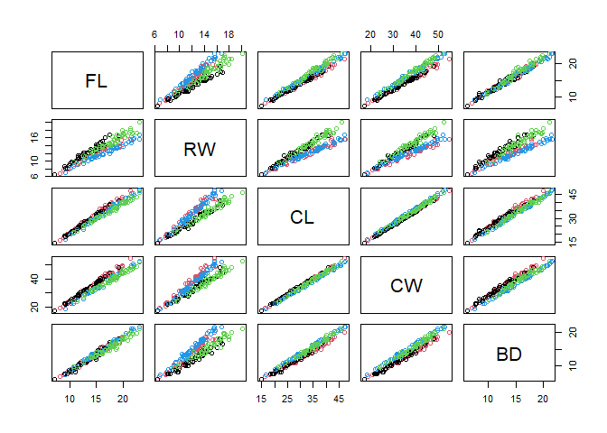<!-- -->

Notamos que existe poca diferenciación: las variables presentan mucha
correlación entre sí. Sin embargo, algunas de ellas están separadas, por
lo que podemos continuar con el análisis. Crearemos otro gráfico,
específicamente el gráfico de coordenadas paralelas, que en este caso
resulta ser más informativo.

``` r
require(lattice)
```

    ## Caricamento del pacchetto richiesto: lattice

``` r
parallelplot(~crabs[,4:8]|spex,data=crabs) 
```

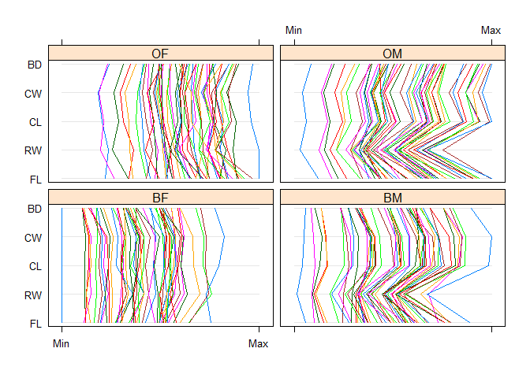<!-- -->

Podemos utilizar también gráficos del tipo *splom* (visualización basata
sobre una matriz de gráficos de dispersión). Este gráfico nos anticipa
que los clasificadores van a tener un rendimiento alto.

``` r
require(car)
```

    ## Caricamento del pacchetto richiesto: car

    ## Warning: il pacchetto 'car' è stato creato con R versione 4.2.3

    ## Caricamento del pacchetto richiesto: carData

    ## Warning: il pacchetto 'carData' è stato creato con R versione 4.2.3

``` r
scatterplotMatrix(~BD+CW+CL+RW+FL | spex, 
                  regLine=FALSE, smooth=TRUE,      
                 diagonal=list(method="density"), by.groups=TRUE, data=crabs)
```

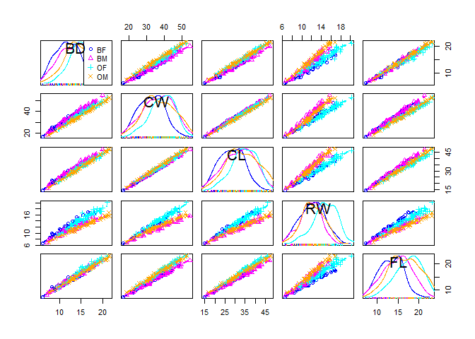<!-- -->

# Pre-Procesamiento y Selección de Características

Utilizamos el paquete CARET:

``` r
library(caret)
```

    ## Warning: il pacchetto 'caret' è stato creato con R versione 4.2.3

    ## Caricamento del pacchetto richiesto: ggplot2

    ## Warning: il pacchetto 'ggplot2' è stato creato con R versione 4.2.3

Puede que haya variables con muy poca variabilidad que podrían
suprimirse al formar los clasificadores. La función `nearZeroVar` nos
ayuda a buscar estas variables y puede proporcionarnos información sobre
la granularidad de los valores (como un ratio de frecuencias) y el
porcentaje de valores únicos (diferentes).

``` r
nzv<-nearZeroVar(crabs, saveMetrics= TRUE)
(1:4)[nzv$nzv]  #nos dice cuales variables tienen varianza casi nula
```

    ## integer(0)

``` r
(1:4)[nzv$zeroVar]  #nos dice cuales variables tienen varianza nula
```

    ## integer(0)

``` r
iremove<-(1:4)[nzv$nzv]  #quito las variables con varianza casi nula
```

En este caso, no hay variables con varianza casi nula o nula, por lo que
no tenemos que eliminar ninguna de ellas.

Ahora analizamos las correlaciones entre variables, estableciendo un
umbral igual a 0.75. Si hubiera variables altamente correlacionadas,
podríamos considerar eliminar algunas de ellas. En este caso, existen
dos funciones que nos permiten buscar estas relaciones: - La función
`findCorrelation` busca a través de una matriz de correlación y devuelve
un vector de números enteros correspondientes a las columnas que se
deben eliminar para reducir las correlaciones por pares. - La función
`findLinearCombos` nos indica qué variables forman un combo lineal, lo
que nos permite identificar aquellas que podríamos eliminar.

``` r
findCorrelation(cor(crabs[,(4:8)]), cutoff=.75)
```

    ## [1] 3 1 4 2

``` r
findLinearCombos(crabs[,(4:8)])
```

    ## $linearCombos
    ## list()
    ## 
    ## $remove
    ## NULL

En este caso no es necesario eliminar ninguna columna.

En `caret`, tenemos una función que busca proporcionarnos una
importancia a priori de cada variable con respecto a la variable de
clasificación. La medida de importancia de este filtro se basa en el
Área Bajo la Curva (AUC) de cada variable por separado. Dado que se
trata de un problema multiclase, la curva ROC se calcula de forma uno a
uno: se calculan todas las AUC y se toma el máximo como medida de
importancia de la variable. Calculemos entonces el filtro a priori de
importancia de las variables. La función `findLinearCombos` especifica
los motores para la importancia de las variables, modelo por modelo.
Además, la función `apply` devuelve un vector/matriz/lista de valores
obtenidos al aplicar una función a los márgenes de una matriz, y su
salida se utiliza como entrada para la función sort().

``` r
rocVarImp<-filterVarImp(x = crabs[,(4:8)], y = as.factor(crabs$spex))

require(dplyr)
```

    ## Caricamento del pacchetto richiesto: dplyr

    ## Warning: il pacchetto 'dplyr' è stato creato con R versione 4.2.3

    ## 
    ## Caricamento pacchetto: 'dplyr'

    ## Il seguente oggetto è mascherato da 'package:car':
    ## 
    ##     recode

    ## Il seguente oggetto è mascherato da 'package:MASS':
    ## 
    ##     select

    ## I seguenti oggetti sono mascherati da 'package:stats':
    ## 
    ##     filter, lag

    ## I seguenti oggetti sono mascherati da 'package:base':
    ## 
    ##     intersect, setdiff, setequal, union

``` r
apply(rocVarImp, 1, mean) %>% sort()
```

    ##      CW      CL      RW      BD      FL 
    ## 0.70335 0.73090 0.74575 0.78180 0.80015

``` r
matrix(apply(rocVarImp, 1, mean)[1:4] , ncol=2, byrow=TRUE)[2:1, ]%>%
image()
```

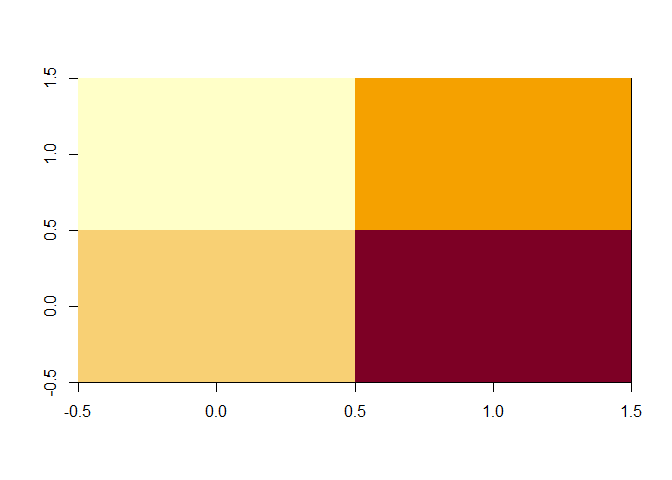<!-- -->

Podemos observar las diferentes importancias; por ejemplo, la variable
CW parece tener menor importancia para la clasificación, mientras que la
variable FL es mucho más relevante.

Un último aspecto a considerar es el equilibrio entre las clases. Si
existe un desequilibrio significativo entre las clases, debemos
contemplar algún procedimiento para que el proceso de entrenamiento se
realice con clases más equilibradas.

``` r
prop.table(table(crabs$spex)) * 100
```

    ## 
    ## BF BM OF OM 
    ## 25 25 25 25

El resultado indica un alto grado de equilibrio.

Las Componentes Principales (CP) son combinaciones lineales de las
variables originales, que nos proporcionan una colección ordenada de
nuevas variables. De la primera a la última CP, cada una captura más
variabilidad original y es incorrelada con las anteriores. Ahora
procederemos a calcular las Componentes Principales de las variables
numéricas, coloreadas por la etiqueta `spex`.

``` r
crabs.PC <- princomp(~BD+CW+CL+RW+FL, cor=TRUE, 
  data=crabs)
  cat("\nComponent loadings:\n")
```

    ## 
    ## Component loadings:

``` r
  print(unclass(loadings(crabs.PC)))
```

    ##       Comp.1     Comp.2      Comp.3       Comp.4      Comp.5
    ## BD 0.4511336  0.2643219  0.44316103  0.706636423  0.17574331
    ## CW 0.4511127  0.1805959 -0.65256956 -0.089187816  0.57452672
    ## CL 0.4531910  0.2682381 -0.30968155  0.001444633 -0.79168267
    ## RW 0.4280774 -0.8981307 -0.01197915  0.083703203 -0.05441759
    ## FL 0.4520437  0.1375813  0.53076841 -0.696923372  0.09649156

``` r
  cat("\nComponent variances:\n")
```

    ## 
    ## Component variances:

``` r
  print(crabs.PC$sd^2)
```

    ##      Comp.1      Comp.2      Comp.3      Comp.4      Comp.5 
    ## 4.788834784 0.151685207 0.046632974 0.011135357 0.001711678

``` r
  cat("\n")
```

``` r
  print(summary(crabs.PC))
```

    ## Importance of components:
    ##                          Comp.1     Comp.2      Comp.3      Comp.4       Comp.5
    ## Standard deviation     2.188341 0.38946785 0.215946693 0.105524202 0.0413724263
    ## Proportion of Variance 0.957767 0.03033704 0.009326595 0.002227071 0.0003423355
    ## Cumulative Proportion  0.957767 0.98810400 0.997430593 0.999657664 1.0000000000

``` r
  crabs <- within(crabs, {
    PC2 <- crabs.PC$scores[,2]
    PC1 <- crabs.PC$scores[,1]
  }) # añadimos las dos primeras Componentes Principales a crabs
```

Si consideramos las dos primeras Componentes Principales (CP), podemos
representar los datos en un gráfico de dispersión. Este gráfico nos
permite visualizar el grado de separación entre los datos, detectar la
presencia de outliers o posibles no linealidades en su relación. Para
ello, visualizamos los datos en el plano definido por las dos primeras
CP y añadimos las curvas de nivel de densidades normales ajustadas a
cada grupo.

``` r
scatterplot(PC2~PC1 | spex, regLine=FALSE, smooth=FALSE, boxplots=FALSE, 
  ellipse=list(levels=c(.25, .5, .9, .95)), by.groups=TRUE, data=crabs)
```

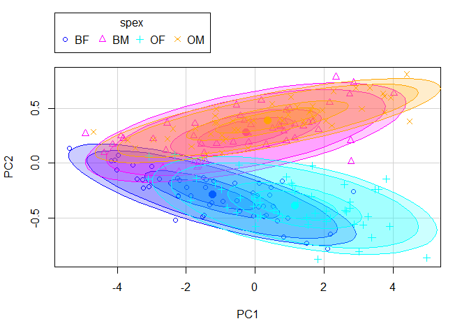<!-- -->

Desde este gráfico, podemos observar que la separación no está bien
definida, por lo que no sería recomendable trabajar únicamente con las
Componentes Principales.

## Particionamiento del Conjunto de Datos

El particionamiento del conjunto inicial en varios subconjuntos es
necesario para obtener estimaciones de parámetros o del error de mala
clasificación que sean generalizables y para evitar el sobreajuste. La
función `createDataPartition` automatiza algunos procedimientos que
simplifican esta tarea.

En nuestro caso, vamos a particionar la muestra `Crabs` en una parte
($70\%$) para el entrenamiento y el resto ($30\%$) para el ajuste de
parámetros.

``` r
set.seed(825)   # permite la reproducibildiad de resultados

inTraining <- createDataPartition(crabs$spex, p = .7, list = FALSE)

#para el entrenamiento:
crabs_pureX <- crabs[inTraining,(4:8)]
crabs_pureY <- factor(crabs$spex[inTraining])

#no de entrenamiento:
crabs_tuneX  <- crabs[-inTraining,(4:8)]
crabs_tuneY <- factor(crabs$spex[-inTraining])

crabs_pure <- crabs[inTraining,(4:9)]
```

# Clasificación

## Planificación del procedimiento de entrenamiento

Realizamos el entrenamiento utilizando validación cruzada repetida.

``` r
require(caret)
fitControl <- trainControl(
  method = "repeatedcv",  # validación cruzada repetida
  number = 5,
  summaryFunction= multiClassSummary,  # función de resumen
  repeats = 3, # repetimos 3 veces
  verboseIter = FALSE )
```

## Primer Clasificador: K-nn

Este es un clasificador sencillo con pocos parámetros adicionales.

Seleccionamos una rejilla para el único parámetro a ajustar, $k$.

``` r
knngrid<-expand.grid(k=1:6)  # número de vecinos

set.seed(825) 
knnFit <- train(crabs_pureX, crabs_pureY,  #X e Y de entrenamiento, 
                method = "knn", 
                trControl = fitControl,  
                preProc = c("center", "scale"),  # voy a centrar y escalar
                tuneGrid = knngrid)

trellis.par.set(caretTheme())
plot(knnFit)
```

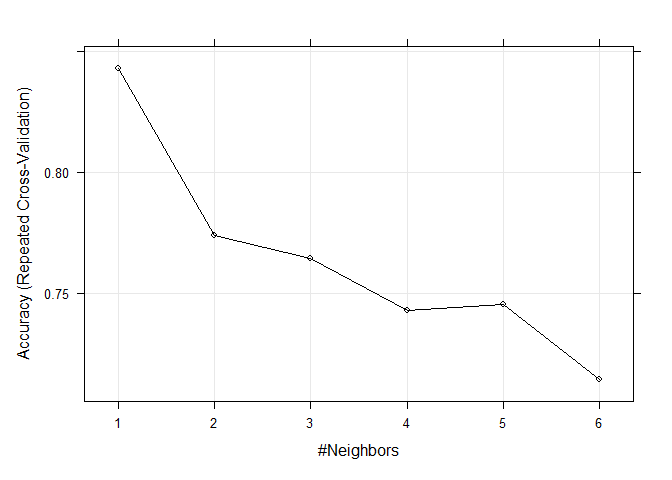<!-- -->

``` r
confusionMatrix(predict(knnFit, newdata=crabs_tuneX), crabs_tuneY)
```

    ## Confusion Matrix and Statistics
    ## 
    ##           Reference
    ## Prediction BF BM OF OM
    ##         BF 12  1  1  0
    ##         BM  2 14  0  2
    ##         OF  1  0 14  0
    ##         OM  0  0  0 13
    ## 
    ## Overall Statistics
    ##                                           
    ##                Accuracy : 0.8833          
    ##                  95% CI : (0.7743, 0.9518)
    ##     No Information Rate : 0.25            
    ##     P-Value [Acc > NIR] : < 2.2e-16       
    ##                                           
    ##                   Kappa : 0.8444          
    ##                                           
    ##  Mcnemar's Test P-Value : NA              
    ## 
    ## Statistics by Class:
    ## 
    ##                      Class: BF Class: BM Class: OF Class: OM
    ## Sensitivity             0.8000    0.9333    0.9333    0.8667
    ## Specificity             0.9556    0.9111    0.9778    1.0000
    ## Pos Pred Value          0.8571    0.7778    0.9333    1.0000
    ## Neg Pred Value          0.9348    0.9762    0.9778    0.9574
    ## Prevalence              0.2500    0.2500    0.2500    0.2500
    ## Detection Rate          0.2000    0.2333    0.2333    0.2167
    ## Detection Prevalence    0.2333    0.3000    0.2500    0.2167
    ## Balanced Accuracy       0.8778    0.9222    0.9556    0.9333

Al observar el gráfico, queremos evaluar cómo ha funcionado el modelo.
La precisión más alta se obtiene con $k=1$ vecino, aunque las
precisiones son bastante similares.

La función `confusionMatrix` calcula una tabla cruzada de clases
observadas y predichas en un nuevo conjunto de datos utilizando el mejor
modelo. En la matriz de confusión, casi todos los valores están en la
diagonal, y la precisión (accuracy) es del 88%. La Tasa de No
Información (No Information Rate) es el porcentaje de buena calificación
al asignar etiquetas al azar, y es igual al 25%.

## Segundo Clasificador: SVM con Base Radial

Para este clasificador, podemos elegir varios valores de sigma (un
parámetro que controla la suavidad del límite de decisión) y C (el
parámetro de regularización que equilibra la obtención de un margen alto
y la correcta clasificación de todos los puntos de entrenamiento).
Realizaremos quince réplicas de validación cruzada.

``` r
require(kernlab)
```

    ## Caricamento del pacchetto richiesto: kernlab

    ## 
    ## Caricamento pacchetto: 'kernlab'

    ## Il seguente oggetto è mascherato da 'package:ggplot2':
    ## 
    ##     alpha

``` r
svmgrid<- expand.grid(sigma=c(0.1, 0.5, 0.9, 1.5), C=c(0.1, 0.5, 1, 1.5))

set.seed(825)
svmBRFit<- train(crabs_pureX, crabs_pureY, method = "svmRadial", 
              trControl = fitControl,  
              preProc = c("center", "scale"),
              tuneGrid=svmgrid,
              prob.model=TRUE) # probability = TRUE
```

    ## Warning in nominalTrainWorkflow(x = x, y = y, wts = weights, info = trainInfo,
    ## : There were missing values in resampled performance measures.

``` r
trellis.par.set(caretTheme())
plot(svmBRFit)
```

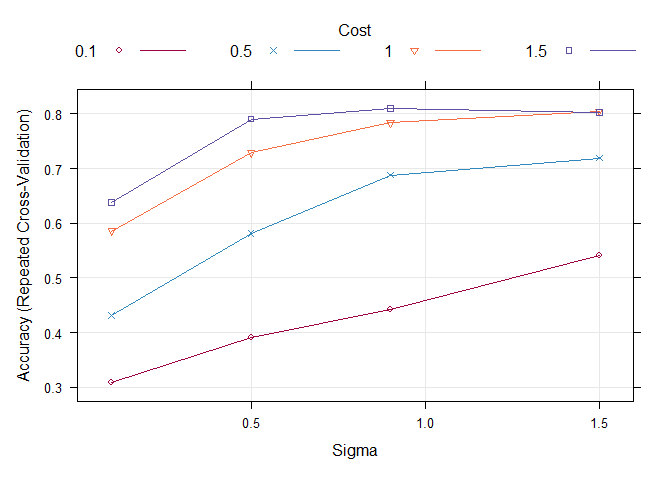<!-- -->

``` r
confusionMatrix(predict(svmBRFit, newdata=crabs_tuneX), crabs_tuneY)
```

    ## Confusion Matrix and Statistics
    ## 
    ##           Reference
    ## Prediction BF BM OF OM
    ##         BF 13  3  3  1
    ##         BM  1 12  0  1
    ##         OF  1  0 12  3
    ##         OM  0  0  0 10
    ## 
    ## Overall Statistics
    ##                                          
    ##                Accuracy : 0.7833         
    ##                  95% CI : (0.658, 0.8793)
    ##     No Information Rate : 0.25           
    ##     P-Value [Acc > NIR] : < 2.2e-16      
    ##                                          
    ##                   Kappa : 0.7111         
    ##                                          
    ##  Mcnemar's Test P-Value : NA             
    ## 
    ## Statistics by Class:
    ## 
    ##                      Class: BF Class: BM Class: OF Class: OM
    ## Sensitivity             0.8667    0.8000    0.8000    0.6667
    ## Specificity             0.8444    0.9556    0.9111    1.0000
    ## Pos Pred Value          0.6500    0.8571    0.7500    1.0000
    ## Neg Pred Value          0.9500    0.9348    0.9318    0.9000
    ## Prevalence              0.2500    0.2500    0.2500    0.2500
    ## Detection Rate          0.2167    0.2000    0.2000    0.1667
    ## Detection Prevalence    0.3333    0.2333    0.2667    0.1667
    ## Balanced Accuracy       0.8556    0.8778    0.8556    0.8333

En primer lugar, al observar el gráfico, queremos evaluar cómo ha
funcionado el modelo. El eje horizontal representa el valor de sigma:
valores más bajos pueden llevar a un modelo más complejo y ajustado a
los datos de entrenamiento, mientras que valores más altos pueden
suavizar la frontera y potencialmente mejorar la generalización. El eje
vertical muestra la precisión del modelo, es decir, cuántas
clasificaciones fueron correctas. Valores más altos indican un mejor
rendimiento del modelo. Las líneas de diferentes colores
(correspondientes a diferentes valores del parámetro C) muestran una
tendencia ascendente a medida que sigma aumenta, lo que sugiere que el
modelo mejora su precisión con un sigma más alto. La precisión más alta
se obtiene para sigma=0.9 y C=1.5.

En la matriz de confusión, casi todos los valores están en la diagonal,
y la precisión (accuracy) es del 88%. La Tasa de No Información (No
Information Rate) es del 25%.

# Comparación de Clasificadores I

Una ventaja de haber utilizado la misma semilla y el mismo esquema de
entrenamiento es la posibilidad de comparar dos o más modelos entre sí.
Se compara el rendimiento muestra a muestra, ya que se utiliza la misma
partición en todos los clasificadores.

En primer lugar, realizamos un t-test para comparar las medias de las
predicciones de los dos modelos.

``` r
compare_models(knnFit, svmBRFit)
```

    ## 
    ##  One Sample t-test
    ## 
    ## data:  x
    ## t = 1.4506, df = 14, p-value = 0.1689
    ## alternative hypothesis: true mean is not equal to 0
    ## 95 percent confidence interval:
    ##  -0.01595108  0.08261775
    ## sample estimates:
    ##  mean of x 
    ## 0.03333333

El valor p es mayor que el umbral común de 0.05, lo que indica que no
hay una diferencia estadísticamente significativa entre los dos modelos
con un nivel de confianza del 95%. La estimación de la muestra para la
media de x es 0.033, que representa la diferencia promedio entre las
predicciones de los modelos `knnFit` y `svmBRFit`.

Ahora utilizamos la función `resamples` con los dos modelos.

``` r
resamp<- resamples(list(SVM=svmBRFit, KNN=knnFit))
summary(resamp) # compara  modelos en base a sus remuestras comunes
```

    ## 
    ## Call:
    ## summary.resamples(object = resamp)
    ## 
    ## Models: SVM, KNN 
    ## Number of resamples: 15 
    ## 
    ## Accuracy 
    ##          Min.   1st Qu.    Median      Mean   3rd Qu.      Max. NA's
    ## SVM 0.6428571 0.7678571 0.8214286 0.8095238 0.8571429 0.8928571    0
    ## KNN 0.7857143 0.8214286 0.8214286 0.8428571 0.8750000 0.9285714    0
    ## 
    ## Kappa 
    ##          Min.   1st Qu.    Median      Mean   3rd Qu.      Max. NA's
    ## SVM 0.5238095 0.6904762 0.7619048 0.7460317 0.8095238 0.8571429    0
    ## KNN 0.7142857 0.7619048 0.7619048 0.7904762 0.8333333 0.9047619    0
    ## 
    ## Mean_Balanced_Accuracy 
    ##          Min.   1st Qu.    Median      Mean   3rd Qu.      Max. NA's
    ## SVM 0.7619048 0.8452381 0.8809524 0.8730159 0.9047619 0.9285714    0
    ## KNN 0.8571429 0.8809524 0.8809524 0.8952381 0.9166667 0.9523810    0
    ## 
    ## Mean_Detection_Rate 
    ##          Min.   1st Qu.    Median      Mean   3rd Qu.      Max. NA's
    ## SVM 0.1607143 0.1919643 0.2053571 0.2023810 0.2142857 0.2232143    0
    ## KNN 0.1964286 0.2053571 0.2053571 0.2107143 0.2187500 0.2321429    0
    ## 
    ## Mean_F1 
    ##          Min.   1st Qu.   Median      Mean   3rd Qu.      Max. NA's
    ## SVM 0.6289683 0.7597886 0.822549 0.8025377 0.8587905 0.8950549    0
    ## KNN 0.7562500 0.8168949 0.821267 0.8394338 0.8716211 0.9282051    0
    ## 
    ## Mean_Neg_Pred_Value 
    ##          Min.   1st Qu.    Median      Mean   3rd Qu.      Max. NA's
    ## SVM 0.8881988 0.9307720 0.9441229 0.9414770 0.9559659 0.9668972    0
    ## KNN 0.9279221 0.9411597 0.9435277 0.9501586 0.9598826 0.9782609    0
    ## 
    ## Mean_Pos_Pred_Value 
    ##          Min.   1st Qu.    Median      Mean   3rd Qu.      Max. NA's
    ## SVM 0.6519481 0.8271329 0.8556548 0.8440452 0.8885417 0.9250000    0
    ## KNN 0.7777778 0.8333829 0.8416667 0.8591180 0.8953373 0.9444444    0
    ## 
    ## Mean_Precision 
    ##          Min.   1st Qu.    Median      Mean   3rd Qu.      Max. NA's
    ## SVM 0.6519481 0.8271329 0.8556548 0.8440452 0.8885417 0.9250000    0
    ## KNN 0.7777778 0.8333829 0.8416667 0.8591180 0.8953373 0.9444444    0
    ## 
    ## Mean_Recall 
    ##          Min.   1st Qu.    Median      Mean   3rd Qu.      Max. NA's
    ## SVM 0.6428571 0.7678571 0.8214286 0.8095238 0.8571429 0.8928571    0
    ## KNN 0.7857143 0.8214286 0.8214286 0.8428571 0.8750000 0.9285714    0
    ## 
    ## Mean_Sensitivity 
    ##          Min.   1st Qu.    Median      Mean   3rd Qu.      Max. NA's
    ## SVM 0.6428571 0.7678571 0.8214286 0.8095238 0.8571429 0.8928571    0
    ## KNN 0.7857143 0.8214286 0.8214286 0.8428571 0.8750000 0.9285714    0
    ## 
    ## Mean_Specificity 
    ##          Min.   1st Qu.    Median      Mean   3rd Qu.      Max. NA's
    ## SVM 0.8809524 0.9226190 0.9404762 0.9365079 0.9523810 0.9642857    0
    ## KNN 0.9285714 0.9404762 0.9404762 0.9476190 0.9583333 0.9761905    0

Esta función permite verificar que los resultados de remuestreo
coincidan y calcular las estadísticas de rendimiento de los modelos
basadas en 15 remuestreos.

En general, los resultados son muy similares entre los dos modelos. Sin
embargo, el modelo SVM tiene unos valores ligeramente peores que el
modelo K-nn.

A continuación, utilizamos `summary(diff(resamples))` con los dos
modelos.

``` r
summary(diff(resamp))
```

    ## 
    ## Call:
    ## summary.diff.resamples(object = diff(resamp))
    ## 
    ## p-value adjustment: bonferroni 
    ## Upper diagonal: estimates of the difference
    ## Lower diagonal: p-value for H0: difference = 0
    ## 
    ## Accuracy 
    ##     SVM    KNN     
    ## SVM        -0.03333
    ## KNN 0.1689         
    ## 
    ## Kappa 
    ##     SVM    KNN     
    ## SVM        -0.04444
    ## KNN 0.1689         
    ## 
    ## Mean_Balanced_Accuracy 
    ##     SVM    KNN     
    ## SVM        -0.02222
    ## KNN 0.1689         
    ## 
    ## Mean_Detection_Rate 
    ##     SVM    KNN      
    ## SVM        -0.008333
    ## KNN 0.1689          
    ## 
    ## Mean_F1 
    ##     SVM    KNN    
    ## SVM        -0.0369
    ## KNN 0.1761        
    ## 
    ## Mean_Neg_Pred_Value 
    ##     SVM    KNN      
    ## SVM        -0.008682
    ## KNN 0.2073          
    ## 
    ## Mean_Pos_Pred_Value 
    ##     SVM  KNN     
    ## SVM      -0.01507
    ## KNN 0.46         
    ## 
    ## Mean_Precision 
    ##     SVM  KNN     
    ## SVM      -0.01507
    ## KNN 0.46         
    ## 
    ## Mean_Recall 
    ##     SVM    KNN     
    ## SVM        -0.03333
    ## KNN 0.1689         
    ## 
    ## Mean_Sensitivity 
    ##     SVM    KNN     
    ## SVM        -0.03333
    ## KNN 0.1689         
    ## 
    ## Mean_Specificity 
    ##     SVM    KNN     
    ## SVM        -0.01111
    ## KNN 0.1689

Esta función realiza una comparación del rendimiento entre los modelos,
analizando las diferencias en una variedad de métricas. En este caso,
las diferencias son mínimas y no son estadísticamente significativas.

También queremos hacer los gráficos:

``` r
densityplot(resamp, metric=resamp$metric[1])
```

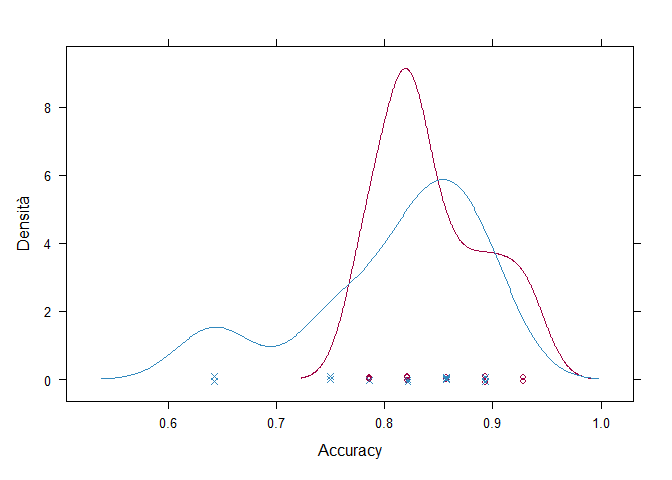<!-- -->

``` r
dotplot(resamp, metric=resamp$metric[1])
```

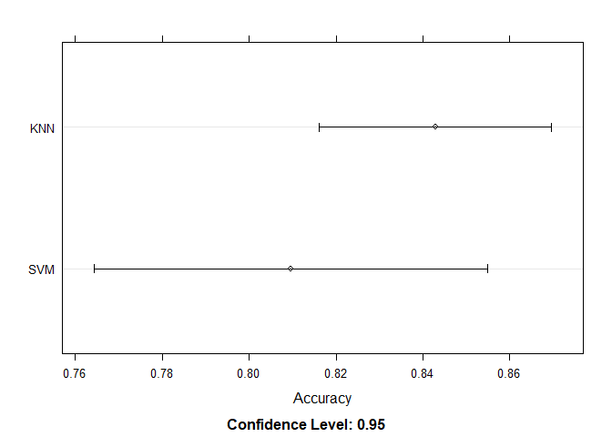<!-- -->

``` r
bwplot(resamp, metric=resamp$metric[1])
```

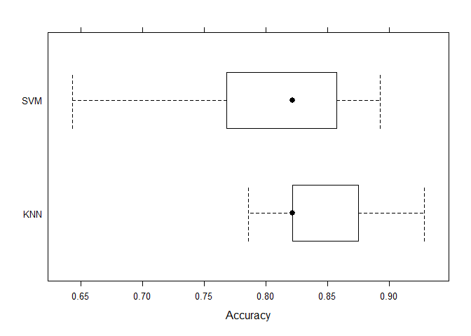<!-- -->

``` r
splom(resamp)
```

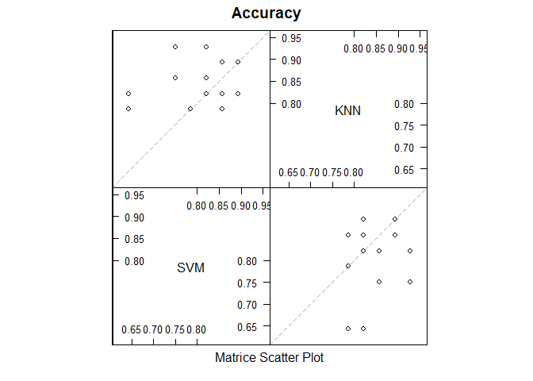<!-- -->

Sobre estos datos, el modelo K-nn parece dar un rendimiento ligeramente
mejor como clasificador que el SVM con Base Radial.

## curvas ROC para clasificadores multi-etiqueta

Queremos obtener las curvas ROC y los valores AUC. Las curvas ROC ayudan
a evaluar el rendimiento de un modelo de clasificación en función de su
capacidad para distinguir entre diferentes clases. El eje X del gráfico
representa la especificidad (tasa de falsos positivos) y varía de 0.00 a
1.00, el eje Y representa la sensibilidad (tasa de verdaderos positivos)
y varía de 0.00 a 1.00. La línea diagonal punteada desde (0,0) hasta
(1,1) representa el rendimiento de un clasificador aleatorio. Cuanto más
cerca esté la curva del vértice superior izquierdo (punto ideal), mejor
será el rendimiento del modelo.El área bajo la curva (valores AUC) es un
indicador del rendimiento global del modelo. Un AUC cercano a 1.00
sugiere un modelo excelente.

En clasificación NO binaria, las curvas ROC se deben ajustar. Hay dos
posibilidades: `One-to-One`y `One-to-rest`. Vamos a usar la librería
`multiROC` para obtener gráficos ROC de cada categoría relativa al resto
y también una medida micro y macro asociadas.

### Curvas ROC del modelo k-nn

El área bajo las curvas parece ser bastante grande, lo cual sugiere un
buen rendimiento del modelo. De hecho, los valores de AUC están cercanos
a 1, lo que indica que el clasificador k-nn está funcionando bien en la
mayoría de las categorías, con una clasificación muy alta en la
categoría ‘BM’ (0.994).

``` r
require(multiROC)
```

    ## Caricamento del pacchetto richiesto: multiROC

    ## Warning: il pacchetto 'multiROC' è stato creato con R versione 4.2.3

``` r
## preprocesamiento
true_label<-data.frame(class2ind(crabs_tuneY))
colnames(true_label)<- paste(colnames(true_label), "_true")
pred_knn<-data.frame(predict(knnFit,newdata=crabs_tuneX, type="prob"))
colnames(pred_knn)<- paste(colnames(pred_knn), "_pred_knn")
final_knn<-cbind(true_label,pred_knn)

## llamada principal
roc_knn <- multi_roc(final_knn, force_diag=T)
```

    ## Warning in regularize.values(x, y, ties, missing(ties), na.rm = na.rm): si
    ## riduce a valori unici di 'x'

    ## Warning in regularize.values(x, y, ties, missing(ties), na.rm = na.rm): si
    ## riduce a valori unici di 'x'

    ## Warning in regularize.values(x, y, ties, missing(ties), na.rm = na.rm): si
    ## riduce a valori unici di 'x'

    ## Warning in regularize.values(x, y, ties, missing(ties), na.rm = na.rm): si
    ## riduce a valori unici di 'x'

``` r
plot_roc_knn<-plot_roc_data(roc_knn)

## valores de AUC
unlist(roc_knn$AUC)
```

    ##   knn.BF    knn.BM    knn.OF    knn.OM  knn.macro knn.micro 
    ## 0.9111111 0.9940741 0.9125926 0.9111111 0.9298148 0.9252778

``` r
## representación gráfica
require(ggplot2)
ggplot(plot_roc_knn, aes(x = 1-Specificity, y=Sensitivity)) +
  geom_path(aes(color = Group, linetype=Method), linewidth=1.5) +
  geom_segment(aes(x = 0, y = 0, xend = 1, yend = 1), 
               colour='grey', linetype = 'dotdash') +
  theme_bw() + 
  theme(plot.title = element_text(hjust = 0.5), 
        legend.justification=c(1, 0), legend.position=c(.95, .05),
        legend.title=element_blank(), 
        legend.background = element_rect(fill=NULL, linewidth=0.5, 
                                         linetype="solid", colour ="black"))
```

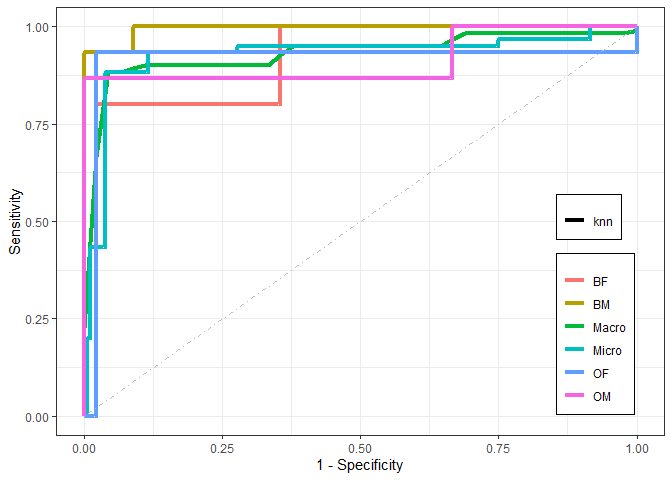<!-- -->

### Curvas ROC del modelo SVM

El área bajo las curvas parece ser bastante grande, lo cual sugiere un
buen rendimiento del modelo. De hecho, los valores de AUC están cercanos
a 1, lo que indica que el clasificador SVM está funcionando bien en la
mayoría de las categorías, con una clasificación casi perfecta en la
categoría ‘OM’ (0.999).

``` r
require(multiROC)

## preprocesamiento
pred_svm<-data.frame(predict(svmBRFit,newdata=crabs_tuneX, type="prob"))
colnames(pred_svm)<- paste(colnames(pred_svm), "_pred_svm")
final_svm<-cbind(true_label,pred_svm)

## llamada principal
roc_svm <- multi_roc(final_svm, force_diag=T)
```

    ## Warning in regularize.values(x, y, ties, missing(ties), na.rm = na.rm): si
    ## riduce a valori unici di 'x'

    ## Warning in regularize.values(x, y, ties, missing(ties), na.rm = na.rm): si
    ## riduce a valori unici di 'x'

    ## Warning in regularize.values(x, y, ties, missing(ties), na.rm = na.rm): si
    ## riduce a valori unici di 'x'

    ## Warning in regularize.values(x, y, ties, missing(ties), na.rm = na.rm): si
    ## riduce a valori unici di 'x'

``` r
plot_roc_svm<-plot_roc_data(roc_svm)

## valores de AUC
unlist(roc_svm$AUC)
```

    ##   svm.BF    svm.BM    svm.OF    svm.OM  svm.macro svm.micro 
    ## 0.9185185 0.9540741 0.9214815 0.9985185 0.9442593 0.9390741

``` r
## representación gráfica
require(ggplot2)
ggplot(plot_roc_svm, aes(x = 1-Specificity, y=Sensitivity)) +
  geom_path(aes(color = Group, linetype=Method), linewidth=1.5) +
  geom_segment(aes(x = 0, y = 0, xend = 1, yend = 1), 
               colour='grey', linetype = 'dotdash') +
  theme_bw() + 
  theme(plot.title = element_text(hjust = 0.5), 
        legend.justification=c(1, 0), legend.position=c(.95, .05),
        legend.title=element_blank(), 
        legend.background = element_rect(fill=NULL, linewidth=0.5, 
                                         linetype="solid", colour ="black"))
```

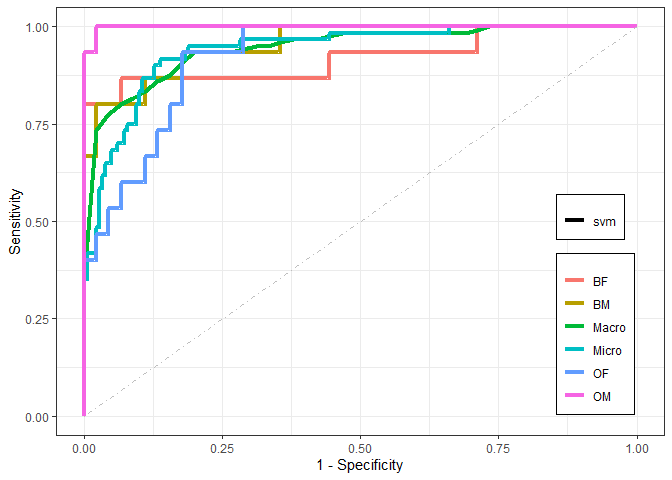<!-- -->

# Ensemble Models

Los modelos GBM (Gradient Boosting Machines) se han revelado en los
últimos años como unos algoritmos de aprendizaje muy competitivos.
Permiten rapidez (paralelismo y stochastic gradient), flexibilidad en
las funciones de pérdida que se pueden optimizar y aplicabilidad a
conjuntos de datos con poco o nulo preprocesamiento. Al tratarse de
métodos de ‘consenso’, siguen siendo modelos en algunos casos difíciles
de interpretación. También dependen de numerosos hiperparámetros que en
ocasiones interactúan y dificultan o ralentizan el ‘ajuste’ óptimo de
los algoritmos al intentar evitar el sobreajuste.

Ahora queremos ajustar un modelo de tipo GBM para nuestros datos,
optimizando algunos de sus hiperparámetros. En primer lugar, creamos un
mallado de hiperparámetros. Luego utilizamos `train` con method=`gbm` e
indicamos los hiperparámetros seleccionados.

``` r
gbmgrid<-expand.grid(shrinkage=c(0.1, 0.01),
                     n.trees=c(1000,  2000), 
                     interaction.depth=1:2,
                     n.minobsinnode=5
                     )
set.seed(825)
gbmFit <- train(crabs_pureX, crabs_pureY, method = "gbm", 
                trControl = fitControl,  
                tuneGrid = gbmgrid,
                verbose = FALSE)
trellis.par.set(caretTheme())
plot(gbmFit)
```

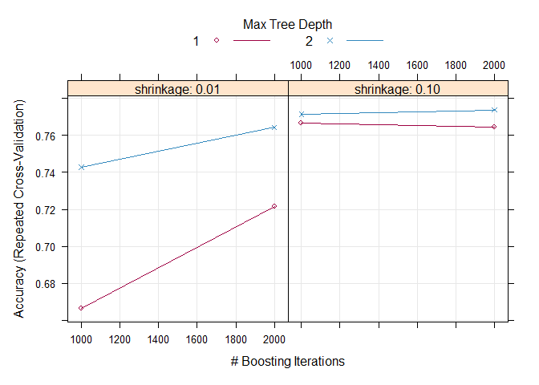<!-- -->

``` r
print(gbmFit)
```

    ## Stochastic Gradient Boosting 
    ## 
    ## 140 samples
    ##   5 predictor
    ##   4 classes: 'BF', 'BM', 'OF', 'OM' 
    ## 
    ## No pre-processing
    ## Resampling: Cross-Validated (5 fold, repeated 3 times) 
    ## Summary of sample sizes: 112, 112, 112, 112, 112, 112, ... 
    ## Resampling results across tuning parameters:
    ## 
    ##   shrinkage  interaction.depth  n.trees  Accuracy   Kappa      Mean_F1  
    ##   0.01       1                  1000     0.6666667  0.5555556  0.6627254
    ##   0.01       1                  2000     0.7214286  0.6285714  0.7168129
    ##   0.01       2                  1000     0.7428571  0.6571429  0.7377060
    ##   0.01       2                  2000     0.7642857  0.6857143  0.7614535
    ##   0.10       1                  1000     0.7666667  0.6888889  0.7643352
    ##   0.10       1                  2000     0.7642857  0.6857143  0.7606195
    ##   0.10       2                  1000     0.7714286  0.6952381  0.7683498
    ##   0.10       2                  2000     0.7738095  0.6984127  0.7721948
    ##   Mean_Sensitivity  Mean_Specificity  Mean_Pos_Pred_Value  Mean_Neg_Pred_Value
    ##   0.6666667         0.8888889         0.6935949            0.8920319          
    ##   0.7214286         0.9071429         0.7401063            0.9103882          
    ##   0.7428571         0.9142857         0.7549008            0.9171503          
    ##   0.7642857         0.9214286         0.7835185            0.9239228          
    ##   0.7666667         0.9222222         0.7841246            0.9244899          
    ##   0.7642857         0.9214286         0.7789153            0.9239400          
    ##   0.7714286         0.9238095         0.7943122            0.9263835          
    ##   0.7738095         0.9246032         0.7926389            0.9268302          
    ##   Mean_Precision  Mean_Recall  Mean_Detection_Rate  Mean_Balanced_Accuracy
    ##   0.6935949       0.6666667    0.1666667            0.7777778             
    ##   0.7401063       0.7214286    0.1803571            0.8142857             
    ##   0.7549008       0.7428571    0.1857143            0.8285714             
    ##   0.7835185       0.7642857    0.1910714            0.8428571             
    ##   0.7841246       0.7666667    0.1916667            0.8444444             
    ##   0.7789153       0.7642857    0.1910714            0.8428571             
    ##   0.7943122       0.7714286    0.1928571            0.8476190             
    ##   0.7926389       0.7738095    0.1934524            0.8492063             
    ## 
    ## Tuning parameter 'n.minobsinnode' was held constant at a value of 5
    ## Accuracy was used to select the optimal model using the largest value.
    ## The final values used for the model were n.trees = 2000, interaction.depth =
    ##  2, shrinkage = 0.1 and n.minobsinnode = 5.

``` r
confusionMatrix(predict(gbmFit, newdata=crabs_tuneX), crabs_tuneY, positive="Yes")
```

    ## Confusion Matrix and Statistics
    ## 
    ##           Reference
    ## Prediction BF BM OF OM
    ##         BF  8  1  0  0
    ##         BM  4 13  0  1
    ##         OF  3  0 15  3
    ##         OM  0  1  0 11
    ## 
    ## Overall Statistics
    ##                                          
    ##                Accuracy : 0.7833         
    ##                  95% CI : (0.658, 0.8793)
    ##     No Information Rate : 0.25           
    ##     P-Value [Acc > NIR] : < 2.2e-16      
    ##                                          
    ##                   Kappa : 0.7111         
    ##                                          
    ##  Mcnemar's Test P-Value : NA             
    ## 
    ## Statistics by Class:
    ## 
    ##                      Class: BF Class: BM Class: OF Class: OM
    ## Sensitivity             0.5333    0.8667    1.0000    0.7333
    ## Specificity             0.9778    0.8889    0.8667    0.9778
    ## Pos Pred Value          0.8889    0.7222    0.7143    0.9167
    ## Neg Pred Value          0.8627    0.9524    1.0000    0.9167
    ## Prevalence              0.2500    0.2500    0.2500    0.2500
    ## Detection Rate          0.1333    0.2167    0.2500    0.1833
    ## Detection Prevalence    0.1500    0.3000    0.3500    0.2000
    ## Balanced Accuracy       0.7556    0.8778    0.9333    0.8556

El gráfico muestra los resultados de un modelo GBM aplicado a los datos.
El eje horizontal generalmente representa alguna variable o
característica. El eje vertical muestra la respuesta o el resultado del
modelo. Observamos que los puntos en el gráfico están agrupados cerca de
una línea diagonal, lo que indica que el modelo está ajustando bien los
datos. La precisión más alta se obtiene con una tasa de aprendizaje de
0.1 (2000 árboles) y una profundidad de interacción de 2.

En la matriz de confusión, casi todos los valores están en la diagonal,
y la precisión (accuracy) es del 78%. La Tasa de No Información (No
Information Rate) es del 25%.

## Comparación de Clasificadores II

En esta sección, ampliamos la comparativa entre clasificadores al
incluir el modelo gbm.

Para comenzar, realizamos un t-test para comparar las medias de las
predicciones de los tres modelos.

``` r
compare_models(knnFit, svmBRFit)
```

    ## 
    ##  One Sample t-test
    ## 
    ## data:  x
    ## t = 1.4506, df = 14, p-value = 0.1689
    ## alternative hypothesis: true mean is not equal to 0
    ## 95 percent confidence interval:
    ##  -0.01595108  0.08261775
    ## sample estimates:
    ##  mean of x 
    ## 0.03333333

``` r
compare_models(knnFit, gbmFit)
```

    ## 
    ##  One Sample t-test
    ## 
    ## data:  x
    ## t = 3.2365, df = 14, p-value = 0.005971
    ## alternative hypothesis: true mean is not equal to 0
    ## 95 percent confidence interval:
    ##  0.0232910 0.1148042
    ## sample estimates:
    ##  mean of x 
    ## 0.06904762

``` r
compare_models(svmBRFit, gbmFit)
```

    ## 
    ##  One Sample t-test
    ## 
    ## data:  x
    ## t = 1.4491, df = 14, p-value = 0.1693
    ## alternative hypothesis: true mean is not equal to 0
    ## 95 percent confidence interval:
    ##  -0.01714441  0.08857298
    ## sample estimates:
    ##  mean of x 
    ## 0.03571429

Ya hemos observado que no existe una diferencia estadísticamente
significativa entre los modelos knnFit y svmBRFit, con un nivel de
confianza del 95%. También no hay una diferencia estadísticamente
significativa entre los modelos gbmFit y svmBRFit. Sin embargo, al
comparar gbmFit con knnFit, el valor p es menor que 0.05, lo que indica
una diferencia estadísticamente significativa entre los modelos, también
con un nivel de confianza del 95%.

Ahora procederemos a utilizar la función `resamples` con los tres
modelos.

``` r
resamp<- resamples(list(SVM=svmBRFit, KNN=knnFit, GBM=gbmFit))
summary(resamp) # compara los modelos
```

    ## 
    ## Call:
    ## summary.resamples(object = resamp)
    ## 
    ## Models: SVM, KNN, GBM 
    ## Number of resamples: 15 
    ## 
    ## Accuracy 
    ##          Min.   1st Qu.    Median      Mean   3rd Qu.      Max. NA's
    ## SVM 0.6428571 0.7678571 0.8214286 0.8095238 0.8571429 0.8928571    0
    ## KNN 0.7857143 0.8214286 0.8214286 0.8428571 0.8750000 0.9285714    0
    ## GBM 0.5714286 0.7321429 0.7857143 0.7738095 0.8392857 0.8928571    0
    ## 
    ## Kappa 
    ##          Min.   1st Qu.    Median      Mean   3rd Qu.      Max. NA's
    ## SVM 0.5238095 0.6904762 0.7619048 0.7460317 0.8095238 0.8571429    0
    ## KNN 0.7142857 0.7619048 0.7619048 0.7904762 0.8333333 0.9047619    0
    ## GBM 0.4285714 0.6428571 0.7142857 0.6984127 0.7857143 0.8571429    0
    ## 
    ## Mean_Balanced_Accuracy 
    ##          Min.   1st Qu.    Median      Mean   3rd Qu.      Max. NA's
    ## SVM 0.7619048 0.8452381 0.8809524 0.8730159 0.9047619 0.9285714    0
    ## KNN 0.8571429 0.8809524 0.8809524 0.8952381 0.9166667 0.9523810    0
    ## GBM 0.7142857 0.8214286 0.8571429 0.8492063 0.8928571 0.9285714    0
    ## 
    ## Mean_Detection_Rate 
    ##          Min.   1st Qu.    Median      Mean   3rd Qu.      Max. NA's
    ## SVM 0.1607143 0.1919643 0.2053571 0.2023810 0.2142857 0.2232143    0
    ## KNN 0.1964286 0.2053571 0.2053571 0.2107143 0.2187500 0.2321429    0
    ## GBM 0.1428571 0.1830357 0.1964286 0.1934524 0.2098214 0.2232143    0
    ## 
    ## Mean_F1 
    ##          Min.   1st Qu.   Median      Mean   3rd Qu.      Max. NA's
    ## SVM 0.6289683 0.7597886 0.822549 0.8025377 0.8587905 0.8950549    0
    ## KNN 0.7562500 0.8168949 0.821267 0.8394338 0.8716211 0.9282051    0
    ## GBM 0.5806277 0.7326215 0.788141 0.7721948 0.8378063 0.8911859    0
    ## 
    ## Mean_Neg_Pred_Value 
    ##          Min.   1st Qu.    Median      Mean   3rd Qu.      Max. NA's
    ## SVM 0.8881988 0.9307720 0.9441229 0.9414770 0.9559659 0.9668972    0
    ## KNN 0.9279221 0.9411597 0.9435277 0.9501586 0.9598826 0.9782609    0
    ## GBM 0.8566573 0.9121803 0.9321640 0.9268302 0.9478924 0.9668972    0
    ## 
    ## Mean_Pos_Pred_Value 
    ##          Min.   1st Qu.    Median      Mean   3rd Qu.      Max. NA's
    ## SVM 0.6519481 0.8271329 0.8556548 0.8440452 0.8885417 0.9250000    0
    ## KNN 0.7777778 0.8333829 0.8416667 0.8591180 0.8953373 0.9444444    0
    ## GBM 0.6245040 0.7560020 0.8035714 0.7926389 0.8541667 0.9131944    0
    ## 
    ## Mean_Precision 
    ##          Min.   1st Qu.    Median      Mean   3rd Qu.      Max. NA's
    ## SVM 0.6519481 0.8271329 0.8556548 0.8440452 0.8885417 0.9250000    0
    ## KNN 0.7777778 0.8333829 0.8416667 0.8591180 0.8953373 0.9444444    0
    ## GBM 0.6245040 0.7560020 0.8035714 0.7926389 0.8541667 0.9131944    0
    ## 
    ## Mean_Recall 
    ##          Min.   1st Qu.    Median      Mean   3rd Qu.      Max. NA's
    ## SVM 0.6428571 0.7678571 0.8214286 0.8095238 0.8571429 0.8928571    0
    ## KNN 0.7857143 0.8214286 0.8214286 0.8428571 0.8750000 0.9285714    0
    ## GBM 0.5714286 0.7321429 0.7857143 0.7738095 0.8392857 0.8928571    0
    ## 
    ## Mean_Sensitivity 
    ##          Min.   1st Qu.    Median      Mean   3rd Qu.      Max. NA's
    ## SVM 0.6428571 0.7678571 0.8214286 0.8095238 0.8571429 0.8928571    0
    ## KNN 0.7857143 0.8214286 0.8214286 0.8428571 0.8750000 0.9285714    0
    ## GBM 0.5714286 0.7321429 0.7857143 0.7738095 0.8392857 0.8928571    0
    ## 
    ## Mean_Specificity 
    ##          Min.   1st Qu.    Median      Mean   3rd Qu.      Max. NA's
    ## SVM 0.8809524 0.9226190 0.9404762 0.9365079 0.9523810 0.9642857    0
    ## KNN 0.9285714 0.9404762 0.9404762 0.9476190 0.9583333 0.9761905    0
    ## GBM 0.8571429 0.9107143 0.9285714 0.9246032 0.9464286 0.9642857    0

Esta función permite verificar que los resultados de remuestreo
coincidan y calcular las estadísticas de rendimiento de los modelos
basadas en 15 remuestreos. Hemos observado que, en general, el modelo
SVM tiene unos valores ligeramente peores que el modelo K-nn. El modelo
GBM también muestra unos valores peores.

A continuación, utilizamos `summary(diff(resamples))` con los tres
modelos.

``` r
summary(diff(resamp))
```

    ## 
    ## Call:
    ## summary.diff.resamples(object = diff(resamp))
    ## 
    ## p-value adjustment: bonferroni 
    ## Upper diagonal: estimates of the difference
    ## Lower diagonal: p-value for H0: difference = 0
    ## 
    ## Accuracy 
    ##     SVM     KNN      GBM     
    ## SVM         -0.03333  0.03571
    ## KNN 0.50676           0.06905
    ## GBM 0.50798 0.01791          
    ## 
    ## Kappa 
    ##     SVM     KNN      GBM     
    ## SVM         -0.04444  0.04762
    ## KNN 0.50676           0.09206
    ## GBM 0.50798 0.01791          
    ## 
    ## Mean_Balanced_Accuracy 
    ##     SVM     KNN      GBM     
    ## SVM         -0.02222  0.02381
    ## KNN 0.50676           0.04603
    ## GBM 0.50798 0.01791          
    ## 
    ## Mean_Detection_Rate 
    ##     SVM     KNN       GBM      
    ## SVM         -0.008333  0.008929
    ## KNN 0.50676            0.017262
    ## GBM 0.50798 0.01791            
    ## 
    ## Mean_F1 
    ##     SVM     KNN      GBM     
    ## SVM         -0.03690  0.03034
    ## KNN 0.52826           0.06724
    ## GBM 0.83562 0.02506          
    ## 
    ## Mean_Neg_Pred_Value 
    ##     SVM    KNN       GBM      
    ## SVM        -0.008682  0.014647
    ## KNN 0.6218            0.023328
    ## GBM 0.2125 0.0164             
    ## 
    ## Mean_Pos_Pred_Value 
    ##     SVM     KNN      GBM     
    ## SVM         -0.01507  0.05141
    ## KNN 1.00000           0.06648
    ## GBM 0.06151 0.02703          
    ## 
    ## Mean_Precision 
    ##     SVM     KNN      GBM     
    ## SVM         -0.01507  0.05141
    ## KNN 1.00000           0.06648
    ## GBM 0.06151 0.02703          
    ## 
    ## Mean_Recall 
    ##     SVM     KNN      GBM     
    ## SVM         -0.03333  0.03571
    ## KNN 0.50676           0.06905
    ## GBM 0.50798 0.01791          
    ## 
    ## Mean_Sensitivity 
    ##     SVM     KNN      GBM     
    ## SVM         -0.03333  0.03571
    ## KNN 0.50676           0.06905
    ## GBM 0.50798 0.01791          
    ## 
    ## Mean_Specificity 
    ##     SVM     KNN      GBM     
    ## SVM         -0.01111  0.01190
    ## KNN 0.50676           0.02302
    ## GBM 0.50798 0.01791

Esta función realiza una comparación del rendimiento entre los modelos,
analizando las diferencias en una variedad de métricas. En este caso, el
KNN parece ser el algoritmo más sólido en términos de rendimiento en
estas métricas.

Además, queremos crear los gráficos:

``` r
densityplot(resamp, metric=resamp$metric[1])
```

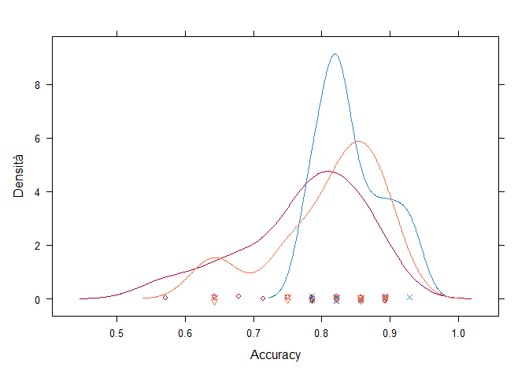<!-- -->

``` r
dotplot(resamp, metric=resamp$metric[1])
```

<!-- -->

``` r
bwplot(resamp, metric=resamp$metric[1])
```

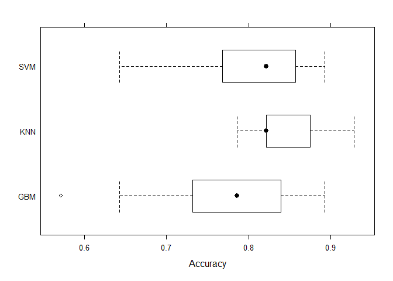<!-- -->

``` r
splom(resamp)
```

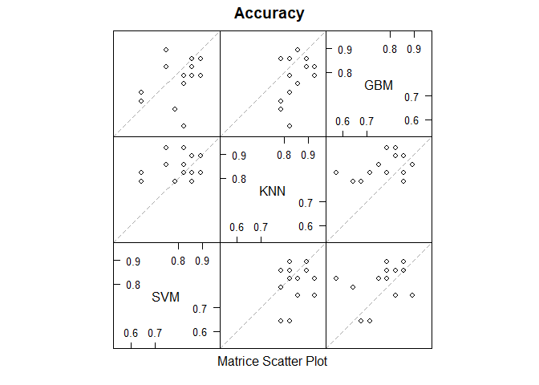<!-- -->

Sobre estos datos, el modelo GBM parece dar peor rendimiento como
clasificador que el SVM con Base Radial y el k-NN, mientras que el k-NN
parece ser el algoritmo más sólido.

### Curvas ROC del modelo GMB

El área bajo las curvas parece ser bastante grande, lo cual sugiere un
buen rendimiento del modelo. De hecho, los valores de AUC están cercanos
a 1, lo que indica que el clasificador SVM está funcionando bien en la
mayoría de las categorías, con una clasificación muy alta en la
categoría ‘OF’ (0.996).

``` r
require(multiROC)

## preprocesamiento
pred_gmb<-data.frame(predict(gbmFit,newdata=crabs_tuneX, type="prob"))
colnames(pred_gmb)<- paste(colnames(pred_gmb), "_pred_gmb")
final_gmb<-cbind(true_label,pred_gmb)

## llamada principal
roc_gmb <- multi_roc(final_gmb, force_diag=T)
```

    ## Warning in regularize.values(x, y, ties, missing(ties), na.rm = na.rm): si
    ## riduce a valori unici di 'x'

    ## Warning in regularize.values(x, y, ties, missing(ties), na.rm = na.rm): si
    ## riduce a valori unici di 'x'

    ## Warning in regularize.values(x, y, ties, missing(ties), na.rm = na.rm): si
    ## riduce a valori unici di 'x'

    ## Warning in regularize.values(x, y, ties, missing(ties), na.rm = na.rm): si
    ## riduce a valori unici di 'x'

``` r
plot_roc_gmb<-plot_roc_data(roc_gmb)

## valores de AUC
unlist(roc_gmb$AUC)
```

    ##   gmb.BF    gmb.BM    gmb.OF    gmb.OM  gmb.macro gmb.micro 
    ## 0.9718519 0.9718519 0.9955556 0.9614815 0.9713889 0.9665741

``` r
## representación gráfica
require(ggplot2)
ggplot(plot_roc_gmb, aes(x = 1-Specificity, y=Sensitivity)) +
  geom_path(aes(color = Group, linetype=Method), linewidth=1.5) +
  geom_segment(aes(x = 0, y = 0, xend = 1, yend = 1), 
               colour='grey', linetype = 'dotdash') +
  theme_bw() + 
  theme(plot.title = element_text(hjust = 0.5), 
        legend.justification=c(1, 0), legend.position=c(.95, .05),
        legend.title=element_blank(), 
        legend.background = element_rect(fill=NULL, linewidth=0.5, 
                                         linetype="solid", colour ="black"))
```

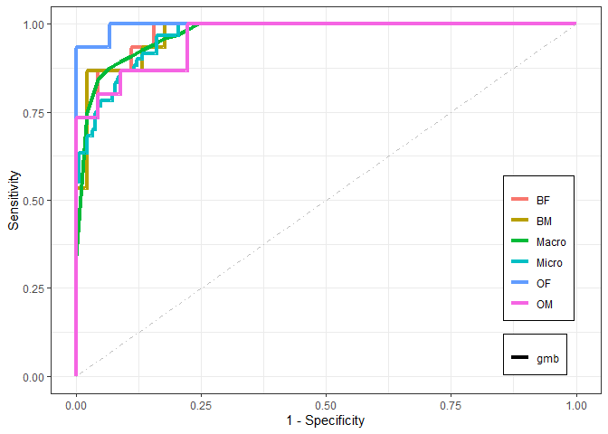<!-- -->
