Tarea sobre Clasificación: Música Turca y Emociones
================
Francesca Mori
2024-03-27

- <a href="#índice" id="toc-índice">Índice</a>
- <a href="#conjunto-de-datos-1" id="toc-conjunto-de-datos-1">Conjunto de
  Datos</a>
- <a href="#análisis-preliminar-1" id="toc-análisis-preliminar-1">Análisis
  preliminar</a>
  - <a href="#las-variables" id="toc-las-variables">Las variables</a>
  - <a href="#visualización" id="toc-visualización">Visualización</a>
  - <a href="#importancia-de-las-variables"
    id="toc-importancia-de-las-variables">Importancia de las Variables</a>
  - <a href="#variabilidad-y-correlación"
    id="toc-variabilidad-y-correlación">Variabilidad y Correlación</a>
  - <a href="#análisis-de-componentes-principales"
    id="toc-análisis-de-componentes-principales">Análisis de Componentes
    Principales</a>
- <a href="#particionamiento-del-conjunto-de-datos-1"
  id="toc-particionamiento-del-conjunto-de-datos-1">Particionamiento del
  Conjunto de Datos</a>
- <a href="#entrenamiento-1" id="toc-entrenamiento-1">Entrenamiento</a>
- <a href="#clasificadores-1" id="toc-clasificadores-1">Clasificadores</a>
  - <a href="#primer-clasificador-árbol-de-decisión-clásico"
    id="toc-primer-clasificador-árbol-de-decisión-clásico">Primer
    clasificador: Árbol de Decisión Clásico</a>
  - <a href="#segundo-clasificador-bootstrap-aggregating"
    id="toc-segundo-clasificador-bootstrap-aggregating">Segundo
    Clasificador: Bootstrap Aggregating</a>
  - <a href="#tercer-clasificador-random-forest"
    id="toc-tercer-clasificador-random-forest">Tercer Clasificador: Random
    Forest</a>
  - <a href="#cuarto-clasificador-perceptrón-multicapa"
    id="toc-cuarto-clasificador-perceptrón-multicapa">Cuarto Clasificador:
    Perceptrón Multicapa</a>
- <a href="#comparación-de-los-clasificadores-1"
  id="toc-comparación-de-los-clasificadores-1">Comparación de los
  Clasificadores</a>
  - <a href="#t-test" id="toc-t-test">t-Test</a>
  - <a href="#comparación-del-rendimiento"
    id="toc-comparación-del-rendimiento">Comparación del Rendimiento</a>
  - <a href="#gráficos" id="toc-gráficos">Gráficos</a>
  - <a href="#curvas-roc" id="toc-curvas-roc">Curvas ROC</a>
- <a href="#conclusión-1" id="toc-conclusión-1">Conclusión</a>

# Índice

#### Conjunto de Datos

#### Análisis preliminar

##### . Las variables

##### . Visualización

##### . Importancia de las Variables

##### . Variabilidad y Correlación

##### . Análisis de Componentes Principales

#### Particionamiento del Conjunto de Datos

#### Entrenamiento

#### Clasificadores

##### . Primer clasificador: Árbol de Decisión Clásico

##### . Segundo Clasificador: Bootstrap Aggregating

##### . Tercer Clasificador: Random Forest

##### . Cuarto Clasificador: Perceptrón Multicapa

#### Comparación de los Clasificadores

##### . t-Test

##### . Comparación del Rendimiento

##### . Gráficos

##### . Curvas ROC: Bagging, Random Forest, Perceptrón Multicapa

#### Conclusión

# Conjunto de Datos

El conjunto de datos se encuentra en el sitio web UCI Machine Learning
Repository
(<https://www.archive.ics.uci.edu/dataset/862/turkish+music+emotion>) y
fue creado por Bilal Er y I. B. Aydilek en 2019. Este conjunto de datos
se diseñó como un modelo discreto, y consta de cuatro clases: feliz,
triste, enojado y relajado. Se seleccionaron 100 piezas musicales para
cada clase, abarcando diferentes géneros de música turca tanto verbal
como no verbal. Cada muestra tiene una duración de 30 segundos, y no hay
valores faltantes. Las demás variables son de tipo numérico (`int`=
entero).

``` r
library("readxl")
```

    ## Warning: il pacchetto 'readxl' è stato creato con R versione 4.2.3

``` r
music <- read.csv2("Acoustic_Features.csv", header=T)

attach(music)
head(music)
```

    ##   Class X_RMSenergy_Mean X_Lowenergy_Mean X_Fluctuation_Mean X_Tempo_Mean
    ## 1 relax               52              591               9136       130043
    ## 2 relax              125              439               6680       142240
    ## 3 relax               46              639              10578       188154
    ## 4 relax              135              603              10442        65991
    ## 5 relax               66              591               9769        88890
    ## 6 relax              137              510               7664       116044
    ##   X_MFCC_Mean_1 X_MFCC_Mean_2 X_MFCC_Mean_3 X_MFCC_Mean_4 X_MFCC_Mean_5
    ## 1          3997           363           887            78           221
    ## 2          4058           516           785           397           556
    ## 3          2775           903           502           329           287
    ## 4          2841          1552           612           351            11
    ## 5          3217           228           814            96           434
    ## 6          2313           -82           365            33          -136
    ##   X_MFCC_Mean_6 X_MFCC_Mean_7 X_MFCC_Mean_8 X_MFCC_Mean_9 X_MFCC_Mean_10
    ## 1           118          -151          -131           129            154
    ## 2           799          -403          -264           -57            288
    ## 3           140          -246            25          -112           -422
    ## 4           143            47           242            18            168
    ## 5           285           104            13          -235           -207
    ## 6          -579          -138           -33           -18            368
    ##   X_MFCC_Mean_11 X_MFCC_Mean_12 X_MFCC_Mean_13 X_Roughness_Mean
    ## 1            274            232            246            51542
    ## 2            309             49             27           336839
    ## 3             18            179            138            39864
    ## 4            141            245            146           353744
    ## 5           -276           -294           -190            46884
    ## 6            117             10            -20           249382
    ##   X_Roughness_Slope X_Zero.crossingrate_Mean X_AttackTime_Mean
    ## 1               325                   403129                28
    ## 2               366                   204886                15
    ## 3               224                   685474                33
    ## 4               215                   579859                29
    ## 5              -118                   430536                40
    ## 6                40                   799914                47
    ##   X_AttackTime_Slope X_Rolloff_Mean X_Eventdensity_Mean X_Pulseclarity_Mean
    ## 1                -14        1844664                1336                  82
    ## 2                -79        1181067                1336                  51
    ## 3               -278       10778651                1336                 299
    ## 4                -76        6745549                2105                 121
    ## 5               -282        3328373                1370                 208
    ## 6                -50        5092687                 936                 164
    ##   X_Brightness_Mean X_Spectralcentroid_Mean X_Spectralspread_Mean
    ## 1               173                 1121368               1970389
    ## 2               117                  896047               1959622
    ## 3               496                 4181110               4716084
    ## 4               319                 2492422               3744719
    ## 5               279                 1776484               2842952
    ## 6               437                 2393320               3077051
    ##   X_Spectralskewness_Mean X_Spectralkurtosis_Mean X_Spectralflatness_Mean
    ## 1                    3621                   18037                      30
    ## 2                    4134                   21990                      25
    ## 3                     902                    2366                      91
    ## 4                    1689                    4780                      53
    ## 5                    2739                   10627                      46
    ## 6                    1961                    6525                      52
    ##   X_EntropyofSpectrum_Mean X_Chromagram_Mean_1 X_Chromagram_Mean_2
    ## 1                      806                 496                   0
    ## 2                      765                   0                 142
    ## 3                      897                 412                 245
    ## 4                      840                 307                 278
    ## 5                      830                  91                   0
    ## 6                      864                  90                   9
    ##   X_Chromagram_Mean_3 X_Chromagram_Mean_4 X_Chromagram_Mean_5
    ## 1                  47                  30                 314
    ## 2                 137                  76                 112
    ## 3                 526                  95                 519
    ## 4                 281                 208                 733
    ## 5                  22                 396                  11
    ## 6                1000                   0                   0
    ##   X_Chromagram_Mean_6 X_Chromagram_Mean_7 X_Chromagram_Mean_8
    ## 1                  38                  24                 951
    ## 2                   0                 120                   0
    ## 3                   1                 563                 282
    ## 4                   2                 276                 436
    ## 5                   0                 135                 635
    ## 6                 455                   0                 875
    ##   X_Chromagram_Mean_9 X_Chromagram_Mean_10 X_Chromagram_Mean_11
    ## 1                 426                 1000                    8
    ## 2                   2                 1000                    0
    ## 3                 184                  746                   16
    ## 4                  38                 1000                  161
    ## 5                   4                  404                 1000
    ## 6                  64                  391                  102
    ##   X_Chromagram_Mean_12 X_HarmonicChangeDetectionFunction_Mean
    ## 1                  101                                    316
    ## 2                  984                                    285
    ## 3                 1000                                    413
    ## 4                  757                                    422
    ## 5                    1                                    345
    ## 6                    0                                    280
    ##   X_HarmonicChangeDetectionFunction_Std X_HarmonicChangeDetectionFunction_Slope
    ## 1                                   261                                      18
    ## 2                                   211                                     -82
    ## 3                                   299                                     134
    ## 4                                   265                                      42
    ## 5                                   261                                      89
    ## 6                                   240                                     355
    ##   X_HarmonicChangeDetectionFunction_PeriodFreq
    ## 1                                         1035
    ## 2                                         3364
    ## 3                                         1682
    ## 4                                          354
    ## 5                                          748
    ## 6                                         1682
    ##   X_HarmonicChangeDetectionFunction_PeriodAmp
    ## 1                                         593
    ## 2                                         702
    ## 3                                         692
    ## 4                                         743
    ## 5                                         674
    ## 6                                         662
    ##   X_HarmonicChangeDetectionFunction_PeriodEntropy
    ## 1                                             970
    ## 2                                             967
    ## 3                                             963
    ## 4                                             968
    ## 5                                             957
    ## 6                                             958

``` r
sum(is.na(music))
```

    ## [1] 0

Para la reproducibildiad de los resultados:

``` r
nip<-905142
```

# Análisis preliminar

## Las variables

Comencemos analizando la variable de clasificación o etiqueta para este
análisis. Hay cuatro categorías: enojado, feliz, relajado y triste.
Estas representan las emociones que las personas experimentan al
escuchar las distintas piezas musicales, con una frecuencia de 100 para
cada una.

``` r
table(music$Class)
```

    ## 
    ## angry happy relax   sad 
    ##   100   100   100   100

Un aspecto importante a considerar es el equilibrio entre las clases. Si
existe un desequilibrio significativo entre las clases, debemos
contemplar algún procedimiento para que el proceso de entrenamiento se
realice con clases más equilibradas.

``` r
prop.table(table(music$Class)) * 100
```

    ## 
    ## angry happy relax   sad 
    ##    25    25    25    25

El resultado indica un alto grado de equilibrio. Transformamos los
nombres de las emociones en colores que pueden representarlas: podemos
asociar la Felicidad con el amarillo, la Tristeza con el azul, la Ira
con el rojo, y la Relajación con el gris.

``` r
music$Class <- replace(music$Class, music$Class == "relax", "grey")
music$Class <- replace(music$Class, music$Class == "happy", "yellow")
music$Class <- replace(music$Class, music$Class == "sad", "blue")
music$Class <- replace(music$Class, music$Class == "angry", "red")
```

Para generar los diagramas de caja (función `Boxplot`), escalamos los
datos.

``` r
summary(music)
```

    ##     Class           X_RMSenergy_Mean X_Lowenergy_Mean X_Fluctuation_Mean
    ##  Length:400         Min.   : 10.0    Min.   :302.0    Min.   : 3580     
    ##  Class :character   1st Qu.: 85.0    1st Qu.:523.0    1st Qu.: 5860     
    ##  Mode  :character   Median :128.0    Median :553.0    Median : 6734     
    ##                     Mean   :134.7    Mean   :553.6    Mean   : 7146     
    ##                     3rd Qu.:174.0    3rd Qu.:583.2    3rd Qu.: 7824     
    ##                     Max.   :431.0    Max.   :703.0    Max.   :23475     
    ##   X_Tempo_Mean    X_MFCC_Mean_1  X_MFCC_Mean_2      X_MFCC_Mean_3   
    ##  Min.   : 48284   Min.   : 323   Min.   :-3484.00   Min.   :-870.0  
    ##  1st Qu.:101490   1st Qu.:1948   1st Qu.: -262.75   1st Qu.: 281.2  
    ##  Median :120133   Median :2390   Median :   68.50   Median : 464.5  
    ##  Mean   :123682   Mean   :2456   Mean   :   71.89   Mean   : 488.1  
    ##  3rd Qu.:148986   3rd Qu.:2860   3rd Qu.:  413.25   3rd Qu.: 686.0  
    ##  Max.   :195026   Max.   :5996   Max.   : 1937.00   Max.   :1622.0  
    ##  X_MFCC_Mean_4      X_MFCC_Mean_5     X_MFCC_Mean_6     X_MFCC_Mean_7    
    ##  Min.   :-1636.00   Min.   :-494.00   Min.   :-916.00   Min.   :-936.00  
    ##  1st Qu.: -117.00   1st Qu.:  61.25   1st Qu.: -78.25   1st Qu.: -41.25  
    ##  Median :   44.50   Median : 181.00   Median :  49.50   Median :  72.00  
    ##  Mean   :   30.46   Mean   : 178.90   Mean   :  38.31   Mean   :  59.94  
    ##  3rd Qu.:  198.25   3rd Qu.: 288.50   3rd Qu.: 151.25   3rd Qu.: 172.25  
    ##  Max.   : 1126.00   Max.   :1055.00   Max.   : 799.00   Max.   : 571.00  
    ##  X_MFCC_Mean_8     X_MFCC_Mean_9     X_MFCC_Mean_10    X_MFCC_Mean_11  
    ##  Min.   :-744.00   Min.   :-621.00   Min.   :-544.00   Min.   :-487.0  
    ##  1st Qu.: -49.25   1st Qu.: -71.00   1st Qu.: -59.25   1st Qu.: -44.0  
    ##  Median :  39.50   Median :  16.50   Median :  31.50   Median :  37.0  
    ##  Mean   :  43.47   Mean   :  23.01   Mean   :  27.79   Mean   :  28.8  
    ##  3rd Qu.: 130.00   3rd Qu.: 123.00   3rd Qu.: 126.00   3rd Qu.: 114.0  
    ##  Max.   : 728.00   Max.   : 539.00   Max.   : 510.00   Max.   : 494.0  
    ##  X_MFCC_Mean_12    X_MFCC_Mean_13    X_Roughness_Mean  X_Roughness_Slope
    ##  Min.   :-418.00   Min.   :-620.00   Min.   :    941   Min.   :-525.00  
    ##  1st Qu.: -56.00   1st Qu.: -45.50   1st Qu.: 169189   1st Qu.: -27.00  
    ##  Median :  22.50   Median :  39.00   Median : 367578   Median :  68.00  
    ##  Mean   :  16.67   Mean   :  24.12   Mean   : 527681   Mean   :  72.04  
    ##  3rd Qu.:  94.50   3rd Qu.: 101.25   3rd Qu.: 734372   3rd Qu.: 174.00  
    ##  Max.   : 355.00   Max.   : 536.00   Max.   :3899847   Max.   : 584.00  
    ##  X_Zero.crossingrate_Mean X_AttackTime_Mean X_AttackTime_Slope
    ##  Min.   : 149490          Min.   : 10.0     Min.   :-465.00   
    ##  1st Qu.: 592275          1st Qu.: 23.0     1st Qu.: -94.00   
    ##  Median : 893491          Median : 27.0     Median :   7.50   
    ##  Mean   : 997252          Mean   : 31.3     Mean   :  -2.89   
    ##  3rd Qu.:1303493          3rd Qu.: 33.0     3rd Qu.:  89.00   
    ##  Max.   :3147907          Max.   :165.0     Max.   : 599.00   
    ##  X_Rolloff_Mean     X_Eventdensity_Mean X_Pulseclarity_Mean X_Brightness_Mean
    ##  Min.   :  887151   Min.   : 234        Min.   : 11.0       Min.   : 53.0    
    ##  1st Qu.: 3933553   1st Qu.:1737        1st Qu.:127.8       1st Qu.:352.5    
    ##  Median : 5648628   Median :2773        Median :218.0       Median :448.0    
    ##  Mean   : 5691070   Mean   :2785        Mean   :249.4       Mean   :434.2    
    ##  3rd Qu.: 7355886   3rd Qu.:3692        3rd Qu.:327.2       3rd Qu.:527.2    
    ##  Max.   :11508298   Max.   :7952        Max.   :856.0       Max.   :737.0    
    ##  X_Spectralcentroid_Mean X_Spectralspread_Mean X_Spectralskewness_Mean
    ##  Min.   : 606524         Min.   : 814817       Min.   : 390           
    ##  1st Qu.:1981558         1st Qu.:2506768       1st Qu.:1327           
    ##  Median :2547678         Median :3150949       Median :1687           
    ##  Mean   :2581167         Mean   :3082395       Mean   :1870           
    ##  3rd Qu.:3182570         3rd Qu.:3684325       3rd Qu.:2182           
    ##  Max.   :5326379         Max.   :4721479       Max.   :7855           
    ##  X_Spectralkurtosis_Mean X_Spectralflatness_Mean X_EntropyofSpectrum_Mean
    ##  Min.   :  1930          Min.   :  6.00          Min.   :740.0           
    ##  1st Qu.:  3882          1st Qu.: 29.00          1st Qu.:853.0           
    ##  Median :  5216          Median : 47.00          Median :879.0           
    ##  Mean   :  7349          Mean   : 48.52          Mean   :872.6           
    ##  3rd Qu.:  7849          3rd Qu.: 62.00          3rd Qu.:899.0           
    ##  Max.   :121996          Max.   :209.00          Max.   :942.0           
    ##  X_Chromagram_Mean_1 X_Chromagram_Mean_2 X_Chromagram_Mean_3
    ##  Min.   :   0.0      Min.   :   0.0      Min.   :   0.00    
    ##  1st Qu.:  57.0      1st Qu.:  18.5      1st Qu.:  79.75    
    ##  Median : 273.5      Median : 142.0      Median : 288.50    
    ##  Mean   : 352.6      Mean   : 253.0      Mean   : 365.10    
    ##  3rd Qu.: 551.2      3rd Qu.: 395.2      3rd Qu.: 576.50    
    ##  Max.   :1000.0      Max.   :1000.0      Max.   :1000.00    
    ##  X_Chromagram_Mean_4 X_Chromagram_Mean_5 X_Chromagram_Mean_6
    ##  Min.   :   0.0      Min.   :   0.00     Min.   :   0.00    
    ##  1st Qu.:  17.0      1st Qu.:  89.75     1st Qu.:  19.75    
    ##  Median : 105.0      Median : 271.00     Median : 144.00    
    ##  Mean   : 208.3      Mean   : 350.41     Mean   : 263.88    
    ##  3rd Qu.: 315.0      3rd Qu.: 535.75     3rd Qu.: 450.50    
    ##  Max.   :1000.0      Max.   :1000.00     Max.   :1000.00    
    ##  X_Chromagram_Mean_7 X_Chromagram_Mean_8 X_Chromagram_Mean_9
    ##  Min.   :   0.0      Min.   :   0.0      Min.   :   0.00    
    ##  1st Qu.:  26.0      1st Qu.: 102.0      1st Qu.:  66.75    
    ##  Median : 141.0      Median : 295.5      Median : 247.00    
    ##  Mean   : 242.8      Mean   : 391.9      Mean   : 354.63    
    ##  3rd Qu.: 365.0      3rd Qu.: 635.5      3rd Qu.: 612.00    
    ##  Max.   :1000.0      Max.   :1000.0      Max.   :1000.00    
    ##  X_Chromagram_Mean_10 X_Chromagram_Mean_11 X_Chromagram_Mean_12
    ##  Min.   :   0.0       Min.   :   0.0       Min.   :   0.00     
    ##  1st Qu.: 264.5       1st Qu.:  59.5       1st Qu.:  60.75     
    ##  Median : 612.0       Median : 247.0       Median : 296.50     
    ##  Mean   : 591.0       Mean   : 342.3       Mean   : 385.62     
    ##  3rd Qu.:1000.0       3rd Qu.: 565.2       3rd Qu.: 670.75     
    ##  Max.   :1000.0       Max.   :1000.0       Max.   :1000.00     
    ##  X_HarmonicChangeDetectionFunction_Mean X_HarmonicChangeDetectionFunction_Std
    ##  Min.   :112.0                          Min.   : 60                          
    ##  1st Qu.:290.8                          1st Qu.:160                          
    ##  Median :333.0                          Median :190                          
    ##  Mean   :328.2                          Mean   :193                          
    ##  3rd Qu.:367.2                          3rd Qu.:226                          
    ##  Max.   :488.0                          Max.   :340                          
    ##  X_HarmonicChangeDetectionFunction_Slope
    ##  Min.   :-285.0000                      
    ##  1st Qu.: -58.0000                      
    ##  Median :  -2.0000                      
    ##  Mean   :  -0.1575                      
    ##  3rd Qu.:  63.2500                      
    ##  Max.   : 442.0000                      
    ##  X_HarmonicChangeDetectionFunction_PeriodFreq
    ##  Min.   : 187                                
    ##  1st Qu.: 961                                
    ##  Median :1682                                
    ##  Mean   :1762                                
    ##  3rd Qu.:2243                                
    ##  Max.   :4486                                
    ##  X_HarmonicChangeDetectionFunction_PeriodAmp
    ##  Min.   :530.0                              
    ##  1st Qu.:725.0                              
    ##  Median :786.0                              
    ##  Mean   :769.7                              
    ##  3rd Qu.:824.0                              
    ##  Max.   :908.0                              
    ##  X_HarmonicChangeDetectionFunction_PeriodEntropy
    ##  Min.   :939.0                                  
    ##  1st Qu.:965.0                                  
    ##  Median :967.0                                  
    ##  Mean   :966.7                                  
    ##  3rd Qu.:969.0                                  
    ##  Max.   :977.0

``` r
music1<-music[,-1]
music1.sc<-scale(music1)
boxplot(music1.sc)
```

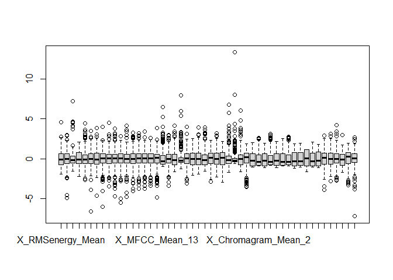<!-- -->

Los diagramas de caja representan la distribución de datos para
diferentes variables. En nuestro caso, se pueden identificar unos
valores atípicos, que se encuentran fuera de los límites de los bigotes.
Por ejemplo, la variable `X_Spectralkurtosis_Mean` tiene una media de
7349, pero su valor máximo es de 121996.

## Visualización

Empezamos a visualizar los datos usando la funcion `pairs` para algunas
variables.

``` r
library(vctrs)
```

    ## Warning: il pacchetto 'vctrs' è stato creato con R versione 4.2.3

``` r
pairs(music[,2:10], col=music$Class)
```

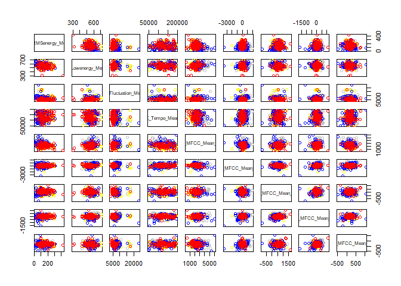<!-- -->

``` r
pairs(music[,10:18], col=music$Class)
```

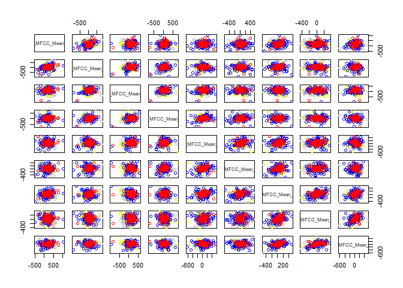<!-- -->

``` r
pairs(music[,18:26], col=music$Class)
```

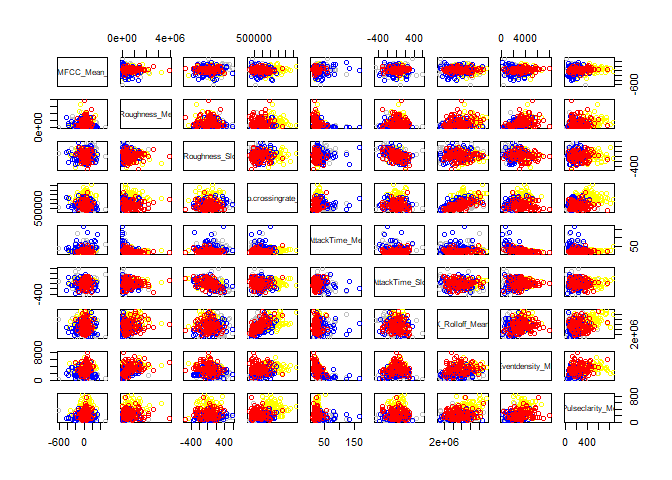<!-- -->

``` r
pairs(music[,26:34], col=music$Class)
```

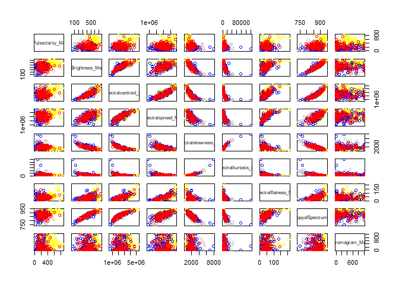<!-- -->

``` r
pairs(music[,34:42], col=music$Class)
```

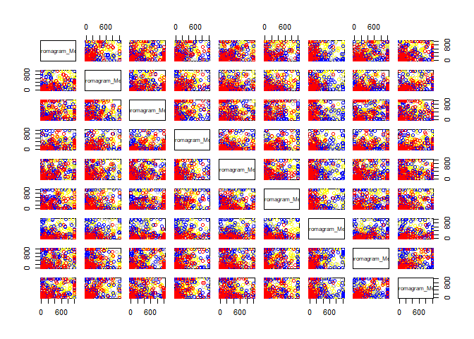<!-- -->

``` r
pairs(music[,42:51], col=music$Class)
```

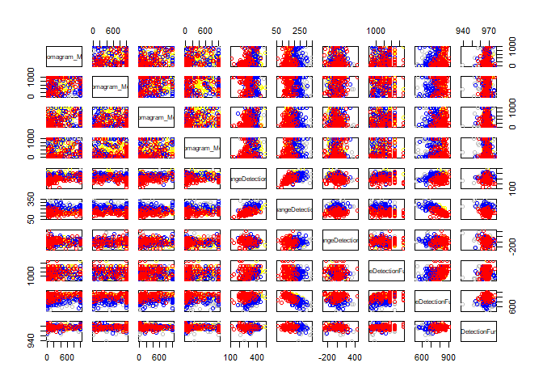<!-- -->

En general, notamos que existe poca diferenciación entre las clases, y
las variables no presentan mucha correlación entre sí. Solo entre las
columnas desde la 27 hasta la 33 encontramos una correlación, y la
felicidad parece ser la emoción que más se distingue de las demás.
Además, en los últimos gráficos podemos ver una diferencia bastante
evidente entre la tristeza y la ira.

Ahora crearemos otro gráfico, específicamente el gráfico de coordenadas
paralelas, que nos permitirá visualizar y comparar múltiples variables
en un solo gráfico.

``` r
require(lattice)
```

    ## Caricamento del pacchetto richiesto: lattice

``` r
parallelplot(~music[,2:51]|Class,data=music) 
```

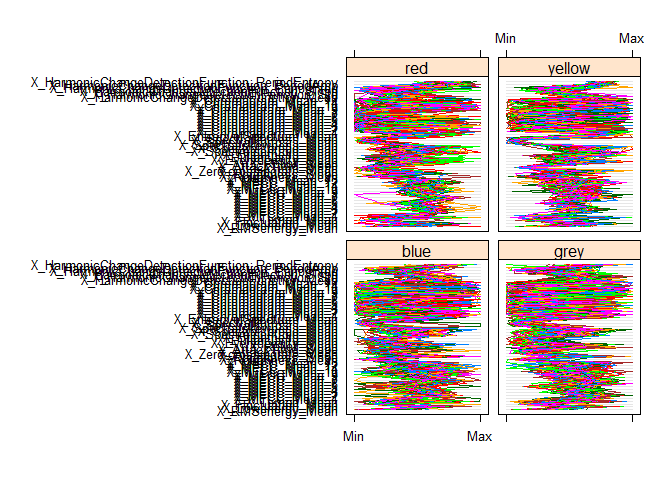<!-- -->

En este caso, los gráficos no son muy útiles para comprender cómo se
comportan las variables. Por lo tanto, es importante continuar
analizando y realizar pruebas estadísticas apropiadas.

## Importancia de las Variables

Utilizamos el paquete `caret`:

``` r
library(caret)
```

    ## Warning: il pacchetto 'caret' è stato creato con R versione 4.2.3

    ## Caricamento del pacchetto richiesto: ggplot2

    ## Warning: il pacchetto 'ggplot2' è stato creato con R versione 4.2.3

En `caret`, tenemos una función que busca proporcionarnos una
importancia a priori de cada variable con respecto a la variable de
clasificación. La medida de importancia de este filtro se basa en el
Área bajo la Curva (AUC) de cada variable por separado. Dado que se
trata de un problema multiclase, la curva ROC se calcula de forma uno a
uno: se calculan todas las AUC y se toma el máximo como medida de
importancia de la variable. Calculemos ahora el filtro a priori de
importancia de las variables. La función `findLinearCombos` especifica
los motores para la importancia de las variables, modelo por modelo.
Además, la función `apply` devuelve un vector/matriz/lista de valores
obtenidos al aplicar una función a los márgenes de una matriz, y su
salida se utiliza como entrada para la función sort().

``` r
rocVarImp<-filterVarImp(x = music[,(2:51)], y = as.factor(music$Class))

require(dplyr)
```

    ## Caricamento del pacchetto richiesto: dplyr

    ## Warning: il pacchetto 'dplyr' è stato creato con R versione 4.2.3

    ## 
    ## Caricamento pacchetto: 'dplyr'

    ## Il seguente oggetto è mascherato da 'package:vctrs':
    ## 
    ##     data_frame

    ## I seguenti oggetti sono mascherati da 'package:stats':
    ## 
    ##     filter, lag

    ## I seguenti oggetti sono mascherati da 'package:base':
    ## 
    ##     intersect, setdiff, setequal, union

``` r
apply(rocVarImp, 1, mean) %>% sort()
```

    ##                                  X_MFCC_Mean_10 
    ##                                       0.5205250 
    ##                                   X_MFCC_Mean_8 
    ##                                       0.5237875 
    ##                                  X_MFCC_Mean_12 
    ##                                       0.5430125 
    ##                         X_Spectralflatness_Mean 
    ##                                       0.5468125 
    ##                                   X_MFCC_Mean_5 
    ##                                       0.5646000 
    ##                             X_Chromagram_Mean_5 
    ##                                       0.5675500 
    ##         X_HarmonicChangeDetectionFunction_Slope 
    ##                                       0.5688125 
    ##                                   X_MFCC_Mean_6 
    ##                                       0.5774875 
    ##                                  X_MFCC_Mean_13 
    ##                                       0.5782750 
    ## X_HarmonicChangeDetectionFunction_PeriodEntropy 
    ##                                       0.5816750 
    ##                                   X_MFCC_Mean_9 
    ##                                       0.5831500 
    ##                            X_Chromagram_Mean_10 
    ##                                       0.5850750 
    ##                                  X_MFCC_Mean_11 
    ##                                       0.5932500 
    ##                                    X_Tempo_Mean 
    ##                                       0.5956000 
    ##                             X_Chromagram_Mean_4 
    ##                                       0.5993750 
    ##                             X_Chromagram_Mean_8 
    ##                                       0.6024750 
    ##                             X_Chromagram_Mean_2 
    ##                                       0.6031750 
    ##                                X_Lowenergy_Mean 
    ##                                       0.6040750 
    ##                             X_Chromagram_Mean_3 
    ##                                       0.6043500 
    ##                            X_Chromagram_Mean_12 
    ##                                       0.6049125 
    ##                             X_Chromagram_Mean_1 
    ##                                       0.6097250 
    ##                              X_AttackTime_Slope 
    ##                                       0.6103750 
    ##                             X_Chromagram_Mean_9 
    ##                                       0.6116750 
    ##                                   X_MFCC_Mean_3 
    ##                                       0.6169250 
    ##                            X_Chromagram_Mean_11 
    ##                                       0.6214000 
    ##    X_HarmonicChangeDetectionFunction_PeriodFreq 
    ##                                       0.6260250 
    ##                           X_Spectralspread_Mean 
    ##                                       0.6304500 
    ##                             X_Chromagram_Mean_6 
    ##                                       0.6326000 
    ##                                   X_MFCC_Mean_7 
    ##                                       0.6419375 
    ##                               X_Roughness_Slope 
    ##                                       0.6587250 
    ##                                  X_Rolloff_Mean 
    ##                                       0.6595750 
    ##                         X_Spectralcentroid_Mean 
    ##                                       0.6722000 
    ##                                   X_MFCC_Mean_4 
    ##                                       0.6746000 
    ##                             X_Chromagram_Mean_7 
    ##                                       0.6778125 
    ##                                   X_MFCC_Mean_2 
    ##                                       0.6783125 
    ##                         X_Spectralkurtosis_Mean 
    ##                                       0.6822750 
    ##                                X_RMSenergy_Mean 
    ##                                       0.6829250 
    ##                         X_Spectralskewness_Mean 
    ##                                       0.6864250 
    ##          X_HarmonicChangeDetectionFunction_Mean 
    ##                                       0.7405375 
    ##                                X_Roughness_Mean 
    ##                                       0.7438000 
    ##                               X_Brightness_Mean 
    ##                                       0.7451375 
    ##                        X_EntropyofSpectrum_Mean 
    ##                                       0.7538875 
    ##                                   X_MFCC_Mean_1 
    ##                                       0.7775875 
    ##                               X_AttackTime_Mean 
    ##                                       0.7932125 
    ##                              X_Fluctuation_Mean 
    ##                                       0.7955000 
    ##                             X_Pulseclarity_Mean 
    ##                                       0.8027500 
    ##                        X_Zero.crossingrate_Mean 
    ##                                       0.8136500 
    ##                             X_Eventdensity_Mean 
    ##                                       0.8477250 
    ##     X_HarmonicChangeDetectionFunction_PeriodAmp 
    ##                                       0.9141750 
    ##           X_HarmonicChangeDetectionFunction_Std 
    ##                                       0.9358375

``` r
matrix(apply(rocVarImp, 1, mean)[50:1] , ncol=5, byrow=TRUE)[10:1, ]%>%
image()
```

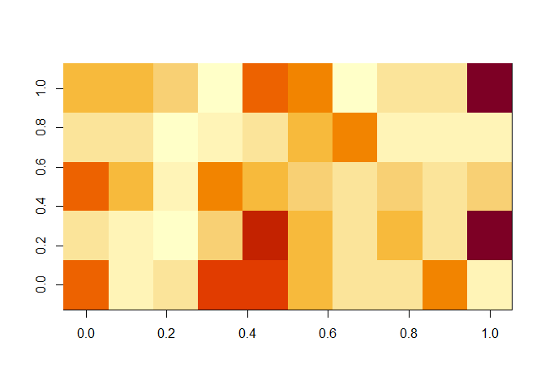<!-- -->

Podemos observar las diferentes importancias; por ejemplo, la variable
`X_MFCC_Mean_10` parece tener menor importancia para la clasificación
(0.52), mientras que la variable `X_HarmonicChangeDetectionFunction_Std`
es mucho más relevante (0.94).

## Variabilidad y Correlación

Puede que haya variables con muy poca variabilidad que podrían
suprimirse al formar los clasificadores. La función `nearZeroVar` nos
ayuda a buscar estas variables y puede proporcionarnos información sobre
la granularidad de los valores (como un ratio de frecuencias) y el
porcentaje de valores únicos (diferentes).

``` r
nzv<-nearZeroVar(music, saveMetrics= TRUE)
(1:4)[nzv$nzv]  #nos dice cuales variables tienen varianza casi nula
```

    ## integer(0)

``` r
(1:4)[nzv$zeroVar]  #nos dice cuales variables tienen varianza nula
```

    ## integer(0)

En este caso, no hay variables con varianza casi nula o nula, por lo que
no tenemos que eliminar ninguna de ellas.

Tambíen puede ser interesante visualizar el grado de correlación entre
las variables. Establecemos un umbral igual a 0.75. Si hubiera variables
altamente correlacionadas, podríamos considerar eliminar algunas de
ellas. En este caso, existen dos funciones que nos permiten buscar estas
relaciones: - La función `findCorrelation` busca a través de una matriz
de correlación y devuelve un vector de números enteros correspondientes
a las columnas que se deben eliminar para reducir las correlaciones por
pares. - La función `findLinearCombos` nos indica qué variables forman
un combo lineal, lo que nos permite identificar aquellas que podríamos
eliminar.

``` r
findCorrelation(cor(music[,(2:51)]), cutoff=.75)
```

    ## [1] 32 26 27 29 23 28 18

``` r
findLinearCombos(music[,(2:51)])
```

    ## $linearCombos
    ## list()
    ## 
    ## $remove
    ## NULL

Entonces podemos eliminar las columnas: 32, 26, 27, 29, 23, 28, 18.

``` r
music2<-music[,-c(32, 26, 27, 29, 23, 28, 18)]
```

## Análisis de Componentes Principales

Las Componentes Principales (CP) son combinaciones lineales de las
variables originales, que nos proporcionan una colección ordenada de
nuevas variables y que explican la mayor parte de la variabilidad. Esto
nos ayuda a identificar patrones en los datos. Si hay una estructura de
asociación entre las variables, es probable que se refleje en las
primeras componentes principales.

Ahora procederemos a calcular las Componentes Principales de las
variables numéricas utilizando la función `princomp`.

``` r
music2<-music2[,-1]
```

``` r
music.pc<-princomp(~. ,data=music2, cor=TRUE, scores=TRUE)
cat("\nComponent loadings:\n")
```

    ## 
    ## Component loadings:

``` r
print(unclass(loadings(music.pc)))
```

    ##                                                       Comp.1       Comp.2
    ## X_RMSenergy_Mean                                 0.181110696  0.208924588
    ## X_Lowenergy_Mean                                -0.103874805 -0.168687700
    ## X_Fluctuation_Mean                              -0.054558026 -0.226341243
    ## X_Tempo_Mean                                     0.040006582  0.065631079
    ## X_MFCC_Mean_1                                   -0.328919708  0.002887747
    ## X_MFCC_Mean_2                                   -0.028761564  0.041507763
    ## X_MFCC_Mean_3                                   -0.078656056  0.184002570
    ## X_MFCC_Mean_4                                   -0.022787277  0.130858789
    ## X_MFCC_Mean_5                                    0.006848925  0.100034955
    ## X_MFCC_Mean_6                                   -0.025287966  0.191904473
    ## X_MFCC_Mean_7                                   -0.024703928  0.185052439
    ## X_MFCC_Mean_8                                    0.008342005  0.051307172
    ## X_MFCC_Mean_9                                   -0.053711261  0.034136716
    ## X_MFCC_Mean_10                                   0.002148622 -0.042975454
    ## X_MFCC_Mean_11                                   0.061457707 -0.026265563
    ## X_MFCC_Mean_12                                  -0.003214834 -0.059790329
    ## X_Roughness_Mean                                 0.198021695  0.205154743
    ## X_Roughness_Slope                               -0.042210960 -0.082891260
    ## X_Zero.crossingrate_Mean                         0.275278009 -0.202951312
    ## X_AttackTime_Mean                               -0.170641468 -0.219891796
    ## X_Rolloff_Mean                                   0.274895164 -0.091920543
    ## X_Eventdensity_Mean                              0.278848150  0.175786664
    ## X_Spectralskewness_Mean                         -0.324095472  0.066392313
    ## X_Spectralkurtosis_Mean                         -0.262142899  0.025870983
    ## X_EntropyofSpectrum_Mean                         0.348875971 -0.123944903
    ## X_Chromagram_Mean_1                              0.092150732 -0.172590839
    ## X_Chromagram_Mean_2                              0.091996986 -0.191407307
    ## X_Chromagram_Mean_3                              0.050879417  0.005069948
    ## X_Chromagram_Mean_4                              0.082923830 -0.179143826
    ## X_Chromagram_Mean_5                              0.033498230 -0.095851898
    ## X_Chromagram_Mean_6                              0.068572423 -0.187152504
    ## X_Chromagram_Mean_7                              0.026780171 -0.261934784
    ## X_Chromagram_Mean_8                              0.066534614 -0.166538405
    ## X_Chromagram_Mean_9                              0.115646231 -0.126458028
    ## X_Chromagram_Mean_10                             0.057091550  0.144804697
    ## X_Chromagram_Mean_11                             0.119892315 -0.124635590
    ## X_Chromagram_Mean_12                             0.050457556 -0.143162326
    ## X_HarmonicChangeDetectionFunction_Mean           0.071534639 -0.323044198
    ## X_HarmonicChangeDetectionFunction_Std           -0.233542181 -0.300942812
    ## X_HarmonicChangeDetectionFunction_Slope         -0.062336645  0.005623725
    ## X_HarmonicChangeDetectionFunction_PeriodFreq     0.098569113  0.076067629
    ## X_HarmonicChangeDetectionFunction_PeriodAmp      0.289329358  0.130683840
    ## X_HarmonicChangeDetectionFunction_PeriodEntropy  0.073938616  0.021329795
    ##                                                      Comp.3       Comp.4
    ## X_RMSenergy_Mean                                 0.15343727  0.019409590
    ## X_Lowenergy_Mean                                -0.19516166 -0.134844304
    ## X_Fluctuation_Mean                              -0.09477183  0.035777595
    ## X_Tempo_Mean                                    -0.03623479 -0.093680105
    ## X_MFCC_Mean_1                                    0.18900385 -0.049334235
    ## X_MFCC_Mean_2                                   -0.31172535 -0.179327874
    ## X_MFCC_Mean_3                                    0.03266039 -0.091869158
    ## X_MFCC_Mean_4                                   -0.22411422 -0.217387876
    ## X_MFCC_Mean_5                                   -0.08363740 -0.249705016
    ## X_MFCC_Mean_6                                   -0.12344188 -0.286772578
    ## X_MFCC_Mean_7                                   -0.03974899 -0.238140718
    ## X_MFCC_Mean_8                                   -0.08784368 -0.226850207
    ## X_MFCC_Mean_9                                   -0.07955652 -0.182563529
    ## X_MFCC_Mean_10                                  -0.08388004 -0.106265170
    ## X_MFCC_Mean_11                                  -0.04554810  0.075748513
    ## X_MFCC_Mean_12                                  -0.01223640  0.106309243
    ## X_Roughness_Mean                                 0.15065443  0.052074094
    ## X_Roughness_Slope                               -0.10350294  0.075150930
    ## X_Zero.crossingrate_Mean                        -0.03164428  0.116083023
    ## X_AttackTime_Mean                               -0.18955001  0.005995504
    ## X_Rolloff_Mean                                  -0.30491261  0.009484184
    ## X_Eventdensity_Mean                              0.19771851  0.028891830
    ## X_Spectralskewness_Mean                          0.30329653 -0.020314983
    ## X_Spectralkurtosis_Mean                          0.28690301 -0.037469731
    ## X_EntropyofSpectrum_Mean                        -0.16286660  0.072652994
    ## X_Chromagram_Mean_1                              0.17754870 -0.109663151
    ## X_Chromagram_Mean_2                              0.16954985 -0.017317520
    ## X_Chromagram_Mean_3                              0.06868375 -0.087364430
    ## X_Chromagram_Mean_4                              0.22069845 -0.234123017
    ## X_Chromagram_Mean_5                              0.09456675  0.220655112
    ## X_Chromagram_Mean_6                              0.17405545 -0.269658947
    ## X_Chromagram_Mean_7                              0.05612513 -0.019688575
    ## X_Chromagram_Mean_8                              0.02731908 -0.312521135
    ## X_Chromagram_Mean_9                              0.08605094 -0.305064916
    ## X_Chromagram_Mean_10                            -0.11421068  0.050561574
    ## X_Chromagram_Mean_11                             0.15650967 -0.301038575
    ## X_Chromagram_Mean_12                             0.09789105  0.181335083
    ## X_HarmonicChangeDetectionFunction_Mean           0.11094376 -0.084291068
    ## X_HarmonicChangeDetectionFunction_Std           -0.09293961  0.045766140
    ## X_HarmonicChangeDetectionFunction_Slope         -0.16776041 -0.017844052
    ## X_HarmonicChangeDetectionFunction_PeriodFreq     0.08243315  0.028218710
    ## X_HarmonicChangeDetectionFunction_PeriodAmp      0.15550195 -0.085636591
    ## X_HarmonicChangeDetectionFunction_PeriodEntropy  0.04594386  0.075963248
    ##                                                       Comp.5       Comp.6
    ## X_RMSenergy_Mean                                 0.068018056  0.052003872
    ## X_Lowenergy_Mean                                -0.123313097  0.051705847
    ## X_Fluctuation_Mean                               0.003090190  0.058481050
    ## X_Tempo_Mean                                     0.091977435  0.061208119
    ## X_MFCC_Mean_1                                    0.071229004 -0.009777037
    ## X_MFCC_Mean_2                                    0.280114946  0.019704683
    ## X_MFCC_Mean_3                                    0.097401003 -0.094402925
    ## X_MFCC_Mean_4                                    0.316862301 -0.105277323
    ## X_MFCC_Mean_5                                    0.281117151 -0.063217971
    ## X_MFCC_Mean_6                                    0.206662471 -0.165401469
    ## X_MFCC_Mean_7                                   -0.095590764 -0.168591938
    ## X_MFCC_Mean_8                                   -0.201780509 -0.107699107
    ## X_MFCC_Mean_9                                   -0.054141142  0.230021340
    ## X_MFCC_Mean_10                                   0.061176622  0.372135512
    ## X_MFCC_Mean_11                                   0.308977836  0.474733141
    ## X_MFCC_Mean_12                                   0.183851520  0.374938308
    ## X_Roughness_Mean                                 0.048283176  0.065024504
    ## X_Roughness_Slope                                0.223307184 -0.039988356
    ## X_Zero.crossingrate_Mean                        -0.175088083 -0.021549221
    ## X_AttackTime_Mean                               -0.213389136  0.104156164
    ## X_Rolloff_Mean                                   0.012242122 -0.047227133
    ## X_Eventdensity_Mean                              0.012546336  0.007618939
    ## X_Spectralskewness_Mean                         -0.006222313  0.033921907
    ## X_Spectralkurtosis_Mean                         -0.029094513  0.008966360
    ## X_EntropyofSpectrum_Mean                        -0.098058361 -0.050078926
    ## X_Chromagram_Mean_1                              0.222766082  0.155931533
    ## X_Chromagram_Mean_2                              0.134284976 -0.149289124
    ## X_Chromagram_Mean_3                             -0.028732199  0.173878850
    ## X_Chromagram_Mean_4                              0.053078733  0.046531698
    ## X_Chromagram_Mean_5                              0.259856484 -0.126331516
    ## X_Chromagram_Mean_6                             -0.100497576  0.085963846
    ## X_Chromagram_Mean_7                              0.083456529 -0.342849530
    ## X_Chromagram_Mean_8                             -0.031515192  0.024218846
    ## X_Chromagram_Mean_9                             -0.045757550 -0.105283299
    ## X_Chromagram_Mean_10                            -0.068029731  0.008838507
    ## X_Chromagram_Mean_11                            -0.057052670  0.149890787
    ## X_Chromagram_Mean_12                             0.370241609 -0.220769564
    ## X_HarmonicChangeDetectionFunction_Mean           0.117488086 -0.077413373
    ## X_HarmonicChangeDetectionFunction_Std            0.083537304 -0.040441141
    ## X_HarmonicChangeDetectionFunction_Slope         -0.029696835  0.001322643
    ## X_HarmonicChangeDetectionFunction_PeriodFreq    -0.072301521  0.015914330
    ## X_HarmonicChangeDetectionFunction_PeriodAmp      0.008032656 -0.004319955
    ## X_HarmonicChangeDetectionFunction_PeriodEntropy  0.025469056  0.065830607
    ##                                                      Comp.7       Comp.8
    ## X_RMSenergy_Mean                                 0.14926608  0.465823836
    ## X_Lowenergy_Mean                                -0.06424720 -0.082175989
    ## X_Fluctuation_Mean                               0.28552576  0.065857705
    ## X_Tempo_Mean                                    -0.27516051 -0.087521882
    ## X_MFCC_Mean_1                                    0.04734379  0.078549716
    ## X_MFCC_Mean_2                                    0.07907422  0.139167842
    ## X_MFCC_Mean_3                                    0.03852037  0.085533352
    ## X_MFCC_Mean_4                                    0.20228980  0.016610023
    ## X_MFCC_Mean_5                                    0.04503212 -0.283124612
    ## X_MFCC_Mean_6                                    0.01547742 -0.139939153
    ## X_MFCC_Mean_7                                   -0.28578458 -0.116000782
    ## X_MFCC_Mean_8                                   -0.30927592  0.155974712
    ## X_MFCC_Mean_9                                   -0.36639209  0.250183502
    ## X_MFCC_Mean_10                                  -0.16578774  0.231985499
    ## X_MFCC_Mean_11                                  -0.13500664 -0.059230080
    ## X_MFCC_Mean_12                                  -0.15671261 -0.088485090
    ## X_Roughness_Mean                                 0.08423378  0.434632349
    ## X_Roughness_Slope                               -0.08021629  0.078756074
    ## X_Zero.crossingrate_Mean                        -0.08853771 -0.104304544
    ## X_AttackTime_Mean                               -0.02448374 -0.001141333
    ## X_Rolloff_Mean                                   0.03704887  0.060094126
    ## X_Eventdensity_Mean                              0.03787178 -0.037368321
    ## X_Spectralskewness_Mean                         -0.03367637 -0.007975219
    ## X_Spectralkurtosis_Mean                         -0.08302194 -0.042668173
    ## X_EntropyofSpectrum_Mean                        -0.02553670 -0.032514755
    ## X_Chromagram_Mean_1                              0.10879775 -0.228032802
    ## X_Chromagram_Mean_2                             -0.19482056  0.012618807
    ## X_Chromagram_Mean_3                              0.26818125 -0.093373255
    ## X_Chromagram_Mean_4                             -0.04601672  0.109811279
    ## X_Chromagram_Mean_5                             -0.18858989  0.071201715
    ## X_Chromagram_Mean_6                              0.11913519 -0.033100813
    ## X_Chromagram_Mean_7                             -0.07958522  0.179762890
    ## X_Chromagram_Mean_8                              0.19589548  0.092840173
    ## X_Chromagram_Mean_9                             -0.19357325  0.096403666
    ## X_Chromagram_Mean_10                            -0.05679753  0.035302534
    ## X_Chromagram_Mean_11                             0.03666806 -0.043161076
    ## X_Chromagram_Mean_12                            -0.18905880 -0.001250052
    ## X_HarmonicChangeDetectionFunction_Mean           0.06986530  0.063574769
    ## X_HarmonicChangeDetectionFunction_Std            0.06849212  0.153316018
    ## X_HarmonicChangeDetectionFunction_Slope          0.05928634  0.115871583
    ## X_HarmonicChangeDetectionFunction_PeriodFreq     0.09871775 -0.136232266
    ## X_HarmonicChangeDetectionFunction_PeriodAmp     -0.02938216 -0.128999451
    ## X_HarmonicChangeDetectionFunction_PeriodEntropy -0.16767593 -0.208096604
    ##                                                       Comp.9      Comp.10
    ## X_RMSenergy_Mean                                 0.038684841  0.162427796
    ## X_Lowenergy_Mean                                 0.300239704  0.099725069
    ## X_Fluctuation_Mean                              -0.155443194 -0.056494739
    ## X_Tempo_Mean                                    -0.104475219 -0.088249419
    ## X_MFCC_Mean_1                                   -0.067329509  0.054564888
    ## X_MFCC_Mean_2                                   -0.085207150  0.126268836
    ## X_MFCC_Mean_3                                    0.137772221 -0.092400151
    ## X_MFCC_Mean_4                                    0.044615757  0.008349750
    ## X_MFCC_Mean_5                                    0.077655627 -0.066645093
    ## X_MFCC_Mean_6                                   -0.038185217 -0.005945898
    ## X_MFCC_Mean_7                                   -0.003933700  0.008210304
    ## X_MFCC_Mean_8                                   -0.278914045 -0.188336487
    ## X_MFCC_Mean_9                                   -0.017824979 -0.126256064
    ## X_MFCC_Mean_10                                  -0.116857622 -0.291609931
    ## X_MFCC_Mean_11                                   0.008999691  0.056513153
    ## X_MFCC_Mean_12                                   0.078298736  0.110044799
    ## X_Roughness_Mean                                 0.079560559  0.091237888
    ## X_Roughness_Slope                               -0.022501607  0.037204696
    ## X_Zero.crossingrate_Mean                         0.107585978 -0.079688248
    ## X_AttackTime_Mean                                0.147989495  0.030333965
    ## X_Rolloff_Mean                                  -0.008150748  0.088780878
    ## X_Eventdensity_Mean                             -0.027663034 -0.051161083
    ## X_Spectralskewness_Mean                          0.047853689  0.005550958
    ## X_Spectralkurtosis_Mean                          0.098125512  0.052561594
    ## X_EntropyofSpectrum_Mean                         0.034338966 -0.025062671
    ## X_Chromagram_Mean_1                              0.061914393 -0.113864962
    ## X_Chromagram_Mean_2                              0.043142318  0.234070962
    ## X_Chromagram_Mean_3                             -0.158740193 -0.160435755
    ## X_Chromagram_Mean_4                              0.075928749 -0.050132564
    ## X_Chromagram_Mean_5                              0.074464517 -0.365710660
    ## X_Chromagram_Mean_6                              0.134493315 -0.243317385
    ## X_Chromagram_Mean_7                             -0.054749275 -0.216602382
    ## X_Chromagram_Mean_8                             -0.178732145 -0.177522855
    ## X_Chromagram_Mean_9                              0.062195902  0.352664828
    ## X_Chromagram_Mean_10                             0.163606336  0.124606872
    ## X_Chromagram_Mean_11                             0.221816523  0.235372249
    ## X_Chromagram_Mean_12                             0.181014275 -0.087096092
    ## X_HarmonicChangeDetectionFunction_Mean          -0.199666830  0.207374064
    ## X_HarmonicChangeDetectionFunction_Std           -0.126759120  0.136327576
    ## X_HarmonicChangeDetectionFunction_Slope          0.509277349 -0.129364428
    ## X_HarmonicChangeDetectionFunction_PeriodFreq    -0.076594489 -0.144452046
    ## X_HarmonicChangeDetectionFunction_PeriodAmp      0.065194223 -0.022478977
    ## X_HarmonicChangeDetectionFunction_PeriodEntropy -0.384108919  0.260770178
    ##                                                      Comp.11      Comp.12
    ## X_RMSenergy_Mean                                 0.007482034  0.090693246
    ## X_Lowenergy_Mean                                 0.012912905  0.090899966
    ## X_Fluctuation_Mean                              -0.221790215 -0.007189560
    ## X_Tempo_Mean                                     0.124210954  0.169425129
    ## X_MFCC_Mean_1                                    0.078309354  0.089111858
    ## X_MFCC_Mean_2                                   -0.096120276  0.087433919
    ## X_MFCC_Mean_3                                   -0.144639768  0.019755564
    ## X_MFCC_Mean_4                                   -0.055945540  0.005169079
    ## X_MFCC_Mean_5                                   -0.062822744 -0.206701151
    ## X_MFCC_Mean_6                                    0.135015071 -0.190948729
    ## X_MFCC_Mean_7                                    0.069696643  0.220639920
    ## X_MFCC_Mean_8                                   -0.012943828  0.131910767
    ## X_MFCC_Mean_9                                   -0.060933801  0.003942332
    ## X_MFCC_Mean_10                                  -0.063718648 -0.261942265
    ## X_MFCC_Mean_11                                  -0.010372394 -0.080875458
    ## X_MFCC_Mean_12                                  -0.146614939  0.200374525
    ## X_Roughness_Mean                                 0.039532950  0.050481318
    ## X_Roughness_Slope                                0.340657962  0.071743062
    ## X_Zero.crossingrate_Mean                         0.057778212 -0.077150414
    ## X_AttackTime_Mean                               -0.083674977  0.056183393
    ## X_Rolloff_Mean                                   0.046314659 -0.011407207
    ## X_Eventdensity_Mean                             -0.078562083 -0.015480835
    ## X_Spectralskewness_Mean                         -0.004382632  0.030575412
    ## X_Spectralkurtosis_Mean                          0.010296014 -0.036657100
    ## X_EntropyofSpectrum_Mean                         0.056967889 -0.039928348
    ## X_Chromagram_Mean_1                             -0.038657089  0.287386289
    ## X_Chromagram_Mean_2                             -0.035556099 -0.315534667
    ## X_Chromagram_Mean_3                              0.504655932 -0.066243731
    ## X_Chromagram_Mean_4                              0.062406050 -0.348312927
    ## X_Chromagram_Mean_5                              0.165050441  0.136546823
    ## X_Chromagram_Mean_6                              0.137858694 -0.010335627
    ## X_Chromagram_Mean_7                             -0.057894797 -0.042438789
    ## X_Chromagram_Mean_8                             -0.064252578  0.354415976
    ## X_Chromagram_Mean_9                             -0.146572766  0.006547074
    ## X_Chromagram_Mean_10                             0.408761548  0.267974594
    ## X_Chromagram_Mean_11                             0.144491911  0.122820073
    ## X_Chromagram_Mean_12                            -0.058262293  0.197553152
    ## X_HarmonicChangeDetectionFunction_Mean           0.011075957  0.157932823
    ## X_HarmonicChangeDetectionFunction_Std            0.104690189  0.030905227
    ## X_HarmonicChangeDetectionFunction_Slope         -0.099716176  0.032548962
    ## X_HarmonicChangeDetectionFunction_PeriodFreq    -0.367287389  0.215902279
    ## X_HarmonicChangeDetectionFunction_PeriodAmp     -0.122334431  0.048618674
    ## X_HarmonicChangeDetectionFunction_PeriodEntropy -0.027000957  0.034492218
    ##                                                      Comp.13      Comp.14
    ## X_RMSenergy_Mean                                 0.035876297  0.166114811
    ## X_Lowenergy_Mean                                -0.133995461  0.166989130
    ## X_Fluctuation_Mean                               0.019498133 -0.059888141
    ## X_Tempo_Mean                                    -0.196037274  0.421062279
    ## X_MFCC_Mean_1                                   -0.106552672  0.025295242
    ## X_MFCC_Mean_2                                   -0.204775705  0.213299946
    ## X_MFCC_Mean_3                                    0.170988641 -0.251286718
    ## X_MFCC_Mean_4                                   -0.034552346 -0.067717678
    ## X_MFCC_Mean_5                                   -0.036526491  0.045430221
    ## X_MFCC_Mean_6                                    0.141115701 -0.097172014
    ## X_MFCC_Mean_7                                    0.243595203 -0.014064688
    ## X_MFCC_Mean_8                                    0.212321285 -0.119549177
    ## X_MFCC_Mean_9                                   -0.124431559  0.037516838
    ## X_MFCC_Mean_10                                  -0.043254142 -0.108451475
    ## X_MFCC_Mean_11                                   0.012800670 -0.122372176
    ## X_MFCC_Mean_12                                   0.308905170 -0.249061724
    ## X_Roughness_Mean                                 0.052159278  0.194451170
    ## X_Roughness_Slope                               -0.270761041 -0.253736010
    ## X_Zero.crossingrate_Mean                         0.031091934  0.004108204
    ## X_AttackTime_Mean                                0.010884745  0.103834991
    ## X_Rolloff_Mean                                   0.010259258  0.139009681
    ## X_Eventdensity_Mean                             -0.093458300 -0.103853542
    ## X_Spectralskewness_Mean                         -0.070473468 -0.013753846
    ## X_Spectralkurtosis_Mean                         -0.085397218  0.083978223
    ## X_EntropyofSpectrum_Mean                         0.075159538  0.021132007
    ## X_Chromagram_Mean_1                              0.181158975  0.253039352
    ## X_Chromagram_Mean_2                             -0.087954238 -0.028292444
    ## X_Chromagram_Mean_3                             -0.051921570  0.039281979
    ## X_Chromagram_Mean_4                              0.035686189  0.008649661
    ## X_Chromagram_Mean_5                             -0.086019245 -0.018920990
    ## X_Chromagram_Mean_6                             -0.134007582 -0.040070403
    ## X_Chromagram_Mean_7                             -0.106562825  0.003363578
    ## X_Chromagram_Mean_8                              0.002492171 -0.066794581
    ## X_Chromagram_Mean_9                             -0.133474438 -0.086885683
    ## X_Chromagram_Mean_10                            -0.145411662 -0.331634409
    ## X_Chromagram_Mean_11                             0.075195633  0.051224183
    ## X_Chromagram_Mean_12                             0.127410183  0.145193359
    ## X_HarmonicChangeDetectionFunction_Mean           0.003178369 -0.296038418
    ## X_HarmonicChangeDetectionFunction_Std            0.118460450 -0.050621353
    ## X_HarmonicChangeDetectionFunction_Slope         -0.275714284 -0.163486180
    ## X_HarmonicChangeDetectionFunction_PeriodFreq    -0.408673691 -0.104827798
    ## X_HarmonicChangeDetectionFunction_PeriodAmp     -0.088925951 -0.199267215
    ## X_HarmonicChangeDetectionFunction_PeriodEntropy -0.329671494  0.032669849
    ##                                                      Comp.15       Comp.16
    ## X_RMSenergy_Mean                                 0.021545378  0.0818279001
    ## X_Lowenergy_Mean                                -0.006978912  0.1712554207
    ## X_Fluctuation_Mean                              -0.081668271  0.1591473534
    ## X_Tempo_Mean                                    -0.398332453 -0.1752709459
    ## X_MFCC_Mean_1                                    0.062700853  0.1372606046
    ## X_MFCC_Mean_2                                    0.084358950 -0.0734975188
    ## X_MFCC_Mean_3                                   -0.621071496 -0.2423103972
    ## X_MFCC_Mean_4                                   -0.011867727 -0.0213730959
    ## X_MFCC_Mean_5                                   -0.037248161  0.3087604599
    ## X_MFCC_Mean_6                                    0.204389272  0.1374909136
    ## X_MFCC_Mean_7                                    0.169257442 -0.1629027995
    ## X_MFCC_Mean_8                                    0.016880916  0.1815701543
    ## X_MFCC_Mean_9                                    0.216752540 -0.0758600500
    ## X_MFCC_Mean_10                                  -0.163226005  0.2146906715
    ## X_MFCC_Mean_11                                   0.066304239  0.0719432049
    ## X_MFCC_Mean_12                                  -0.047806858 -0.0063013538
    ## X_Roughness_Mean                                 0.022252750  0.0669638859
    ## X_Roughness_Slope                                0.159707903 -0.4097780357
    ## X_Zero.crossingrate_Mean                         0.007401471  0.0737366514
    ## X_AttackTime_Mean                               -0.067612715  0.0085800154
    ## X_Rolloff_Mean                                   0.037500446  0.0807791322
    ## X_Eventdensity_Mean                              0.031022558 -0.0594300870
    ## X_Spectralskewness_Mean                          0.034986449  0.0859033665
    ## X_Spectralkurtosis_Mean                          0.041233614  0.1811489827
    ## X_EntropyofSpectrum_Mean                         0.011472388 -0.0045103439
    ## X_Chromagram_Mean_1                              0.077540851 -0.0687450118
    ## X_Chromagram_Mean_2                             -0.217231600 -0.0526086490
    ## X_Chromagram_Mean_3                             -0.157092136  0.1232069169
    ## X_Chromagram_Mean_4                              0.173362215 -0.1461470024
    ## X_Chromagram_Mean_5                              0.111242180  0.0684392535
    ## X_Chromagram_Mean_6                             -0.013908804 -0.1871114444
    ## X_Chromagram_Mean_7                             -0.128829496  0.1883086657
    ## X_Chromagram_Mean_8                             -0.083323905 -0.0361734742
    ## X_Chromagram_Mean_9                             -0.045208936  0.0937112579
    ## X_Chromagram_Mean_10                            -0.156275513  0.4058052244
    ## X_Chromagram_Mean_11                            -0.057234158  0.0661467334
    ## X_Chromagram_Mean_12                            -0.032423644  0.1944439130
    ## X_HarmonicChangeDetectionFunction_Mean           0.053070605 -0.0125041095
    ## X_HarmonicChangeDetectionFunction_Std            0.034551696 -0.0109915065
    ## X_HarmonicChangeDetectionFunction_Slope         -0.010839661 -0.1141922448
    ## X_HarmonicChangeDetectionFunction_PeriodFreq     0.179708819  0.1263996598
    ## X_HarmonicChangeDetectionFunction_PeriodAmp      0.070835187  0.0096050523
    ## X_HarmonicChangeDetectionFunction_PeriodEntropy -0.180276467  0.0003295127
    ##                                                     Comp.17      Comp.18
    ## X_RMSenergy_Mean                                 0.08800322  0.004701142
    ## X_Lowenergy_Mean                                 0.43156303  0.015895770
    ## X_Fluctuation_Mean                              -0.41572106  0.028651245
    ## X_Tempo_Mean                                    -0.30773590 -0.154986256
    ## X_MFCC_Mean_1                                    0.03057451 -0.127245117
    ## X_MFCC_Mean_2                                    0.06317363 -0.185276800
    ## X_MFCC_Mean_3                                    0.23005712  0.067352291
    ## X_MFCC_Mean_4                                   -0.04546481 -0.079267419
    ## X_MFCC_Mean_5                                   -0.07051864  0.330756248
    ## X_MFCC_Mean_6                                   -0.02068727 -0.113462290
    ## X_MFCC_Mean_7                                   -0.11590501 -0.112867266
    ## X_MFCC_Mean_8                                    0.13590990  0.059752768
    ## X_MFCC_Mean_9                                   -0.03609343  0.214069026
    ## X_MFCC_Mean_10                                  -0.01673760  0.042980193
    ## X_MFCC_Mean_11                                  -0.00733788  0.050367093
    ## X_MFCC_Mean_12                                   0.12277650 -0.242509859
    ## X_Roughness_Mean                                 0.03170461  0.095799041
    ## X_Roughness_Slope                                0.12351387  0.384292207
    ## X_Zero.crossingrate_Mean                        -0.07573927  0.160148273
    ## X_AttackTime_Mean                                0.02659739 -0.176458538
    ## X_Rolloff_Mean                                   0.01956037 -0.075622583
    ## X_Eventdensity_Mean                             -0.22969080  0.016718003
    ## X_Spectralskewness_Mean                         -0.04438408  0.049639193
    ## X_Spectralkurtosis_Mean                         -0.12291893  0.163634153
    ## X_EntropyofSpectrum_Mean                        -0.01231012  0.071453139
    ## X_Chromagram_Mean_1                             -0.04630551  0.114626887
    ## X_Chromagram_Mean_2                             -0.02168189 -0.194016020
    ## X_Chromagram_Mean_3                              0.28835268 -0.148730436
    ## X_Chromagram_Mean_4                              0.05679625 -0.316752720
    ## X_Chromagram_Mean_5                             -0.08905994 -0.298680524
    ## X_Chromagram_Mean_6                             -0.02464245 -0.080108800
    ## X_Chromagram_Mean_7                              0.16038332  0.096326510
    ## X_Chromagram_Mean_8                             -0.05491712  0.095096470
    ## X_Chromagram_Mean_9                             -0.10666370 -0.093864447
    ## X_Chromagram_Mean_10                            -0.23361596 -0.131257688
    ## X_Chromagram_Mean_11                            -0.01945431  0.197523172
    ## X_Chromagram_Mean_12                             0.13231440  0.101136915
    ## X_HarmonicChangeDetectionFunction_Mean          -0.02414989  0.006513054
    ## X_HarmonicChangeDetectionFunction_Std           -0.08814057 -0.002097291
    ## X_HarmonicChangeDetectionFunction_Slope         -0.17972555  0.016939913
    ## X_HarmonicChangeDetectionFunction_PeriodFreq     0.23210596 -0.187801791
    ## X_HarmonicChangeDetectionFunction_PeriodAmp      0.11706570 -0.050978483
    ## X_HarmonicChangeDetectionFunction_PeriodEntropy  0.11461492  0.106231293
    ##                                                      Comp.19      Comp.20
    ## X_RMSenergy_Mean                                 0.087656903  0.110658802
    ## X_Lowenergy_Mean                                -0.126320099  0.122057532
    ## X_Fluctuation_Mean                              -0.154986346  0.438494755
    ## X_Tempo_Mean                                     0.320037505  0.094154871
    ## X_MFCC_Mean_1                                   -0.027266212  0.057057466
    ## X_MFCC_Mean_2                                   -0.133808756 -0.069508699
    ## X_MFCC_Mean_3                                    0.025312771  0.100953390
    ## X_MFCC_Mean_4                                   -0.179700664  0.018598228
    ## X_MFCC_Mean_5                                    0.195614356  0.033089628
    ## X_MFCC_Mean_6                                    0.176843048  0.209237429
    ## X_MFCC_Mean_7                                   -0.176767160  0.032285673
    ## X_MFCC_Mean_8                                    0.070693707  0.231094194
    ## X_MFCC_Mean_9                                   -0.253814758  0.016061229
    ## X_MFCC_Mean_10                                   0.021534052 -0.033423984
    ## X_MFCC_Mean_11                                   0.106545184 -0.245781400
    ## X_MFCC_Mean_12                                   0.017321208  0.168335825
    ## X_Roughness_Mean                                 0.093945647  0.170343277
    ## X_Roughness_Slope                                0.258477395  0.116614288
    ## X_Zero.crossingrate_Mean                         0.003079568  0.022218696
    ## X_AttackTime_Mean                                0.214727840  0.036245373
    ## X_Rolloff_Mean                                   0.020293588  0.069197683
    ## X_Eventdensity_Mean                             -0.100487734 -0.028022650
    ## X_Spectralskewness_Mean                         -0.015377021 -0.007004823
    ## X_Spectralkurtosis_Mean                          0.003987394  0.041859372
    ## X_EntropyofSpectrum_Mean                         0.029884322  0.039228751
    ## X_Chromagram_Mean_1                             -0.112339120  0.001720508
    ## X_Chromagram_Mean_2                             -0.052904986 -0.030193152
    ## X_Chromagram_Mean_3                             -0.216561577 -0.075661726
    ## X_Chromagram_Mean_4                             -0.020043516  0.085753278
    ## X_Chromagram_Mean_5                             -0.095519910  0.085829881
    ## X_Chromagram_Mean_6                              0.119936292  0.221730718
    ## X_Chromagram_Mean_7                             -0.051821224 -0.088394897
    ## X_Chromagram_Mean_8                             -0.026993693 -0.442058930
    ## X_Chromagram_Mean_9                              0.086204272 -0.281967462
    ## X_Chromagram_Mean_10                             0.007170382 -0.073770426
    ## X_Chromagram_Mean_11                             0.029735443  0.196046529
    ## X_Chromagram_Mean_12                            -0.061650421 -0.011539519
    ## X_HarmonicChangeDetectionFunction_Mean           0.004999780  0.122121702
    ## X_HarmonicChangeDetectionFunction_Std            0.158154509  0.006885282
    ## X_HarmonicChangeDetectionFunction_Slope         -0.240206790  0.083121138
    ## X_HarmonicChangeDetectionFunction_PeriodFreq     0.393261086  0.107234468
    ## X_HarmonicChangeDetectionFunction_PeriodAmp     -0.088857129  0.024743782
    ## X_HarmonicChangeDetectionFunction_PeriodEntropy -0.368112997  0.281174214
    ##                                                      Comp.21       Comp.22
    ## X_RMSenergy_Mean                                 0.099882741  0.0659608555
    ## X_Lowenergy_Mean                                 0.044184661 -0.0579884805
    ## X_Fluctuation_Mean                              -0.069277389 -0.0942748805
    ## X_Tempo_Mean                                    -0.171900983  0.1353967728
    ## X_MFCC_Mean_1                                   -0.157777130  0.0671897017
    ## X_MFCC_Mean_2                                    0.061702478  0.0576524597
    ## X_MFCC_Mean_3                                    0.121932300 -0.2056316355
    ## X_MFCC_Mean_4                                   -0.241120016 -0.1919973888
    ## X_MFCC_Mean_5                                    0.245713432  0.1504299343
    ## X_MFCC_Mean_6                                    0.013255019 -0.0021993068
    ## X_MFCC_Mean_7                                    0.280374137  0.1030107400
    ## X_MFCC_Mean_8                                   -0.245552654  0.1886716213
    ## X_MFCC_Mean_9                                   -0.248271695 -0.2666972258
    ## X_MFCC_Mean_10                                   0.160280730 -0.1141163338
    ## X_MFCC_Mean_11                                   0.004639063  0.0518883819
    ## X_MFCC_Mean_12                                  -0.059071392  0.3853616387
    ## X_Roughness_Mean                                 0.146413489  0.0928993966
    ## X_Roughness_Slope                               -0.048991141  0.0123591931
    ## X_Zero.crossingrate_Mean                         0.052423506  0.0554363887
    ## X_AttackTime_Mean                                0.116289350 -0.1626229677
    ## X_Rolloff_Mean                                  -0.092876942  0.0688188240
    ## X_Eventdensity_Mean                             -0.096643833  0.0778471758
    ## X_Spectralskewness_Mean                         -0.026260532  0.0242422198
    ## X_Spectralkurtosis_Mean                         -0.026353815  0.1558610436
    ## X_EntropyofSpectrum_Mean                        -0.013608838  0.0281744653
    ## X_Chromagram_Mean_1                             -0.088834237 -0.0797017710
    ## X_Chromagram_Mean_2                             -0.326595879 -0.0219948506
    ## X_Chromagram_Mean_3                             -0.156760091  0.1793839215
    ## X_Chromagram_Mean_4                              0.190268738  0.0120820661
    ## X_Chromagram_Mean_5                              0.299089611 -0.2506780523
    ## X_Chromagram_Mean_6                              0.087259118  0.0232620521
    ## X_Chromagram_Mean_7                             -0.050240812  0.2465474273
    ## X_Chromagram_Mean_8                              0.150418646  0.0794618371
    ## X_Chromagram_Mean_9                              0.114311014 -0.0009147892
    ## X_Chromagram_Mean_10                             0.003993464 -0.1635810794
    ## X_Chromagram_Mean_11                            -0.076100108 -0.2290662560
    ## X_Chromagram_Mean_12                            -0.076036731 -0.0693382152
    ## X_HarmonicChangeDetectionFunction_Mean           0.016669522  0.0212294417
    ## X_HarmonicChangeDetectionFunction_Std            0.078990530  0.0412590866
    ## X_HarmonicChangeDetectionFunction_Slope         -0.001021911  0.4765703434
    ## X_HarmonicChangeDetectionFunction_PeriodFreq    -0.056895037 -0.0723433468
    ## X_HarmonicChangeDetectionFunction_PeriodAmp     -0.161659632 -0.0957074223
    ## X_HarmonicChangeDetectionFunction_PeriodEntropy  0.379444892  0.0421213866
    ##                                                     Comp.23      Comp.24
    ## X_RMSenergy_Mean                                 0.04539144  0.054249435
    ## X_Lowenergy_Mean                                 0.36949090 -0.111635684
    ## X_Fluctuation_Mean                              -0.10154455 -0.056784106
    ## X_Tempo_Mean                                     0.26832106 -0.107996790
    ## X_MFCC_Mean_1                                   -0.03941777 -0.155732238
    ## X_MFCC_Mean_2                                   -0.29158661  0.104745119
    ## X_MFCC_Mean_3                                   -0.06668160  0.125939251
    ## X_MFCC_Mean_4                                    0.24459966 -0.115232798
    ## X_MFCC_Mean_5                                   -0.01926838  0.314624777
    ## X_MFCC_Mean_6                                    0.13521348 -0.164185746
    ## X_MFCC_Mean_7                                    0.06907251  0.220427954
    ## X_MFCC_Mean_8                                   -0.29143651 -0.058763977
    ## X_MFCC_Mean_9                                    0.10053542  0.374529483
    ## X_MFCC_Mean_10                                   0.12996613 -0.244202579
    ## X_MFCC_Mean_11                                  -0.07859285  0.099291320
    ## X_MFCC_Mean_12                                   0.05147293 -0.043915266
    ## X_Roughness_Mean                                 0.14505452  0.107355948
    ## X_Roughness_Slope                               -0.11065040 -0.207981346
    ## X_Zero.crossingrate_Mean                         0.13248243  0.008081114
    ## X_AttackTime_Mean                               -0.03907455  0.084525051
    ## X_Rolloff_Mean                                  -0.10233553 -0.052122091
    ## X_Eventdensity_Mean                              0.04451814 -0.008858984
    ## X_Spectralskewness_Mean                          0.05561233 -0.055185298
    ## X_Spectralkurtosis_Mean                          0.06759993 -0.028417063
    ## X_EntropyofSpectrum_Mean                         0.06164436 -0.009824021
    ## X_Chromagram_Mean_1                             -0.14709477  0.049382356
    ## X_Chromagram_Mean_2                             -0.06096103  0.267808194
    ## X_Chromagram_Mean_3                             -0.00750091  0.206423010
    ## X_Chromagram_Mean_4                             -0.12040152 -0.182615341
    ## X_Chromagram_Mean_5                              0.02114412 -0.010054927
    ## X_Chromagram_Mean_6                             -0.12136984  0.218868242
    ## X_Chromagram_Mean_7                              0.00667952  0.023611625
    ## X_Chromagram_Mean_8                              0.08168263 -0.177024516
    ## X_Chromagram_Mean_9                             -0.11770405 -0.127216966
    ## X_Chromagram_Mean_10                            -0.14122290  0.097081433
    ## X_Chromagram_Mean_11                            -0.21517546 -0.155847006
    ## X_Chromagram_Mean_12                            -0.13545957 -0.070528102
    ## X_HarmonicChangeDetectionFunction_Mean           0.42364293  0.199215063
    ## X_HarmonicChangeDetectionFunction_Std            0.12164984  0.256558468
    ## X_HarmonicChangeDetectionFunction_Slope         -0.04518107 -0.022691623
    ## X_HarmonicChangeDetectionFunction_PeriodFreq    -0.06168514  0.187945375
    ## X_HarmonicChangeDetectionFunction_PeriodAmp      0.19957192 -0.122311524
    ## X_HarmonicChangeDetectionFunction_PeriodEntropy -0.08715704 -0.075685811
    ##                                                      Comp.25      Comp.26
    ## X_RMSenergy_Mean                                 0.076283888  0.104017584
    ## X_Lowenergy_Mean                                 0.021989237  0.190483039
    ## X_Fluctuation_Mean                               0.156910815 -0.116402846
    ## X_Tempo_Mean                                    -0.003465659 -0.074992053
    ## X_MFCC_Mean_1                                   -0.019437017  0.092333281
    ## X_MFCC_Mean_2                                   -0.154197482 -0.145787502
    ## X_MFCC_Mean_3                                   -0.021049715 -0.168232839
    ## X_MFCC_Mean_4                                   -0.229532316 -0.025925898
    ## X_MFCC_Mean_5                                    0.054610978  0.133126906
    ## X_MFCC_Mean_6                                    0.104857133  0.009910982
    ## X_MFCC_Mean_7                                    0.187432185 -0.258724989
    ## X_MFCC_Mean_8                                    0.035063584  0.191363349
    ## X_MFCC_Mean_9                                   -0.059392891 -0.078054346
    ## X_MFCC_Mean_10                                   0.211479915  0.013390299
    ## X_MFCC_Mean_11                                  -0.119684621 -0.096457780
    ## X_MFCC_Mean_12                                  -0.182664066  0.034151133
    ## X_Roughness_Mean                                 0.067252187  0.036436119
    ## X_Roughness_Slope                                0.192476974 -0.018921472
    ## X_Zero.crossingrate_Mean                        -0.098369397 -0.188141743
    ## X_AttackTime_Mean                                0.209828034 -0.102045819
    ## X_Rolloff_Mean                                  -0.106228533 -0.136415467
    ## X_Eventdensity_Mean                             -0.034952825 -0.054028652
    ## X_Spectralskewness_Mean                         -0.046943875 -0.085847333
    ## X_Spectralkurtosis_Mean                         -0.138496872 -0.295681900
    ## X_EntropyofSpectrum_Mean                        -0.035901442 -0.052955726
    ## X_Chromagram_Mean_1                              0.269926657  0.301990665
    ## X_Chromagram_Mean_2                              0.274448122  0.197481967
    ## X_Chromagram_Mean_3                              0.267465908 -0.231713537
    ## X_Chromagram_Mean_4                              0.026155474 -0.254555091
    ## X_Chromagram_Mean_5                             -0.028272903  0.150155176
    ## X_Chromagram_Mean_6                             -0.447655973  0.282377904
    ## X_Chromagram_Mean_7                             -0.260790785 -0.100859920
    ## X_Chromagram_Mean_8                              0.054569470 -0.012845870
    ## X_Chromagram_Mean_9                              0.087388392  0.121417738
    ## X_Chromagram_Mean_10                            -0.059353394  0.047623392
    ## X_Chromagram_Mean_11                            -0.094462717 -0.255888964
    ## X_Chromagram_Mean_12                             0.099780314 -0.247396906
    ## X_HarmonicChangeDetectionFunction_Mean           0.048192626 -0.037952983
    ## X_HarmonicChangeDetectionFunction_Std           -0.006941895 -0.070144313
    ## X_HarmonicChangeDetectionFunction_Slope          0.258977372  0.016088944
    ## X_HarmonicChangeDetectionFunction_PeriodFreq     0.133643548 -0.235132747
    ## X_HarmonicChangeDetectionFunction_PeriodAmp      0.057296771 -0.020106367
    ## X_HarmonicChangeDetectionFunction_PeriodEntropy -0.042842929  0.053914130
    ##                                                      Comp.27       Comp.28
    ## X_RMSenergy_Mean                                 0.134309513  5.847640e-02
    ## X_Lowenergy_Mean                                 0.056865561 -4.823288e-02
    ## X_Fluctuation_Mean                               0.287442604  1.079197e-01
    ## X_Tempo_Mean                                    -0.055229615  5.387040e-02
    ## X_MFCC_Mean_1                                   -0.023697886 -3.916729e-02
    ## X_MFCC_Mean_2                                   -0.227951915 -1.167862e-01
    ## X_MFCC_Mean_3                                   -0.076637926 -1.039223e-01
    ## X_MFCC_Mean_4                                    0.406695663 -4.082177e-02
    ## X_MFCC_Mean_5                                    0.112781855  2.566268e-02
    ## X_MFCC_Mean_6                                   -0.304196243  2.018341e-01
    ## X_MFCC_Mean_7                                    0.274417454 -3.155592e-02
    ## X_MFCC_Mean_8                                    0.002478733 -9.277573e-02
    ## X_MFCC_Mean_9                                   -0.058532254  1.241873e-01
    ## X_MFCC_Mean_10                                  -0.092616461 -2.901027e-01
    ## X_MFCC_Mean_11                                   0.073154929  1.798156e-01
    ## X_MFCC_Mean_12                                   0.154438748  4.554588e-02
    ## X_Roughness_Mean                                 0.066556778  9.685046e-02
    ## X_Roughness_Slope                                0.257934224  3.009218e-02
    ## X_Zero.crossingrate_Mean                         0.096069629 -1.299524e-01
    ## X_AttackTime_Mean                                0.080644870  4.061850e-01
    ## X_Rolloff_Mean                                   0.005108340 -2.541538e-01
    ## X_Eventdensity_Mean                             -0.123401201  5.994711e-05
    ## X_Spectralskewness_Mean                          0.031356162 -2.512311e-02
    ## X_Spectralkurtosis_Mean                          0.106107784 -2.326330e-01
    ## X_EntropyofSpectrum_Mean                         0.005211199 -6.563130e-02
    ## X_Chromagram_Mean_1                             -0.075787191 -4.826075e-03
    ## X_Chromagram_Mean_2                              0.084411123  1.121914e-02
    ## X_Chromagram_Mean_3                              0.165262785 -7.609101e-02
    ## X_Chromagram_Mean_4                             -0.025442874  1.490983e-01
    ## X_Chromagram_Mean_5                              0.096858530 -9.507993e-02
    ## X_Chromagram_Mean_6                              0.053979291 -1.210412e-01
    ## X_Chromagram_Mean_7                              0.044973864  4.664234e-01
    ## X_Chromagram_Mean_8                              0.012175812  1.282138e-01
    ## X_Chromagram_Mean_9                              0.272233652 -2.114974e-01
    ## X_Chromagram_Mean_10                            -0.087076976  1.374226e-01
    ## X_Chromagram_Mean_11                            -0.156963859  4.983653e-02
    ## X_Chromagram_Mean_12                            -0.094031492 -1.132941e-01
    ## X_HarmonicChangeDetectionFunction_Mean          -0.290031767 -9.157677e-02
    ## X_HarmonicChangeDetectionFunction_Std           -0.150903969 -1.836502e-01
    ## X_HarmonicChangeDetectionFunction_Slope         -0.221621682 -2.740001e-02
    ## X_HarmonicChangeDetectionFunction_PeriodFreq     0.044949521 -1.159339e-01
    ## X_HarmonicChangeDetectionFunction_PeriodAmp     -0.049241967  1.294249e-01
    ## X_HarmonicChangeDetectionFunction_PeriodEntropy -0.048446118  1.158681e-01
    ##                                                      Comp.29      Comp.30
    ## X_RMSenergy_Mean                                 0.041218438  0.008321128
    ## X_Lowenergy_Mean                                -0.222688830  0.044777806
    ## X_Fluctuation_Mean                              -0.320311832  0.017716207
    ## X_Tempo_Mean                                    -0.062237494 -0.071788597
    ## X_MFCC_Mean_1                                   -0.000880615 -0.045432504
    ## X_MFCC_Mean_2                                   -0.264157864 -0.146072077
    ## X_MFCC_Mean_3                                   -0.144094007  0.179189366
    ## X_MFCC_Mean_4                                    0.380653148 -0.033534416
    ## X_MFCC_Mean_5                                   -0.008285364 -0.157527817
    ## X_MFCC_Mean_6                                   -0.025634187  0.467720553
    ## X_MFCC_Mean_7                                    0.026716472 -0.222121587
    ## X_MFCC_Mean_8                                   -0.087389279  0.002801913
    ## X_MFCC_Mean_9                                    0.056084246  0.215209249
    ## X_MFCC_Mean_10                                   0.213425157 -0.271955438
    ## X_MFCC_Mean_11                                  -0.288284776  0.100497535
    ## X_MFCC_Mean_12                                   0.137830120  0.071823669
    ## X_Roughness_Mean                                 0.002927223  0.065477856
    ## X_Roughness_Slope                               -0.040991988 -0.039126670
    ## X_Zero.crossingrate_Mean                         0.041303258  0.159643959
    ## X_AttackTime_Mean                                0.037606121  0.012068885
    ## X_Rolloff_Mean                                   0.029886601  0.141899845
    ## X_Eventdensity_Mean                             -0.054836047  0.084002854
    ## X_Spectralskewness_Mean                         -0.043399179  0.043356058
    ## X_Spectralkurtosis_Mean                         -0.051048434  0.179032506
    ## X_EntropyofSpectrum_Mean                         0.021231467  0.071786122
    ## X_Chromagram_Mean_1                              0.160973751 -0.018730519
    ## X_Chromagram_Mean_2                              0.116919449  0.139479169
    ## X_Chromagram_Mean_3                             -0.110457307  0.080373597
    ## X_Chromagram_Mean_4                              0.142397629 -0.118983264
    ## X_Chromagram_Mean_5                             -0.193472040  0.220026911
    ## X_Chromagram_Mean_6                             -0.011783206 -0.036479059
    ## X_Chromagram_Mean_7                              0.049664014 -0.141432845
    ## X_Chromagram_Mean_8                              0.071024673  0.319882961
    ## X_Chromagram_Mean_9                             -0.180857742  0.127875131
    ## X_Chromagram_Mean_10                             0.154268004 -0.125566053
    ## X_Chromagram_Mean_11                             0.086343700 -0.041507909
    ## X_Chromagram_Mean_12                             0.060520297 -0.052791790
    ## X_HarmonicChangeDetectionFunction_Mean          -0.131188117 -0.202146366
    ## X_HarmonicChangeDetectionFunction_Std            0.179817467  0.064445883
    ## X_HarmonicChangeDetectionFunction_Slope          0.088100407  0.064354958
    ## X_HarmonicChangeDetectionFunction_PeriodFreq     0.221591589  0.084608616
    ## X_HarmonicChangeDetectionFunction_PeriodAmp     -0.290985706 -0.283765673
    ## X_HarmonicChangeDetectionFunction_PeriodEntropy  0.239626309  0.153876288
    ##                                                      Comp.31      Comp.32
    ## X_RMSenergy_Mean                                 0.021211225  0.032640548
    ## X_Lowenergy_Mean                                 0.112939192 -0.138642524
    ## X_Fluctuation_Mean                               0.111838530 -0.123522774
    ## X_Tempo_Mean                                    -0.096512091 -0.020866358
    ## X_MFCC_Mean_1                                    0.012471993  0.057665838
    ## X_MFCC_Mean_2                                    0.075913569 -0.144468065
    ## X_MFCC_Mean_3                                   -0.071979069  0.014188892
    ## X_MFCC_Mean_4                                   -0.154067677  0.264299528
    ## X_MFCC_Mean_5                                   -0.281671866 -0.236797875
    ## X_MFCC_Mean_6                                    0.229993635  0.109181050
    ## X_MFCC_Mean_7                                    0.376546186  0.059450940
    ## X_MFCC_Mean_8                                   -0.234737741  0.158037253
    ## X_MFCC_Mean_9                                   -0.161093337 -0.146381598
    ## X_MFCC_Mean_10                                   0.285606632  0.042745046
    ## X_MFCC_Mean_11                                   0.129385685  0.375514201
    ## X_MFCC_Mean_12                                  -0.034259073 -0.308150461
    ## X_Roughness_Mean                                 0.030465621  0.039986036
    ## X_Roughness_Slope                                0.044449760 -0.106992832
    ## X_Zero.crossingrate_Mean                        -0.063002542  0.054651176
    ## X_AttackTime_Mean                               -0.161955452  0.312816955
    ## X_Rolloff_Mean                                   0.022812657 -0.024788501
    ## X_Eventdensity_Mean                              0.001213148  0.083397959
    ## X_Spectralskewness_Mean                         -0.020206392  0.035944141
    ## X_Spectralkurtosis_Mean                          0.009443717 -0.048872077
    ## X_EntropyofSpectrum_Mean                        -0.018162152 -0.011068776
    ## X_Chromagram_Mean_1                             -0.022164520  0.108892196
    ## X_Chromagram_Mean_2                              0.294108376 -0.200799286
    ## X_Chromagram_Mean_3                             -0.104370986  0.097165552
    ## X_Chromagram_Mean_4                             -0.368299902 -0.184304561
    ## X_Chromagram_Mean_5                             -0.112287835 -0.084083847
    ## X_Chromagram_Mean_6                              0.235422520  0.200587283
    ## X_Chromagram_Mean_7                              0.222037698  0.045685756
    ## X_Chromagram_Mean_8                              0.054116597 -0.270987937
    ## X_Chromagram_Mean_9                             -0.154486916  0.204506052
    ## X_Chromagram_Mean_10                            -0.018384784 -0.145116059
    ## X_Chromagram_Mean_11                             0.132921589 -0.068686904
    ## X_Chromagram_Mean_12                             0.002227778  0.161142020
    ## X_HarmonicChangeDetectionFunction_Mean          -0.163760350  0.120257126
    ## X_HarmonicChangeDetectionFunction_Std           -0.024094017  0.069241739
    ## X_HarmonicChangeDetectionFunction_Slope         -0.070822062  0.172413956
    ## X_HarmonicChangeDetectionFunction_PeriodFreq     0.092088502 -0.042413380
    ## X_HarmonicChangeDetectionFunction_PeriodAmp     -0.049805717  0.001239037
    ## X_HarmonicChangeDetectionFunction_PeriodEntropy -0.045605025  0.161300161
    ##                                                      Comp.33       Comp.34
    ## X_RMSenergy_Mean                                 0.054655728  0.0249038011
    ## X_Lowenergy_Mean                                 0.067704897 -0.1784437346
    ## X_Fluctuation_Mean                               0.166782999 -0.1409611053
    ## X_Tempo_Mean                                     0.135798250 -0.0261787400
    ## X_MFCC_Mean_1                                   -0.117938727  0.0486764489
    ## X_MFCC_Mean_2                                   -0.233124399 -0.1076416571
    ## X_MFCC_Mean_3                                   -0.073562206 -0.1513265630
    ## X_MFCC_Mean_4                                   -0.088441022  0.0382205283
    ## X_MFCC_Mean_5                                   -0.050156633  0.1714056459
    ## X_MFCC_Mean_6                                    0.078464806 -0.1053696858
    ## X_MFCC_Mean_7                                   -0.020611014  0.0005860062
    ## X_MFCC_Mean_8                                   -0.153146611  0.0089134562
    ## X_MFCC_Mean_9                                    0.169414515 -0.0122431171
    ## X_MFCC_Mean_10                                  -0.090923876  0.0246846830
    ## X_MFCC_Mean_11                                   0.005531643 -0.0485744496
    ## X_MFCC_Mean_12                                   0.038371350  0.0744031444
    ## X_Roughness_Mean                                -0.121263593 -0.0864385327
    ## X_Roughness_Slope                               -0.087382956 -0.0706285141
    ## X_Zero.crossingrate_Mean                        -0.167393079 -0.2813950698
    ## X_AttackTime_Mean                               -0.398891547  0.1355705303
    ## X_Rolloff_Mean                                  -0.254505626  0.0459669389
    ## X_Eventdensity_Mean                             -0.123632709  0.0292048825
    ## X_Spectralskewness_Mean                         -0.155630054 -0.0590642485
    ## X_Spectralkurtosis_Mean                         -0.338944472 -0.1000345271
    ## X_EntropyofSpectrum_Mean                        -0.056025467  0.0567063833
    ## X_Chromagram_Mean_1                             -0.150347539 -0.3272419861
    ## X_Chromagram_Mean_2                             -0.241780671  0.0566855282
    ## X_Chromagram_Mean_3                              0.132235985  0.1049845049
    ## X_Chromagram_Mean_4                              0.053591417 -0.2952715929
    ## X_Chromagram_Mean_5                             -0.109309345  0.3536334020
    ## X_Chromagram_Mean_6                              0.059905575 -0.0801419052
    ## X_Chromagram_Mean_7                              0.038259558 -0.0042532524
    ## X_Chromagram_Mean_8                             -0.126154888  0.0418921824
    ## X_Chromagram_Mean_9                              0.291978392 -0.0259086762
    ## X_Chromagram_Mean_10                            -0.030421583 -0.3368383813
    ## X_Chromagram_Mean_11                             0.066523967  0.4969158128
    ## X_Chromagram_Mean_12                             0.251875934 -0.0806963032
    ## X_HarmonicChangeDetectionFunction_Mean          -0.058568992  0.0534079387
    ## X_HarmonicChangeDetectionFunction_Std            0.075745284 -0.0140200483
    ## X_HarmonicChangeDetectionFunction_Slope          0.068165064  0.1257875053
    ## X_HarmonicChangeDetectionFunction_PeriodFreq     0.115979228 -0.0336342866
    ## X_HarmonicChangeDetectionFunction_PeriodAmp     -0.214008248  0.0199691542
    ## X_HarmonicChangeDetectionFunction_PeriodEntropy -0.020900239 -0.0043611748
    ##                                                       Comp.35       Comp.36
    ## X_RMSenergy_Mean                                 0.0134040331  0.0955629008
    ## X_Lowenergy_Mean                                 0.1606207791  0.1322405970
    ## X_Fluctuation_Mean                               0.0122615073  0.0529262732
    ## X_Tempo_Mean                                     0.0831173031 -0.0008631417
    ## X_MFCC_Mean_1                                   -0.0434703290  0.0168112102
    ## X_MFCC_Mean_2                                   -0.1564887773 -0.0441994571
    ## X_MFCC_Mean_3                                    0.0603281273 -0.1317392695
    ## X_MFCC_Mean_4                                    0.1046990150  0.0411042211
    ## X_MFCC_Mean_5                                   -0.0431108589  0.0941656296
    ## X_MFCC_Mean_6                                   -0.1682826166 -0.0764800095
    ## X_MFCC_Mean_7                                    0.0830551885  0.0195176628
    ## X_MFCC_Mean_8                                    0.2255543488  0.1405123617
    ## X_MFCC_Mean_9                                   -0.1737902422 -0.0551640736
    ## X_MFCC_Mean_10                                  -0.1498422056 -0.0737163297
    ## X_MFCC_Mean_11                                   0.4209302303  0.1193587006
    ## X_MFCC_Mean_12                                  -0.2808048002 -0.0962393157
    ## X_Roughness_Mean                                 0.0050756789 -0.0417722072
    ## X_Roughness_Slope                               -0.1200547869 -0.0186061430
    ## X_Zero.crossingrate_Mean                        -0.0394908385 -0.0648119860
    ## X_AttackTime_Mean                               -0.3258909252  0.0959849033
    ## X_Rolloff_Mean                                   0.0327755521 -0.0582934311
    ## X_Eventdensity_Mean                             -0.2378697756  0.1371061376
    ## X_Spectralskewness_Mean                         -0.0068939526  0.0552963303
    ## X_Spectralkurtosis_Mean                         -0.0073986225 -0.0861631734
    ## X_EntropyofSpectrum_Mean                         0.0026911160  0.0064391748
    ## X_Chromagram_Mean_1                              0.0524028288 -0.3855679995
    ## X_Chromagram_Mean_2                              0.1145537714  0.1872934080
    ## X_Chromagram_Mean_3                             -0.1528698328 -0.0760394160
    ## X_Chromagram_Mean_4                              0.2078196588  0.1111847742
    ## X_Chromagram_Mean_5                              0.1241018159 -0.1512466826
    ## X_Chromagram_Mean_6                             -0.2014236947  0.2463878923
    ## X_Chromagram_Mean_7                              0.0008054387 -0.3770983075
    ## X_Chromagram_Mean_8                              0.0578228907  0.3163250778
    ## X_Chromagram_Mean_9                             -0.2299579489 -0.2653912358
    ## X_Chromagram_Mean_10                             0.0226308787  0.0181349777
    ## X_Chromagram_Mean_11                             0.1551517448 -0.1109287446
    ## X_Chromagram_Mean_12                            -0.2592968328  0.4597998273
    ## X_HarmonicChangeDetectionFunction_Mean           0.0123303467  0.0032471957
    ## X_HarmonicChangeDetectionFunction_Std            0.1196962887 -0.0254886272
    ## X_HarmonicChangeDetectionFunction_Slope          0.1498761439 -0.0146600298
    ## X_HarmonicChangeDetectionFunction_PeriodFreq     0.1493831796 -0.0773329407
    ## X_HarmonicChangeDetectionFunction_PeriodAmp     -0.0585970959 -0.0062049817
    ## X_HarmonicChangeDetectionFunction_PeriodEntropy  0.0154674015  0.0716728984
    ##                                                       Comp.37      Comp.38
    ## X_RMSenergy_Mean                                 0.0752175302  0.184953997
    ## X_Lowenergy_Mean                                -0.3322076550 -0.047054783
    ## X_Fluctuation_Mean                              -0.0009738936  0.023000877
    ## X_Tempo_Mean                                     0.0283623244  0.001751803
    ## X_MFCC_Mean_1                                   -0.0149776619  0.079691275
    ## X_MFCC_Mean_2                                    0.0629612387 -0.292215522
    ## X_MFCC_Mean_3                                   -0.0627880236  0.094597250
    ## X_MFCC_Mean_4                                   -0.0054128982 -0.128657626
    ## X_MFCC_Mean_5                                   -0.0427263723  0.027271630
    ## X_MFCC_Mean_6                                    0.1034065912 -0.003466416
    ## X_MFCC_Mean_7                                   -0.0632376279  0.053498945
    ## X_MFCC_Mean_8                                   -0.0573690185 -0.161449492
    ## X_MFCC_Mean_9                                    0.0490739388  0.129369342
    ## X_MFCC_Mean_10                                  -0.0224461256  0.001469011
    ## X_MFCC_Mean_11                                  -0.0262244276  0.053194292
    ## X_MFCC_Mean_12                                   0.0032204747 -0.049723042
    ## X_Roughness_Mean                                 0.0298378790 -0.247002899
    ## X_Roughness_Slope                               -0.0738270464 -0.001387705
    ## X_Zero.crossingrate_Mean                         0.2376248438 -0.500230243
    ## X_AttackTime_Mean                               -0.0574942517  0.027750791
    ## X_Rolloff_Mean                                  -0.0688650978  0.491552618
    ## X_Eventdensity_Mean                             -0.7581657588 -0.123792316
    ## X_Spectralskewness_Mean                          0.0449291270 -0.031829573
    ## X_Spectralkurtosis_Mean                          0.0419656197  0.225083288
    ## X_EntropyofSpectrum_Mean                         0.0048307007  0.253459344
    ## X_Chromagram_Mean_1                             -0.0699035958  0.084520850
    ## X_Chromagram_Mean_2                              0.0654235311 -0.095292713
    ## X_Chromagram_Mean_3                              0.0063980474 -0.045934810
    ## X_Chromagram_Mean_4                             -0.1102007071  0.072115137
    ## X_Chromagram_Mean_5                             -0.0204905987 -0.068830316
    ## X_Chromagram_Mean_6                              0.1072237737  0.087634992
    ## X_Chromagram_Mean_7                             -0.1203093811  0.049652967
    ## X_Chromagram_Mean_8                              0.1011092454  0.014741281
    ## X_Chromagram_Mean_9                             -0.0122758084 -0.004500645
    ## X_Chromagram_Mean_10                            -0.0279474972  0.060041839
    ## X_Chromagram_Mean_11                            -0.0362802660 -0.196867465
    ## X_Chromagram_Mean_12                             0.0691505408  0.030006768
    ## X_HarmonicChangeDetectionFunction_Mean           0.0403777250  0.073727269
    ## X_HarmonicChangeDetectionFunction_Std           -0.1434946371 -0.098159220
    ## X_HarmonicChangeDetectionFunction_Slope          0.1117537136  0.014526666
    ## X_HarmonicChangeDetectionFunction_PeriodFreq    -0.0301830346 -0.042858164
    ## X_HarmonicChangeDetectionFunction_PeriodAmp      0.3112064512  0.090062557
    ## X_HarmonicChangeDetectionFunction_PeriodEntropy  0.0682426778  0.045309286
    ##                                                      Comp.39       Comp.40
    ## X_RMSenergy_Mean                                 0.547496824  0.3720378990
    ## X_Lowenergy_Mean                                 0.040696916 -0.0081870122
    ## X_Fluctuation_Mean                              -0.021875521 -0.0040373117
    ## X_Tempo_Mean                                     0.021981466  0.0225281277
    ## X_MFCC_Mean_1                                   -0.493638990  0.5942130855
    ## X_MFCC_Mean_2                                    0.113497690 -0.0060960250
    ## X_MFCC_Mean_3                                   -0.071552842  0.1414329385
    ## X_MFCC_Mean_4                                    0.037253727 -0.0795316891
    ## X_MFCC_Mean_5                                   -0.073400984  0.1193855771
    ## X_MFCC_Mean_6                                    0.062478183  0.0025315227
    ## X_MFCC_Mean_7                                   -0.065611343  0.1093434681
    ## X_MFCC_Mean_8                                    0.100998383 -0.0942690806
    ## X_MFCC_Mean_9                                   -0.061533984  0.0867901894
    ## X_MFCC_Mean_10                                   0.029407126 -0.0090024899
    ## X_MFCC_Mean_11                                  -0.048155915  0.0589334619
    ## X_MFCC_Mean_12                                   0.011819031 -0.0191323959
    ## X_Roughness_Mean                                -0.520919368 -0.3626216745
    ## X_Roughness_Slope                                0.025694223 -0.0022874964
    ## X_Zero.crossingrate_Mean                         0.047888141  0.4290735238
    ## X_AttackTime_Mean                                0.052272300 -0.0143659241
    ## X_Rolloff_Mean                                  -0.170068941  0.0506478222
    ## X_Eventdensity_Mean                              0.060928839  0.0792862318
    ## X_Spectralskewness_Mean                          0.032460729  0.0227263144
    ## X_Spectralkurtosis_Mean                          0.225379919 -0.2947680211
    ## X_EntropyofSpectrum_Mean                        -0.134261772  0.0407647524
    ## X_Chromagram_Mean_1                              0.053899862 -0.0034653140
    ## X_Chromagram_Mean_2                              0.021229792 -0.0195541228
    ## X_Chromagram_Mean_3                              0.024251390 -0.0573321461
    ## X_Chromagram_Mean_4                             -0.032066970  0.0008757063
    ## X_Chromagram_Mean_5                              0.059776731 -0.0098235148
    ## X_Chromagram_Mean_6                             -0.017878601 -0.0667253329
    ## X_Chromagram_Mean_7                              0.041704602  0.0076816907
    ## X_Chromagram_Mean_8                             -0.047538347 -0.0130615953
    ## X_Chromagram_Mean_9                             -0.060998715 -0.0398786406
    ## X_Chromagram_Mean_10                             0.014440863 -0.0471975989
    ## X_Chromagram_Mean_11                             0.023157429  0.0200502095
    ## X_Chromagram_Mean_12                            -0.045112031 -0.0750276244
    ## X_HarmonicChangeDetectionFunction_Mean           0.019202806 -0.0221421748
    ## X_HarmonicChangeDetectionFunction_Std            0.057114133 -0.0168556301
    ## X_HarmonicChangeDetectionFunction_Slope          0.005739064  0.0017626410
    ## X_HarmonicChangeDetectionFunction_PeriodFreq    -0.031702099  0.0043773678
    ## X_HarmonicChangeDetectionFunction_PeriodAmp      0.006419221 -0.0412482549
    ## X_HarmonicChangeDetectionFunction_PeriodEntropy -0.004906994 -0.0212486382
    ##                                                       Comp.41       Comp.42
    ## X_RMSenergy_Mean                                 0.0108760911  0.0327757464
    ## X_Lowenergy_Mean                                -0.0118817733  0.0154695066
    ## X_Fluctuation_Mean                              -0.0231601130  0.0334458383
    ## X_Tempo_Mean                                    -0.0215507563  0.0061425103
    ## X_MFCC_Mean_1                                    0.0393291124  0.0403545603
    ## X_MFCC_Mean_2                                    0.1394188000  0.1299813362
    ## X_MFCC_Mean_3                                    0.0072270025  0.0174821480
    ## X_MFCC_Mean_4                                    0.0650824424  0.0259643163
    ## X_MFCC_Mean_5                                   -0.0458770846  0.0006384956
    ## X_MFCC_Mean_6                                    0.0205407626  0.0050372734
    ## X_MFCC_Mean_7                                   -0.0020305823 -0.0098952689
    ## X_MFCC_Mean_8                                    0.0168413542  0.0212874336
    ## X_MFCC_Mean_9                                   -0.0308763185 -0.0149298990
    ## X_MFCC_Mean_10                                   0.0242993796  0.0065940333
    ## X_MFCC_Mean_11                                   0.0298775226 -0.0176965392
    ## X_MFCC_Mean_12                                   0.0007270128  0.0144733426
    ## X_Roughness_Mean                                -0.0177252550 -0.0156451803
    ## X_Roughness_Slope                               -0.0082912171 -0.0095308479
    ## X_Zero.crossingrate_Mean                        -0.0510425748 -0.1246061322
    ## X_AttackTime_Mean                                0.0142529227 -0.0164245719
    ## X_Rolloff_Mean                                  -0.3061800820 -0.2884732172
    ## X_Eventdensity_Mean                             -0.0641889008  0.0232670993
    ## X_Spectralskewness_Mean                          0.0501737657  0.2774030998
    ## X_Spectralkurtosis_Mean                          0.0869225738 -0.0393855291
    ## X_EntropyofSpectrum_Mean                         0.4860234816  0.6689839592
    ## X_Chromagram_Mean_1                              0.0146775841  0.0283069813
    ## X_Chromagram_Mean_2                              0.0369359999 -0.0008797976
    ## X_Chromagram_Mean_3                             -0.0069420957  0.0234351706
    ## X_Chromagram_Mean_4                              0.0072021005 -0.0004233863
    ## X_Chromagram_Mean_5                             -0.0032473165 -0.0011222483
    ## X_Chromagram_Mean_6                             -0.0428368761 -0.0047894395
    ## X_Chromagram_Mean_7                             -0.0200303741  0.0054134092
    ## X_Chromagram_Mean_8                             -0.0384567929 -0.0101616602
    ## X_Chromagram_Mean_9                             -0.0227268720  0.0499792178
    ## X_Chromagram_Mean_10                             0.0278718190  0.0074657570
    ## X_Chromagram_Mean_11                            -0.0043058616 -0.0063711759
    ## X_Chromagram_Mean_12                            -0.0211393067 -0.0193938654
    ## X_HarmonicChangeDetectionFunction_Mean           0.3216258106 -0.2976847186
    ## X_HarmonicChangeDetectionFunction_Std           -0.5206971946  0.4260069335
    ## X_HarmonicChangeDetectionFunction_Slope         -0.0134611303  0.0025266097
    ## X_HarmonicChangeDetectionFunction_PeriodFreq     0.0619375396  0.0080954676
    ## X_HarmonicChangeDetectionFunction_PeriodAmp     -0.4792909755  0.2690682948
    ## X_HarmonicChangeDetectionFunction_PeriodEntropy -0.0734582101  0.0606712057
    ##                                                      Comp.43
    ## X_RMSenergy_Mean                                 0.016576779
    ## X_Lowenergy_Mean                                 0.006319746
    ## X_Fluctuation_Mean                              -0.008627122
    ## X_Tempo_Mean                                    -0.014837496
    ## X_MFCC_Mean_1                                    0.256638084
    ## X_MFCC_Mean_2                                    0.008096585
    ## X_MFCC_Mean_3                                    0.022143149
    ## X_MFCC_Mean_4                                    0.017921292
    ## X_MFCC_Mean_5                                   -0.026692168
    ## X_MFCC_Mean_6                                   -0.008956214
    ## X_MFCC_Mean_7                                   -0.010303492
    ## X_MFCC_Mean_8                                    0.011214655
    ## X_MFCC_Mean_9                                    0.001487903
    ## X_MFCC_Mean_10                                  -0.014562312
    ## X_MFCC_Mean_11                                   0.028367175
    ## X_MFCC_Mean_12                                  -0.019274701
    ## X_Roughness_Mean                                -0.007325117
    ## X_Roughness_Slope                               -0.012091051
    ## X_Zero.crossingrate_Mean                        -0.013160794
    ## X_AttackTime_Mean                                0.034258601
    ## X_Rolloff_Mean                                  -0.311875312
    ## X_Eventdensity_Mean                              0.021740494
    ## X_Spectralskewness_Mean                         -0.796905852
    ## X_Spectralkurtosis_Mean                          0.399786435
    ## X_EntropyofSpectrum_Mean                         0.056822720
    ## X_Chromagram_Mean_1                             -0.014053524
    ## X_Chromagram_Mean_2                             -0.009540032
    ## X_Chromagram_Mean_3                             -0.017785899
    ## X_Chromagram_Mean_4                              0.012106959
    ## X_Chromagram_Mean_5                              0.007774875
    ## X_Chromagram_Mean_6                              0.004947931
    ## X_Chromagram_Mean_7                             -0.040029814
    ## X_Chromagram_Mean_8                              0.028037862
    ## X_Chromagram_Mean_9                             -0.018165735
    ## X_Chromagram_Mean_10                             0.005781376
    ## X_Chromagram_Mean_11                            -0.009890309
    ## X_Chromagram_Mean_12                             0.019144269
    ## X_HarmonicChangeDetectionFunction_Mean          -0.079570854
    ## X_HarmonicChangeDetectionFunction_Std            0.104178119
    ## X_HarmonicChangeDetectionFunction_Slope         -0.002616416
    ## X_HarmonicChangeDetectionFunction_PeriodFreq    -0.001387287
    ## X_HarmonicChangeDetectionFunction_PeriodAmp      0.106641796
    ## X_HarmonicChangeDetectionFunction_PeriodEntropy  0.014644662

``` r
cat("\nComponent variances:\n")
```

    ## 
    ## Component variances:

``` r
print(music.pc$sd^2)
```

    ##     Comp.1     Comp.2     Comp.3     Comp.4     Comp.5     Comp.6     Comp.7 
    ## 6.13394584 3.52321968 2.90130630 2.18163780 1.91448480 1.89752303 1.60523223 
    ##     Comp.8     Comp.9    Comp.10    Comp.11    Comp.12    Comp.13    Comp.14 
    ## 1.47330212 1.36895864 1.29410405 1.21711273 1.16003235 1.09288138 0.99369536 
    ##    Comp.15    Comp.16    Comp.17    Comp.18    Comp.19    Comp.20    Comp.21 
    ## 0.96575743 0.93391133 0.90056360 0.87823436 0.87092940 0.78232665 0.76274191 
    ##    Comp.22    Comp.23    Comp.24    Comp.25    Comp.26    Comp.27    Comp.28 
    ## 0.71187805 0.67582375 0.66273286 0.63468104 0.58647652 0.53091320 0.50469478 
    ##    Comp.29    Comp.30    Comp.31    Comp.32    Comp.33    Comp.34    Comp.35 
    ## 0.46197871 0.44215578 0.41796373 0.39511599 0.37267763 0.35881406 0.32522017 
    ##    Comp.36    Comp.37    Comp.38    Comp.39    Comp.40    Comp.41    Comp.42 
    ## 0.25027938 0.23614241 0.21982626 0.12734454 0.10301180 0.06084333 0.04334158 
    ##    Comp.43 
    ## 0.02618343

``` r
cat("\n")
```

``` r
print(summary(music.pc))
```

    ## Importance of components:
    ##                           Comp.1     Comp.2     Comp.3     Comp.4    Comp.5
    ## Standard deviation     2.4766804 1.87702416 1.70332214 1.47703683 1.3836491
    ## Proportion of Variance 0.1426499 0.08193534 0.06747224 0.05073576 0.0445229
    ## Cumulative Proportion  0.1426499 0.22458524 0.29205748 0.34279325 0.3873161
    ##                            Comp.6     Comp.7     Comp.8     Comp.9    Comp.10
    ## Standard deviation     1.37750609 1.26697760 1.21379657 1.17002506 1.13758694
    ## Proportion of Variance 0.04412844 0.03733098 0.03426284 0.03183625 0.03009544
    ## Cumulative Proportion  0.43144459 0.46877557 0.50303841 0.53487466 0.56497010
    ##                           Comp.11   Comp.12    Comp.13    Comp.14    Comp.15
    ## Standard deviation     1.10322832 1.0770480 1.04540967 0.99684269 0.98272958
    ## Proportion of Variance 0.02830495 0.0269775 0.02541585 0.02310919 0.02245948
    ## Cumulative Proportion  0.59327505 0.6202525 0.64566839 0.66877759 0.69123706
    ##                           Comp.16    Comp.17    Comp.18    Comp.19    Comp.20
    ## Standard deviation     0.96639088 0.94898029 0.93714159 0.93323598 0.88449231
    ## Proportion of Variance 0.02171887 0.02094334 0.02042405 0.02025417 0.01819364
    ## Cumulative Proportion  0.71295593 0.73389927 0.75432333 0.77457750 0.79277114
    ##                           Comp.21   Comp.22    Comp.23    Comp.24    Comp.25
    ## Standard deviation     0.87335097 0.8437287 0.82208500 0.81408406 0.79666871
    ## Proportion of Variance 0.01773818 0.0165553 0.01571683 0.01541239 0.01476002
    ## Cumulative Proportion  0.81050933 0.8270646 0.84278146 0.85819385 0.87295388
    ##                           Comp.26    Comp.27    Comp.28    Comp.29    Comp.30
    ## Standard deviation     0.76581755 0.72863791 0.71041874 0.67969016 0.66494796
    ## Proportion of Variance 0.01363899 0.01234682 0.01173709 0.01074369 0.01028269
    ## Cumulative Proportion  0.88659287 0.89893968 0.91067677 0.92142046 0.93170316
    ##                            Comp.31     Comp.32     Comp.33     Comp.34
    ## Standard deviation     0.646501141 0.628582522 0.610473284 0.599010897
    ## Proportion of Variance 0.009720087 0.009188744 0.008666922 0.008344513
    ## Cumulative Proportion  0.941423243 0.950611987 0.959278908 0.967623421
    ##                           Comp.35     Comp.36     Comp.37     Comp.38
    ## Standard deviation     0.57028078 0.500279298 0.485944860 0.468856331
    ## Proportion of Variance 0.00756326 0.005820451 0.005491684 0.005112239
    ## Cumulative Proportion  0.97518668 0.981007131 0.986498815 0.991611054
    ##                            Comp.39     Comp.40     Comp.41     Comp.42
    ## Standard deviation     0.356853668 0.320954522 0.246664404 0.208186413
    ## Proportion of Variance 0.002961501 0.002395623 0.001414961 0.001007944
    ## Cumulative Proportion  0.994572555 0.996968178 0.998383139 0.999391083
    ##                             Comp.43
    ## Standard deviation     0.1618129439
    ## Proportion of Variance 0.0006089169
    ## Cumulative Proportion  1.0000000000

Los pesos de las variables no presentan valores absolutos muy grandes,
lo que sugiere que no existe una fuerte correlación entre ellas.

La primera componente principal tiene una desviación estándar aproximada
de 2.48 y representa la mayor parte de la variabilidad en los datos
(aproximadamente el 14.27%). La segunda componente principal tiene una
desviación estándar de aproximadamente 1.88 y contribuye alrededor del
8.19% de la variabilidad total. Aunque es menos importante que la
primera componente, sigue siendo relevante.

Finalmente, añadimos las dos primeras Componentes Principales al
conjunto de datos.

``` r
music3<-music2
music3 <- within(music3, {
    PC1 <- music.pc$scores[,1]
    PC2 <- music.pc$scores[,2]
  })
```

Si consideramos las dos primeras Componentes Principales (CP), podemos
representar los datos en un gráfico de dispersión. Este gráfico nos
permite visualizar el grado de separación entre los datos, detectar la
presencia de outliers o posibles no linealidades en su relación. Para
ello, visualizamos los datos en el plano definido por las dos primeras
CP y añadimos las curvas de nivel de densidades normales ajustadas a
cada grupo.

``` r
require(car)
```

    ## Caricamento del pacchetto richiesto: car

    ## Warning: il pacchetto 'car' è stato creato con R versione 4.2.3

    ## Caricamento del pacchetto richiesto: carData

    ## Warning: il pacchetto 'carData' è stato creato con R versione 4.2.3

    ## 
    ## Caricamento pacchetto: 'car'

    ## Il seguente oggetto è mascherato da 'package:dplyr':
    ## 
    ##     recode

``` r
scatterplot(PC2~PC1 | Class, regLine=FALSE, smooth=FALSE, boxplots=FALSE, 
  ellipse=list(levels=c(.25, .5, .9, .95)), by.groups=TRUE, data=music3)
```

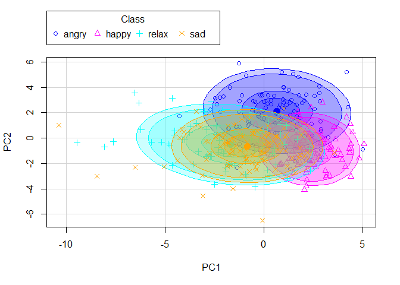<!-- -->

Al analizar este gráfico, se observa que la separación no está
claramente definida y se identifican algunos valores atípicos. Por lo
tanto, no sería recomendable basar nuestro análisis únicamente en las
Componentes Principales.

# Particionamiento del Conjunto de Datos

El particionamiento del conjunto inicial en varios subconjuntos es
necesario para obtener estimaciones de parámetros o del error de mala
clasificación que sean generalizables y para evitar el sobreajuste. La
función `createDataPartition` automatiza algunos procedimientos que
simplifican esta tarea.

En nuestro caso, vamos a particionar la muestra `music` en una parte
($70\%$) para el entrenamiento (`music_pureX`) y el resto ($30\%$) para
el ajuste de parámetros (`music_tuneX`).

``` r
music<-music[,-c(32, 26, 27, 29, 23, 28, 18)]

set.seed(nip)
inTraining <- createDataPartition(music$Class, p = .7, list = FALSE)

#para el entrenamiento:
music_pureX <- music[inTraining,]

#no de entrenamiento:
music_tuneX  <- music[-inTraining,]
```

Para poder utilizar Bagging o Random Forest, las variables de salida
deben ser de tipo numérico o lógico. En nuestro caso, las variables son
de tipo carácter, por lo que debemos convertirlas a factores utilizando
la función `as.factor()`.

``` r
music_tuneX$Class <- as.factor(music_tuneX$Class)
music_pureX$Class <- as.factor(music_pureX$Class)
```

# Entrenamiento

Creamos el objeto `fitControl` utilizando la función `trainControl()`.
Este objeto controla el proceso de entrenamiento y utiliza la validación
cruzada repetida (repeated k-fold cross-validation). En este caso,
realizaremos 10 bloques de validación cruzada, cada uno repetido 3
veces. Además, utilizaremos la función `multiClassSummary` para calcular
las métricas de rendimiento (como precisión, sensibilidad, etc.) a lo
largo de las iteraciones de validación cruzada.

``` r
require(caret)
fitControl <- trainControl(
               method = "repeatedcv",
               #validación cruzada de 10 bloques repetida 3 veces
               number = 10,
               repeats = 3,
               classProbs = TRUE,
               summaryFunction = multiClassSummary,
               verboseIter = FALSE)
```

# Clasificadores

Para resolver nuestro problema de clasificación, utilizaremos los
siguientes métodos: Árbol de Decisión, Método Bootstrap, Random Forest y
Perceptrón Multicapa.

## Primer clasificador: Árbol de Decisión Clásico

Los árboles dividen el conjunto de datos en ramas o nodos, tomando
decisiones basadas en características específicas. Cada nodo representa
una pregunta sobre una característica y las ramas representan las
posibles respuestas. Al final del árbol, se llega a una hoja que
contiene la predicción o clasificación final.

Para establecer un punto de referencia, ajustamos un árbol de decisión
clásico utilizando `rpart`.

``` r
require(rpart)
```

    ## Caricamento del pacchetto richiesto: rpart

``` r
require(rpart.plot)
```

    ## Caricamento del pacchetto richiesto: rpart.plot

    ## Warning: il pacchetto 'rpart.plot' è stato creato con R versione 4.2.3

``` r
set.seed(nip)
music.TREE<- rpart(music_pureX[,1]~. ,data=music_pureX[,-1], method="class",
                     control=list(minsplit=15,  #número mínimo de obs. requeridas para dividir un nodo
                                  minbucket=5,  #número mínimo de obs. en un nodo terminal (hoja)
                                  maxdepth=11,  #profundidad máxima del árbol
                                  xval=10   #número de pliegues en la validación cruzada k-fold
                                  )
                    )

plotcp(music.TREE)
```

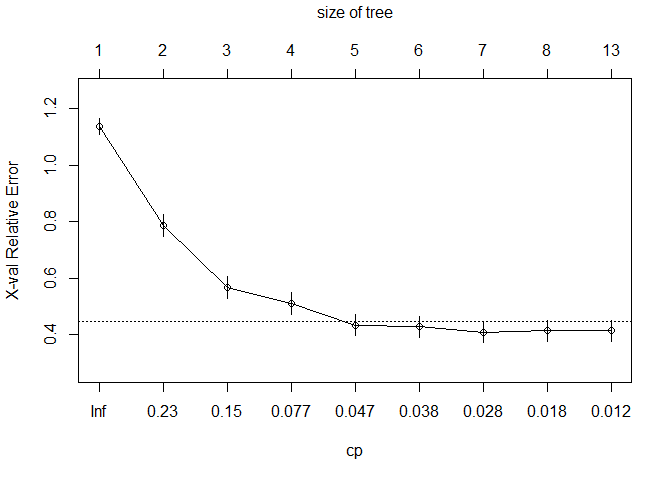<!-- -->

El valor mínimo del error cruzado se encuentra con el parámetro de
complejidad $cp=0.028$.

``` r
set.seed(nip)
music.TREE<-prune(music.TREE, cp=0.028)
rpart.plot(music.TREE, box.palette=list("blue", "grey", "red", "yellow"))
```

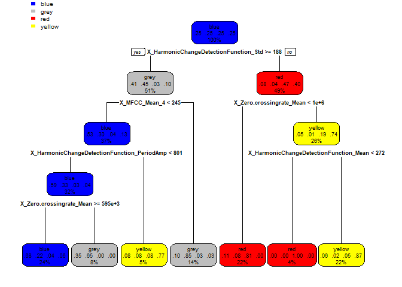<!-- -->

``` r
confusionMatrix(predict(music.TREE, newdata=music_tuneX, type="class"), reference=music_tuneX[,1], positive="Yes",mode="everything")
```

    ## Confusion Matrix and Statistics
    ## 
    ##           Reference
    ## Prediction blue grey red yellow
    ##     blue     18   14   3      3
    ##     grey      6   15   1      1
    ##     red       6    0  23      1
    ##     yellow    0    1   3     25
    ## 
    ## Overall Statistics
    ##                                           
    ##                Accuracy : 0.675           
    ##                  95% CI : (0.5835, 0.7577)
    ##     No Information Rate : 0.25            
    ##     P-Value [Acc > NIR] : <2e-16          
    ##                                           
    ##                   Kappa : 0.5667          
    ##                                           
    ##  Mcnemar's Test P-Value : 0.1626          
    ## 
    ## Statistics by Class:
    ## 
    ##                      Class: blue Class: grey Class: red Class: yellow
    ## Sensitivity               0.6000      0.5000     0.7667        0.8333
    ## Specificity               0.7778      0.9111     0.9222        0.9556
    ## Pos Pred Value            0.4737      0.6522     0.7667        0.8621
    ## Neg Pred Value            0.8537      0.8454     0.9222        0.9451
    ## Precision                 0.4737      0.6522     0.7667        0.8621
    ## Recall                    0.6000      0.5000     0.7667        0.8333
    ## F1                        0.5294      0.5660     0.7667        0.8475
    ## Prevalence                0.2500      0.2500     0.2500        0.2500
    ## Detection Rate            0.1500      0.1250     0.1917        0.2083
    ## Detection Prevalence      0.3167      0.1917     0.2500        0.2417
    ## Balanced Accuracy         0.6889      0.7056     0.8444        0.8944

En el árbol, las percentajes que se obtienen son: Tristeza 24%,
Relajación 22%, felicidad 27%, ira 26%. En la matriz de confusión, la
mayoría de los valores están en la diagonal, excepto por la Tristeza, y
la precisión (accuracy) es del 68%. La Tasa de No Información (No
Information Rate) es del 25%.

## Segundo Clasificador: Bootstrap Aggregating

La variabilidad de los clasificadores se obtiene mediante selección
aleatoria de una submuestra de los casos utilizados para construir los
clasificadores (árboles). La metodología Bagging (Bootstrap Aggregating)
es un método de aprendizaje por conjuntos que se utiliza para reducir la
varianza en un conjunto de datos ruidoso. Genera una forma alternativa
de medir el error de clasificación al usar la muestra OOB (out of bag)
para estimar este error. Aproximadamente una tercera parte de los datos
originales quedan fuera de una remuestra bootstrap y pueden servir para
medir sin sesgo ‘honestamente’ el error sobre el árbol generado con los
otros dos tercios de los datos que sí forman parte de la remuestra
Bootstrap.

``` r
library(adabag)
```

    ## Warning: il pacchetto 'adabag' è stato creato con R versione 4.2.3

    ## Caricamento del pacchetto richiesto: foreach

    ## Warning: il pacchetto 'foreach' è stato creato con R versione 4.2.3

    ## Caricamento del pacchetto richiesto: doParallel

    ## Warning: il pacchetto 'doParallel' è stato creato con R versione 4.2.3

    ## Caricamento del pacchetto richiesto: iterators

    ## Warning: il pacchetto 'iterators' è stato creato con R versione 4.2.3

    ## Caricamento del pacchetto richiesto: parallel

Ahora podemos aplicar el Bagging. Usamos `mfinal=5` para visualizar los
resultados de manera más efectiva. La salida proporciona información
sobre cada uno de los 5 árboles, la importancia de las variables y los
votos que recibe cada caso del conjunto de entrenamiento, entre otros
detalles.

``` r
set.seed(nip)
music.bagging <- bagging(Class~., data=music_pureX, mfinal=5)
print(music.bagging)
```

    ## $formula
    ## Class ~ .
    ## 
    ## $trees
    ## $trees[[1]]
    ## n= 280 
    ## 
    ## node), split, n, loss, yval, (yprob)
    ##       * denotes terminal node
    ## 
    ##  1) root 280 198 yellow (0.23928571 0.22142857 0.24642857 0.29285714)  
    ##    2) X_HarmonicChangeDetectionFunction_Std>=190 125  67 grey (0.42400000 0.46400000 0.01600000 0.09600000)  
    ##      4) X_MFCC_Mean_4< 245 90  41 blue (0.54444444 0.30000000 0.02222222 0.13333333)  
    ##        8) X_Chromagram_Mean_9>=99 59  18 blue (0.69491525 0.13559322 0.03389831 0.13559322)  
    ##         16) X_MFCC_Mean_1>=1781.5 48   8 blue (0.83333333 0.12500000 0.02083333 0.02083333)  
    ##           32) X_Roughness_Slope< 197.5 39   2 blue (0.94871795 0.02564103 0.00000000 0.02564103) *
    ##           33) X_Roughness_Slope>=197.5 9   4 grey (0.33333333 0.55555556 0.11111111 0.00000000) *
    ##         17) X_MFCC_Mean_1< 1781.5 11   4 yellow (0.09090909 0.18181818 0.09090909 0.63636364) *
    ##        9) X_Chromagram_Mean_9< 99 31  12 grey (0.25806452 0.61290323 0.00000000 0.12903226)  
    ##         18) X_Zero.crossingrate_Mean< 760261 19   1 grey (0.05263158 0.94736842 0.00000000 0.00000000) *
    ##         19) X_Zero.crossingrate_Mean>=760261 12   5 blue (0.58333333 0.08333333 0.00000000 0.33333333) *
    ##      5) X_MFCC_Mean_4>=245 35   4 grey (0.11428571 0.88571429 0.00000000 0.00000000) *
    ##    3) X_HarmonicChangeDetectionFunction_Std< 190 155  85 yellow (0.09032258 0.02580645 0.43225806 0.45161290)  
    ##      6) X_Zero.crossingrate_Mean< 938231.5 64   8 red (0.07812500 0.04687500 0.87500000 0.00000000) *
    ##      7) X_Zero.crossingrate_Mean>=938231.5 91  21 yellow (0.09890110 0.01098901 0.12087912 0.76923077)  
    ##       14) X_Fluctuation_Mean< 5024 7   0 red (0.00000000 0.00000000 1.00000000 0.00000000) *
    ##       15) X_Fluctuation_Mean>=5024 84  14 yellow (0.10714286 0.01190476 0.04761905 0.83333333)  
    ##         30) X_Chromagram_Mean_2< 36.5 7   3 blue (0.57142857 0.00000000 0.28571429 0.14285714) *
    ##         31) X_Chromagram_Mean_2>=36.5 77   8 yellow (0.06493506 0.01298701 0.02597403 0.89610390) *
    ## 
    ## $trees[[2]]
    ## n= 280 
    ## 
    ## node), split, n, loss, yval, (yprob)
    ##       * denotes terminal node
    ## 
    ##  1) root 280 204 blue (0.27142857 0.25357143 0.26428571 0.21071429)  
    ##    2) X_HarmonicChangeDetectionFunction_Std>=191.5 135  69 grey (0.44444444 0.48888889 0.02962963 0.03703704)  
    ##      4) X_MFCC_Mean_4< 245 90  37 blue (0.58888889 0.31111111 0.04444444 0.05555556)  
    ##        8) X_Chromagram_Mean_4>=0.5 70  21 blue (0.70000000 0.17142857 0.05714286 0.07142857) *
    ##        9) X_Chromagram_Mean_4< 0.5 20   4 grey (0.20000000 0.80000000 0.00000000 0.00000000) *
    ##      5) X_MFCC_Mean_4>=245 45   7 grey (0.15555556 0.84444444 0.00000000 0.00000000)  
    ##       10) X_Chromagram_Mean_1>=636 8   2 blue (0.75000000 0.25000000 0.00000000 0.00000000) *
    ##       11) X_Chromagram_Mean_1< 636 37   1 grey (0.02702703 0.97297297 0.00000000 0.00000000) *
    ##    3) X_HarmonicChangeDetectionFunction_Std< 191.5 145  75 red (0.11034483 0.03448276 0.48275862 0.37241379)  
    ##      6) X_Zero.crossingrate_Mean< 1036245 72  12 red (0.11111111 0.04166667 0.83333333 0.01388889)  
    ##       12) X_MFCC_Mean_11< -65 13   5 blue (0.61538462 0.07692308 0.30769231 0.00000000) *
    ##       13) X_MFCC_Mean_11>=-65 59   3 red (0.00000000 0.03389831 0.94915254 0.01694915) *
    ##      7) X_Zero.crossingrate_Mean>=1036245 73  20 yellow (0.10958904 0.02739726 0.13698630 0.72602740)  
    ##       14) X_HarmonicChangeDetectionFunction_Mean< 271.5 10   0 red (0.00000000 0.00000000 1.00000000 0.00000000) *
    ##       15) X_HarmonicChangeDetectionFunction_Mean>=271.5 63  10 yellow (0.12698413 0.03174603 0.00000000 0.84126984) *
    ## 
    ## $trees[[3]]
    ## n= 280 
    ## 
    ## node), split, n, loss, yval, (yprob)
    ##       * denotes terminal node
    ## 
    ##  1) root 280 201 grey (0.257142857 0.282142857 0.253571429 0.207142857)  
    ##    2) X_HarmonicChangeDetectionFunction_Std>=188 151  80 grey (0.443708609 0.470198675 0.026490066 0.059602649)  
    ##      4) X_Zero.crossingrate_Mean>=925743 49  16 blue (0.673469388 0.122448980 0.040816327 0.163265306)  
    ##        8) X_HarmonicChangeDetectionFunction_PeriodAmp< 800.5 40   8 blue (0.800000000 0.150000000 0.025000000 0.025000000) *
    ##        9) X_HarmonicChangeDetectionFunction_PeriodAmp>=800.5 9   2 yellow (0.111111111 0.000000000 0.111111111 0.777777778) *
    ##      5) X_Zero.crossingrate_Mean< 925743 102  37 grey (0.333333333 0.637254902 0.019607843 0.009803922)  
    ##       10) X_Chromagram_Mean_6>=372.5 26   6 blue (0.769230769 0.192307692 0.038461538 0.000000000)  
    ##         20) X_Chromagram_Mean_3< 530.5 18   0 blue (1.000000000 0.000000000 0.000000000 0.000000000) *
    ##         21) X_Chromagram_Mean_3>=530.5 8   3 grey (0.250000000 0.625000000 0.125000000 0.000000000) *
    ##       11) X_Chromagram_Mean_6< 372.5 76  16 grey (0.184210526 0.789473684 0.013157895 0.013157895) *
    ##    3) X_HarmonicChangeDetectionFunction_Std< 188 129  62 red (0.038759690 0.062015504 0.519379845 0.379844961)  
    ##      6) X_Zero.crossingrate_Mean< 1130830 64   9 red (0.015625000 0.109375000 0.859375000 0.015625000) *
    ##      7) X_Zero.crossingrate_Mean>=1130830 65  17 yellow (0.061538462 0.015384615 0.184615385 0.738461538)  
    ##       14) X_HarmonicChangeDetectionFunction_Mean< 276.5 11   0 red (0.000000000 0.000000000 1.000000000 0.000000000) *
    ##       15) X_HarmonicChangeDetectionFunction_Mean>=276.5 54   6 yellow (0.074074074 0.018518519 0.018518519 0.888888889) *
    ## 
    ## $trees[[4]]
    ## n= 280 
    ## 
    ## node), split, n, loss, yval, (yprob)
    ##       * denotes terminal node
    ## 
    ##   1) root 280 198 yellow (0.250000000 0.185714286 0.271428571 0.292857143)  
    ##     2) X_Zero.crossingrate_Mean< 1184519 169 109 red (0.313609467 0.301775148 0.355029586 0.029585799)  
    ##       4) X_HarmonicChangeDetectionFunction_Std>=169.5 121  68 blue (0.438016529 0.421487603 0.115702479 0.024793388)  
    ##         8) X_Spectralkurtosis_Mean>=4555 89  38 blue (0.573033708 0.247191011 0.146067416 0.033707865)  
    ##          16) X_HarmonicChangeDetectionFunction_PeriodAmp< 793.5 75  24 blue (0.680000000 0.266666667 0.040000000 0.013333333)  
    ##            32) X_Chromagram_Mean_9>=56 61  12 blue (0.803278689 0.180327869 0.016393443 0.000000000)  
    ##              64) X_Chromagram_Mean_7>=169 41   2 blue (0.951219512 0.048780488 0.000000000 0.000000000) *
    ##              65) X_Chromagram_Mean_7< 169 20  10 blue (0.500000000 0.450000000 0.050000000 0.000000000)  
    ##               130) X_Chromagram_Mean_6>=303.5 10   1 blue (0.900000000 0.100000000 0.000000000 0.000000000) *
    ##               131) X_Chromagram_Mean_6< 303.5 10   2 grey (0.100000000 0.800000000 0.100000000 0.000000000) *
    ##            33) X_Chromagram_Mean_9< 56 14   5 grey (0.142857143 0.642857143 0.142857143 0.071428571) *
    ##          17) X_HarmonicChangeDetectionFunction_PeriodAmp>=793.5 14   4 red (0.000000000 0.142857143 0.714285714 0.142857143) *
    ##         9) X_Spectralkurtosis_Mean< 4555 32   3 grey (0.062500000 0.906250000 0.031250000 0.000000000) *
    ##       5) X_HarmonicChangeDetectionFunction_Std< 169.5 48   2 red (0.000000000 0.000000000 0.958333333 0.041666667) *
    ##     3) X_Zero.crossingrate_Mean>=1184519 111  34 yellow (0.153153153 0.009009009 0.144144144 0.693693694)  
    ##       6) X_Fluctuation_Mean< 5385 15   1 red (0.000000000 0.000000000 0.933333333 0.066666667) *
    ##       7) X_Fluctuation_Mean>=5385 96  20 yellow (0.177083333 0.010416667 0.020833333 0.791666667)  
    ##        14) X_HarmonicChangeDetectionFunction_PeriodAmp< 783 14   3 blue (0.785714286 0.000000000 0.071428571 0.142857143) *
    ##        15) X_HarmonicChangeDetectionFunction_PeriodAmp>=783 82   8 yellow (0.073170732 0.012195122 0.012195122 0.902439024) *
    ## 
    ## $trees[[5]]
    ## n= 280 
    ## 
    ## node), split, n, loss, yval, (yprob)
    ##       * denotes terminal node
    ## 
    ##  1) root 280 202 yellow (0.25714286 0.21071429 0.25357143 0.27857143)  
    ##    2) X_HarmonicChangeDetectionFunction_PeriodAmp< 793.5 134  71 blue (0.47014925 0.38059701 0.11194030 0.03731343)  
    ##      4) X_HarmonicChangeDetectionFunction_Std>=170.5 123  60 blue (0.51219512 0.41463415 0.04065041 0.03252033)  
    ##        8) X_MFCC_Mean_4< 250.5 86  31 blue (0.63953488 0.26744186 0.04651163 0.04651163)  
    ##         16) X_Roughness_Slope< 197 65  15 blue (0.76923077 0.13846154 0.03076923 0.06153846)  
    ##           32) X_Fluctuation_Mean< 8433.5 56   8 blue (0.85714286 0.07142857 0.03571429 0.03571429) *
    ##           33) X_Fluctuation_Mean>=8433.5 9   4 grey (0.22222222 0.55555556 0.00000000 0.22222222) *
    ##         17) X_Roughness_Slope>=197 21   7 grey (0.23809524 0.66666667 0.09523810 0.00000000)  
    ##           34) X_Chromagram_Mean_7< 164.5 7   2 blue (0.71428571 0.14285714 0.14285714 0.00000000) *
    ##           35) X_Chromagram_Mean_7>=164.5 14   1 grey (0.00000000 0.92857143 0.07142857 0.00000000) *
    ##        9) X_MFCC_Mean_4>=250.5 37   9 grey (0.21621622 0.75675676 0.02702703 0.00000000)  
    ##         18) X_Chromagram_Mean_1>=593 7   1 blue (0.85714286 0.14285714 0.00000000 0.00000000) *
    ##         19) X_Chromagram_Mean_1< 593 30   3 grey (0.06666667 0.90000000 0.03333333 0.00000000) *
    ##      5) X_HarmonicChangeDetectionFunction_Std< 170.5 11   1 red (0.00000000 0.00000000 0.90909091 0.09090909) *
    ##    3) X_HarmonicChangeDetectionFunction_PeriodAmp>=793.5 146  73 yellow (0.06164384 0.05479452 0.38356164 0.50000000)  
    ##      6) X_Zero.crossingrate_Mean< 1035788 53   7 red (0.00000000 0.11320755 0.86792453 0.01886792)  
    ##       12) X_HarmonicChangeDetectionFunction_Std>=188 8   2 grey (0.00000000 0.75000000 0.12500000 0.12500000) *
    ##       13) X_HarmonicChangeDetectionFunction_Std< 188 45   0 red (0.00000000 0.00000000 1.00000000 0.00000000) *
    ##      7) X_Zero.crossingrate_Mean>=1035788 93  21 yellow (0.09677419 0.02150538 0.10752688 0.77419355)  
    ##       14) X_Fluctuation_Mean< 5330 10   0 red (0.00000000 0.00000000 1.00000000 0.00000000) *
    ##       15) X_Fluctuation_Mean>=5330 83  11 yellow (0.10843373 0.02409639 0.00000000 0.86746988) *
    ## 
    ## 
    ## $votes
    ##        [,1] [,2] [,3] [,4]
    ##   [1,]    0    5    0    0
    ##   [2,]    0    5    0    0
    ##   [3,]    0    5    0    0
    ##   [4,]    1    4    0    0
    ##   [5,]    3    2    0    0
    ##   [6,]    0    2    3    0
    ##   [7,]    0    5    0    0
    ##   [8,]    0    4    1    0
    ##   [9,]    0    4    1    0
    ##  [10,]    0    5    0    0
    ##  [11,]    0    5    0    0
    ##  [12,]    1    4    0    0
    ##  [13,]    2    3    0    0
    ##  [14,]    0    5    0    0
    ##  [15,]    0    5    0    0
    ##  [16,]    2    3    0    0
    ##  [17,]    1    0    0    4
    ##  [18,]    3    2    0    0
    ##  [19,]    4    0    0    1
    ##  [20,]    0    5    0    0
    ##  [21,]    2    3    0    0
    ##  [22,]    2    1    2    0
    ##  [23,]    1    4    0    0
    ##  [24,]    2    3    0    0
    ##  [25,]    2    3    0    0
    ##  [26,]    0    5    0    0
    ##  [27,]    1    2    2    0
    ##  [28,]    0    5    0    0
    ##  [29,]    3    2    0    0
    ##  [30,]    0    5    0    0
    ##  [31,]    1    4    0    0
    ##  [32,]    2    3    0    0
    ##  [33,]    2    3    0    0
    ##  [34,]    3    2    0    0
    ##  [35,]    0    5    0    0
    ##  [36,]    3    2    0    0
    ##  [37,]    0    0    0    5
    ##  [38,]    2    3    0    0
    ##  [39,]    1    4    0    0
    ##  [40,]    1    0    4    0
    ##  [41,]    0    5    0    0
    ##  [42,]    2    3    0    0
    ##  [43,]    0    5    0    0
    ##  [44,]    0    5    0    0
    ##  [45,]    0    5    0    0
    ##  [46,]    0    5    0    0
    ##  [47,]    1    4    0    0
    ##  [48,]    1    4    0    0
    ##  [49,]    2    3    0    0
    ##  [50,]    2    3    0    0
    ##  [51,]    0    5    0    0
    ##  [52,]    1    4    0    0
    ##  [53,]    0    4    1    0
    ##  [54,]    4    1    0    0
    ##  [55,]    2    3    0    0
    ##  [56,]    1    4    0    0
    ##  [57,]    1    4    0    0
    ##  [58,]    0    5    0    0
    ##  [59,]    0    2    3    0
    ##  [60,]    1    4    0    0
    ##  [61,]    0    5    0    0
    ##  [62,]    1    4    0    0
    ##  [63,]    1    1    2    1
    ##  [64,]    0    5    0    0
    ##  [65,]    0    5    0    0
    ##  [66,]    1    4    0    0
    ##  [67,]    0    5    0    0
    ##  [68,]    1    4    0    0
    ##  [69,]    2    3    0    0
    ##  [70,]    2    3    0    0
    ##  [71,]    0    0    0    5
    ##  [72,]    0    0    1    4
    ##  [73,]    0    0    0    5
    ##  [74,]    0    0    0    5
    ##  [75,]    0    0    0    5
    ##  [76,]    0    0    0    5
    ##  [77,]    0    0    0    5
    ##  [78,]    0    0    0    5
    ##  [79,]    0    0    0    5
    ##  [80,]    0    0    2    3
    ##  [81,]    1    0    2    2
    ##  [82,]    0    0    0    5
    ##  [83,]    0    0    0    5
    ##  [84,]    0    0    0    5
    ##  [85,]    0    0    0    5
    ##  [86,]    2    0    1    2
    ##  [87,]    0    0    2    3
    ##  [88,]    0    1    2    2
    ##  [89,]    1    0    0    4
    ##  [90,]    0    0    0    5
    ##  [91,]    0    0    1    4
    ##  [92,]    0    0    0    5
    ##  [93,]    1    0    0    4
    ##  [94,]    0    0    0    5
    ##  [95,]    0    0    0    5
    ##  [96,]    2    0    0    3
    ##  [97,]    0    0    0    5
    ##  [98,]    0    0    2    3
    ##  [99,]    0    0    0    5
    ## [100,]    4    1    0    0
    ## [101,]    0    0    0    5
    ## [102,]    2    0    0    3
    ## [103,]    0    0    0    5
    ## [104,]    0    0    0    5
    ## [105,]    0    0    0    5
    ## [106,]    0    0    0    5
    ## [107,]    0    0    0    5
    ## [108,]    0    0    0    5
    ## [109,]    0    0    2    3
    ## [110,]    0    0    0    5
    ## [111,]    0    0    0    5
    ## [112,]    0    0    1    4
    ## [113,]    0    0    0    5
    ## [114,]    0    0    0    5
    ## [115,]    2    0    0    3
    ## [116,]    3    0    0    2
    ## [117,]    0    0    0    5
    ## [118,]    0    0    0    5
    ## [119,]    0    0    0    5
    ## [120,]    0    0    0    5
    ## [121,]    0    0    1    4
    ## [122,]    0    0    0    5
    ## [123,]    0    0    0    5
    ## [124,]    2    0    1    2
    ## [125,]    2    0    0    3
    ## [126,]    0    0    0    5
    ## [127,]    1    0    0    4
    ## [128,]    0    0    0    5
    ## [129,]    0    0    0    5
    ## [130,]    0    0    0    5
    ## [131,]    0    2    0    3
    ## [132,]    0    0    0    5
    ## [133,]    0    0    0    5
    ## [134,]    0    0    0    5
    ## [135,]    0    0    0    5
    ## [136,]    1    0    0    4
    ## [137,]    0    0    0    5
    ## [138,]    3    2    0    0
    ## [139,]    2    0    0    3
    ## [140,]    0    0    0    5
    ## [141,]    4    1    0    0
    ## [142,]    1    4    0    0
    ## [143,]    4    1    0    0
    ## [144,]    2    3    0    0
    ## [145,]    4    1    0    0
    ## [146,]    5    0    0    0
    ## [147,]    5    0    0    0
    ## [148,]    4    1    0    0
    ## [149,]    1    4    0    0
    ## [150,]    4    0    0    1
    ## [151,]    5    0    0    0
    ## [152,]    2    1    1    1
    ## [153,]    4    0    1    0
    ## [154,]    5    0    0    0
    ## [155,]    4    1    0    0
    ## [156,]    4    1    0    0
    ## [157,]    4    1    0    0
    ## [158,]    3    2    0    0
    ## [159,]    5    0    0    0
    ## [160,]    4    1    0    0
    ## [161,]    4    1    0    0
    ## [162,]    0    0    0    5
    ## [163,]    3    2    0    0
    ## [164,]    4    1    0    0
    ## [165,]    4    1    0    0
    ## [166,]    3    2    0    0
    ## [167,]    1    0    0    4
    ## [168,]    2    1    2    0
    ## [169,]    4    0    0    1
    ## [170,]    5    0    0    0
    ## [171,]    5    0    0    0
    ## [172,]    5    0    0    0
    ## [173,]    5    0    0    0
    ## [174,]    3    2    0    0
    ## [175,]    5    0    0    0
    ## [176,]    5    0    0    0
    ## [177,]    0    0    0    5
    ## [178,]    3    0    2    0
    ## [179,]    1    4    0    0
    ## [180,]    3    2    0    0
    ## [181,]    5    0    0    0
    ## [182,]    3    1    1    0
    ## [183,]    5    0    0    0
    ## [184,]    2    0    0    3
    ## [185,]    5    0    0    0
    ## [186,]    3    2    0    0
    ## [187,]    3    2    0    0
    ## [188,]    3    0    2    0
    ## [189,]    4    0    1    0
    ## [190,]    3    2    0    0
    ## [191,]    4    1    0    0
    ## [192,]    2    3    0    0
    ## [193,]    3    2    0    0
    ## [194,]    5    0    0    0
    ## [195,]    3    2    0    0
    ## [196,]    4    0    1    0
    ## [197,]    3    0    2    0
    ## [198,]    4    1    0    0
    ## [199,]    3    2    0    0
    ## [200,]    3    1    0    1
    ## [201,]    5    0    0    0
    ## [202,]    1    0    4    0
    ## [203,]    3    2    0    0
    ## [204,]    2    0    0    3
    ## [205,]    3    0    1    1
    ## [206,]    1    2    2    0
    ## [207,]    3    2    0    0
    ## [208,]    4    0    1    0
    ## [209,]    2    2    0    1
    ## [210,]    5    0    0    0
    ## [211,]    0    0    5    0
    ## [212,]    0    0    5    0
    ## [213,]    0    2    3    0
    ## [214,]    0    0    4    1
    ## [215,]    0    0    5    0
    ## [216,]    0    0    5    0
    ## [217,]    0    0    5    0
    ## [218,]    0    0    5    0
    ## [219,]    0    0    5    0
    ## [220,]    1    0    4    0
    ## [221,]    1    0    4    0
    ## [222,]    0    0    5    0
    ## [223,]    0    0    5    0
    ## [224,]    0    0    5    0
    ## [225,]    0    0    4    1
    ## [226,]    0    0    5    0
    ## [227,]    1    0    4    0
    ## [228,]    0    0    5    0
    ## [229,]    0    0    5    0
    ## [230,]    1    1    3    0
    ## [231,]    2    2    1    0
    ## [232,]    0    0    5    0
    ## [233,]    0    0    5    0
    ## [234,]    0    0    5    0
    ## [235,]    0    0    5    0
    ## [236,]    0    0    0    5
    ## [237,]    0    0    5    0
    ## [238,]    0    0    5    0
    ## [239,]    0    0    5    0
    ## [240,]    1    1    3    0
    ## [241,]    0    0    5    0
    ## [242,]    0    0    5    0
    ## [243,]    4    0    0    1
    ## [244,]    0    0    5    0
    ## [245,]    0    0    5    0
    ## [246,]    0    0    5    0
    ## [247,]    0    0    5    0
    ## [248,]    2    0    3    0
    ## [249,]    0    0    5    0
    ## [250,]    1    0    4    0
    ## [251,]    1    0    4    0
    ## [252,]    0    0    5    0
    ## [253,]    0    0    5    0
    ## [254,]    0    0    5    0
    ## [255,]    1    1    3    0
    ## [256,]    1    0    4    0
    ## [257,]    0    0    5    0
    ## [258,]    1    0    4    0
    ## [259,]    2    2    0    1
    ## [260,]    0    0    5    0
    ## [261,]    0    0    5    0
    ## [262,]    0    0    5    0
    ## [263,]    0    0    5    0
    ## [264,]    0    0    5    0
    ## [265,]    0    0    5    0
    ## [266,]    0    0    3    2
    ## [267,]    0    0    5    0
    ## [268,]    0    0    5    0
    ## [269,]    0    0    5    0
    ## [270,]    1    2    0    2
    ## [271,]    0    0    5    0
    ## [272,]    0    3    2    0
    ## [273,]    0    0    5    0
    ## [274,]    0    0    5    0
    ## [275,]    1    0    4    0
    ## [276,]    0    0    3    2
    ## [277,]    1    0    4    0
    ## [278,]    1    0    4    0
    ## [279,]    0    0    5    0
    ## [280,]    0    0    5    0
    ## 
    ## $prob
    ##        [,1] [,2] [,3] [,4]
    ##   [1,]  0.0  1.0  0.0  0.0
    ##   [2,]  0.0  1.0  0.0  0.0
    ##   [3,]  0.0  1.0  0.0  0.0
    ##   [4,]  0.2  0.8  0.0  0.0
    ##   [5,]  0.6  0.4  0.0  0.0
    ##   [6,]  0.0  0.4  0.6  0.0
    ##   [7,]  0.0  1.0  0.0  0.0
    ##   [8,]  0.0  0.8  0.2  0.0
    ##   [9,]  0.0  0.8  0.2  0.0
    ##  [10,]  0.0  1.0  0.0  0.0
    ##  [11,]  0.0  1.0  0.0  0.0
    ##  [12,]  0.2  0.8  0.0  0.0
    ##  [13,]  0.4  0.6  0.0  0.0
    ##  [14,]  0.0  1.0  0.0  0.0
    ##  [15,]  0.0  1.0  0.0  0.0
    ##  [16,]  0.4  0.6  0.0  0.0
    ##  [17,]  0.2  0.0  0.0  0.8
    ##  [18,]  0.6  0.4  0.0  0.0
    ##  [19,]  0.8  0.0  0.0  0.2
    ##  [20,]  0.0  1.0  0.0  0.0
    ##  [21,]  0.4  0.6  0.0  0.0
    ##  [22,]  0.4  0.2  0.4  0.0
    ##  [23,]  0.2  0.8  0.0  0.0
    ##  [24,]  0.4  0.6  0.0  0.0
    ##  [25,]  0.4  0.6  0.0  0.0
    ##  [26,]  0.0  1.0  0.0  0.0
    ##  [27,]  0.2  0.4  0.4  0.0
    ##  [28,]  0.0  1.0  0.0  0.0
    ##  [29,]  0.6  0.4  0.0  0.0
    ##  [30,]  0.0  1.0  0.0  0.0
    ##  [31,]  0.2  0.8  0.0  0.0
    ##  [32,]  0.4  0.6  0.0  0.0
    ##  [33,]  0.4  0.6  0.0  0.0
    ##  [34,]  0.6  0.4  0.0  0.0
    ##  [35,]  0.0  1.0  0.0  0.0
    ##  [36,]  0.6  0.4  0.0  0.0
    ##  [37,]  0.0  0.0  0.0  1.0
    ##  [38,]  0.4  0.6  0.0  0.0
    ##  [39,]  0.2  0.8  0.0  0.0
    ##  [40,]  0.2  0.0  0.8  0.0
    ##  [41,]  0.0  1.0  0.0  0.0
    ##  [42,]  0.4  0.6  0.0  0.0
    ##  [43,]  0.0  1.0  0.0  0.0
    ##  [44,]  0.0  1.0  0.0  0.0
    ##  [45,]  0.0  1.0  0.0  0.0
    ##  [46,]  0.0  1.0  0.0  0.0
    ##  [47,]  0.2  0.8  0.0  0.0
    ##  [48,]  0.2  0.8  0.0  0.0
    ##  [49,]  0.4  0.6  0.0  0.0
    ##  [50,]  0.4  0.6  0.0  0.0
    ##  [51,]  0.0  1.0  0.0  0.0
    ##  [52,]  0.2  0.8  0.0  0.0
    ##  [53,]  0.0  0.8  0.2  0.0
    ##  [54,]  0.8  0.2  0.0  0.0
    ##  [55,]  0.4  0.6  0.0  0.0
    ##  [56,]  0.2  0.8  0.0  0.0
    ##  [57,]  0.2  0.8  0.0  0.0
    ##  [58,]  0.0  1.0  0.0  0.0
    ##  [59,]  0.0  0.4  0.6  0.0
    ##  [60,]  0.2  0.8  0.0  0.0
    ##  [61,]  0.0  1.0  0.0  0.0
    ##  [62,]  0.2  0.8  0.0  0.0
    ##  [63,]  0.2  0.2  0.4  0.2
    ##  [64,]  0.0  1.0  0.0  0.0
    ##  [65,]  0.0  1.0  0.0  0.0
    ##  [66,]  0.2  0.8  0.0  0.0
    ##  [67,]  0.0  1.0  0.0  0.0
    ##  [68,]  0.2  0.8  0.0  0.0
    ##  [69,]  0.4  0.6  0.0  0.0
    ##  [70,]  0.4  0.6  0.0  0.0
    ##  [71,]  0.0  0.0  0.0  1.0
    ##  [72,]  0.0  0.0  0.2  0.8
    ##  [73,]  0.0  0.0  0.0  1.0
    ##  [74,]  0.0  0.0  0.0  1.0
    ##  [75,]  0.0  0.0  0.0  1.0
    ##  [76,]  0.0  0.0  0.0  1.0
    ##  [77,]  0.0  0.0  0.0  1.0
    ##  [78,]  0.0  0.0  0.0  1.0
    ##  [79,]  0.0  0.0  0.0  1.0
    ##  [80,]  0.0  0.0  0.4  0.6
    ##  [81,]  0.2  0.0  0.4  0.4
    ##  [82,]  0.0  0.0  0.0  1.0
    ##  [83,]  0.0  0.0  0.0  1.0
    ##  [84,]  0.0  0.0  0.0  1.0
    ##  [85,]  0.0  0.0  0.0  1.0
    ##  [86,]  0.4  0.0  0.2  0.4
    ##  [87,]  0.0  0.0  0.4  0.6
    ##  [88,]  0.0  0.2  0.4  0.4
    ##  [89,]  0.2  0.0  0.0  0.8
    ##  [90,]  0.0  0.0  0.0  1.0
    ##  [91,]  0.0  0.0  0.2  0.8
    ##  [92,]  0.0  0.0  0.0  1.0
    ##  [93,]  0.2  0.0  0.0  0.8
    ##  [94,]  0.0  0.0  0.0  1.0
    ##  [95,]  0.0  0.0  0.0  1.0
    ##  [96,]  0.4  0.0  0.0  0.6
    ##  [97,]  0.0  0.0  0.0  1.0
    ##  [98,]  0.0  0.0  0.4  0.6
    ##  [99,]  0.0  0.0  0.0  1.0
    ## [100,]  0.8  0.2  0.0  0.0
    ## [101,]  0.0  0.0  0.0  1.0
    ## [102,]  0.4  0.0  0.0  0.6
    ## [103,]  0.0  0.0  0.0  1.0
    ## [104,]  0.0  0.0  0.0  1.0
    ## [105,]  0.0  0.0  0.0  1.0
    ## [106,]  0.0  0.0  0.0  1.0
    ## [107,]  0.0  0.0  0.0  1.0
    ## [108,]  0.0  0.0  0.0  1.0
    ## [109,]  0.0  0.0  0.4  0.6
    ## [110,]  0.0  0.0  0.0  1.0
    ## [111,]  0.0  0.0  0.0  1.0
    ## [112,]  0.0  0.0  0.2  0.8
    ## [113,]  0.0  0.0  0.0  1.0
    ## [114,]  0.0  0.0  0.0  1.0
    ## [115,]  0.4  0.0  0.0  0.6
    ## [116,]  0.6  0.0  0.0  0.4
    ## [117,]  0.0  0.0  0.0  1.0
    ## [118,]  0.0  0.0  0.0  1.0
    ## [119,]  0.0  0.0  0.0  1.0
    ## [120,]  0.0  0.0  0.0  1.0
    ## [121,]  0.0  0.0  0.2  0.8
    ## [122,]  0.0  0.0  0.0  1.0
    ## [123,]  0.0  0.0  0.0  1.0
    ## [124,]  0.4  0.0  0.2  0.4
    ## [125,]  0.4  0.0  0.0  0.6
    ## [126,]  0.0  0.0  0.0  1.0
    ## [127,]  0.2  0.0  0.0  0.8
    ## [128,]  0.0  0.0  0.0  1.0
    ## [129,]  0.0  0.0  0.0  1.0
    ## [130,]  0.0  0.0  0.0  1.0
    ## [131,]  0.0  0.4  0.0  0.6
    ## [132,]  0.0  0.0  0.0  1.0
    ## [133,]  0.0  0.0  0.0  1.0
    ## [134,]  0.0  0.0  0.0  1.0
    ## [135,]  0.0  0.0  0.0  1.0
    ## [136,]  0.2  0.0  0.0  0.8
    ## [137,]  0.0  0.0  0.0  1.0
    ## [138,]  0.6  0.4  0.0  0.0
    ## [139,]  0.4  0.0  0.0  0.6
    ## [140,]  0.0  0.0  0.0  1.0
    ## [141,]  0.8  0.2  0.0  0.0
    ## [142,]  0.2  0.8  0.0  0.0
    ## [143,]  0.8  0.2  0.0  0.0
    ## [144,]  0.4  0.6  0.0  0.0
    ## [145,]  0.8  0.2  0.0  0.0
    ## [146,]  1.0  0.0  0.0  0.0
    ## [147,]  1.0  0.0  0.0  0.0
    ## [148,]  0.8  0.2  0.0  0.0
    ## [149,]  0.2  0.8  0.0  0.0
    ## [150,]  0.8  0.0  0.0  0.2
    ## [151,]  1.0  0.0  0.0  0.0
    ## [152,]  0.4  0.2  0.2  0.2
    ## [153,]  0.8  0.0  0.2  0.0
    ## [154,]  1.0  0.0  0.0  0.0
    ## [155,]  0.8  0.2  0.0  0.0
    ## [156,]  0.8  0.2  0.0  0.0
    ## [157,]  0.8  0.2  0.0  0.0
    ## [158,]  0.6  0.4  0.0  0.0
    ## [159,]  1.0  0.0  0.0  0.0
    ## [160,]  0.8  0.2  0.0  0.0
    ## [161,]  0.8  0.2  0.0  0.0
    ## [162,]  0.0  0.0  0.0  1.0
    ## [163,]  0.6  0.4  0.0  0.0
    ## [164,]  0.8  0.2  0.0  0.0
    ## [165,]  0.8  0.2  0.0  0.0
    ## [166,]  0.6  0.4  0.0  0.0
    ## [167,]  0.2  0.0  0.0  0.8
    ## [168,]  0.4  0.2  0.4  0.0
    ## [169,]  0.8  0.0  0.0  0.2
    ## [170,]  1.0  0.0  0.0  0.0
    ## [171,]  1.0  0.0  0.0  0.0
    ## [172,]  1.0  0.0  0.0  0.0
    ## [173,]  1.0  0.0  0.0  0.0
    ## [174,]  0.6  0.4  0.0  0.0
    ## [175,]  1.0  0.0  0.0  0.0
    ## [176,]  1.0  0.0  0.0  0.0
    ## [177,]  0.0  0.0  0.0  1.0
    ## [178,]  0.6  0.0  0.4  0.0
    ## [179,]  0.2  0.8  0.0  0.0
    ## [180,]  0.6  0.4  0.0  0.0
    ## [181,]  1.0  0.0  0.0  0.0
    ## [182,]  0.6  0.2  0.2  0.0
    ## [183,]  1.0  0.0  0.0  0.0
    ## [184,]  0.4  0.0  0.0  0.6
    ## [185,]  1.0  0.0  0.0  0.0
    ## [186,]  0.6  0.4  0.0  0.0
    ## [187,]  0.6  0.4  0.0  0.0
    ## [188,]  0.6  0.0  0.4  0.0
    ## [189,]  0.8  0.0  0.2  0.0
    ## [190,]  0.6  0.4  0.0  0.0
    ## [191,]  0.8  0.2  0.0  0.0
    ## [192,]  0.4  0.6  0.0  0.0
    ## [193,]  0.6  0.4  0.0  0.0
    ## [194,]  1.0  0.0  0.0  0.0
    ## [195,]  0.6  0.4  0.0  0.0
    ## [196,]  0.8  0.0  0.2  0.0
    ## [197,]  0.6  0.0  0.4  0.0
    ## [198,]  0.8  0.2  0.0  0.0
    ## [199,]  0.6  0.4  0.0  0.0
    ## [200,]  0.6  0.2  0.0  0.2
    ## [201,]  1.0  0.0  0.0  0.0
    ## [202,]  0.2  0.0  0.8  0.0
    ## [203,]  0.6  0.4  0.0  0.0
    ## [204,]  0.4  0.0  0.0  0.6
    ## [205,]  0.6  0.0  0.2  0.2
    ## [206,]  0.2  0.4  0.4  0.0
    ## [207,]  0.6  0.4  0.0  0.0
    ## [208,]  0.8  0.0  0.2  0.0
    ## [209,]  0.4  0.4  0.0  0.2
    ## [210,]  1.0  0.0  0.0  0.0
    ## [211,]  0.0  0.0  1.0  0.0
    ## [212,]  0.0  0.0  1.0  0.0
    ## [213,]  0.0  0.4  0.6  0.0
    ## [214,]  0.0  0.0  0.8  0.2
    ## [215,]  0.0  0.0  1.0  0.0
    ## [216,]  0.0  0.0  1.0  0.0
    ## [217,]  0.0  0.0  1.0  0.0
    ## [218,]  0.0  0.0  1.0  0.0
    ## [219,]  0.0  0.0  1.0  0.0
    ## [220,]  0.2  0.0  0.8  0.0
    ## [221,]  0.2  0.0  0.8  0.0
    ## [222,]  0.0  0.0  1.0  0.0
    ## [223,]  0.0  0.0  1.0  0.0
    ## [224,]  0.0  0.0  1.0  0.0
    ## [225,]  0.0  0.0  0.8  0.2
    ## [226,]  0.0  0.0  1.0  0.0
    ## [227,]  0.2  0.0  0.8  0.0
    ## [228,]  0.0  0.0  1.0  0.0
    ## [229,]  0.0  0.0  1.0  0.0
    ## [230,]  0.2  0.2  0.6  0.0
    ## [231,]  0.4  0.4  0.2  0.0
    ## [232,]  0.0  0.0  1.0  0.0
    ## [233,]  0.0  0.0  1.0  0.0
    ## [234,]  0.0  0.0  1.0  0.0
    ## [235,]  0.0  0.0  1.0  0.0
    ## [236,]  0.0  0.0  0.0  1.0
    ## [237,]  0.0  0.0  1.0  0.0
    ## [238,]  0.0  0.0  1.0  0.0
    ## [239,]  0.0  0.0  1.0  0.0
    ## [240,]  0.2  0.2  0.6  0.0
    ## [241,]  0.0  0.0  1.0  0.0
    ## [242,]  0.0  0.0  1.0  0.0
    ## [243,]  0.8  0.0  0.0  0.2
    ## [244,]  0.0  0.0  1.0  0.0
    ## [245,]  0.0  0.0  1.0  0.0
    ## [246,]  0.0  0.0  1.0  0.0
    ## [247,]  0.0  0.0  1.0  0.0
    ## [248,]  0.4  0.0  0.6  0.0
    ## [249,]  0.0  0.0  1.0  0.0
    ## [250,]  0.2  0.0  0.8  0.0
    ## [251,]  0.2  0.0  0.8  0.0
    ## [252,]  0.0  0.0  1.0  0.0
    ## [253,]  0.0  0.0  1.0  0.0
    ## [254,]  0.0  0.0  1.0  0.0
    ## [255,]  0.2  0.2  0.6  0.0
    ## [256,]  0.2  0.0  0.8  0.0
    ## [257,]  0.0  0.0  1.0  0.0
    ## [258,]  0.2  0.0  0.8  0.0
    ## [259,]  0.4  0.4  0.0  0.2
    ## [260,]  0.0  0.0  1.0  0.0
    ## [261,]  0.0  0.0  1.0  0.0
    ## [262,]  0.0  0.0  1.0  0.0
    ## [263,]  0.0  0.0  1.0  0.0
    ## [264,]  0.0  0.0  1.0  0.0
    ## [265,]  0.0  0.0  1.0  0.0
    ## [266,]  0.0  0.0  0.6  0.4
    ## [267,]  0.0  0.0  1.0  0.0
    ## [268,]  0.0  0.0  1.0  0.0
    ## [269,]  0.0  0.0  1.0  0.0
    ## [270,]  0.2  0.4  0.0  0.4
    ## [271,]  0.0  0.0  1.0  0.0
    ## [272,]  0.0  0.6  0.4  0.0
    ## [273,]  0.0  0.0  1.0  0.0
    ## [274,]  0.0  0.0  1.0  0.0
    ## [275,]  0.2  0.0  0.8  0.0
    ## [276,]  0.0  0.0  0.6  0.4
    ## [277,]  0.2  0.0  0.8  0.0
    ## [278,]  0.2  0.0  0.8  0.0
    ## [279,]  0.0  0.0  1.0  0.0
    ## [280,]  0.0  0.0  1.0  0.0
    ## 
    ## $class
    ##   [1] "grey"   "grey"   "grey"   "grey"   "blue"   "red"    "grey"   "grey"  
    ##   [9] "grey"   "grey"   "grey"   "grey"   "grey"   "grey"   "grey"   "grey"  
    ##  [17] "yellow" "blue"   "blue"   "grey"   "grey"   "blue"   "grey"   "grey"  
    ##  [25] "grey"   "grey"   "grey"   "grey"   "blue"   "grey"   "grey"   "grey"  
    ##  [33] "grey"   "blue"   "grey"   "blue"   "yellow" "grey"   "grey"   "red"   
    ##  [41] "grey"   "grey"   "grey"   "grey"   "grey"   "grey"   "grey"   "grey"  
    ##  [49] "grey"   "grey"   "grey"   "grey"   "grey"   "blue"   "grey"   "grey"  
    ##  [57] "grey"   "grey"   "red"    "grey"   "grey"   "grey"   "red"    "grey"  
    ##  [65] "grey"   "grey"   "grey"   "grey"   "grey"   "grey"   "yellow" "yellow"
    ##  [73] "yellow" "yellow" "yellow" "yellow" "yellow" "yellow" "yellow" "yellow"
    ##  [81] "red"    "yellow" "yellow" "yellow" "yellow" "blue"   "yellow" "red"   
    ##  [89] "yellow" "yellow" "yellow" "yellow" "yellow" "yellow" "yellow" "yellow"
    ##  [97] "yellow" "yellow" "yellow" "blue"   "yellow" "yellow" "yellow" "yellow"
    ## [105] "yellow" "yellow" "yellow" "yellow" "yellow" "yellow" "yellow" "yellow"
    ## [113] "yellow" "yellow" "yellow" "blue"   "yellow" "yellow" "yellow" "yellow"
    ## [121] "yellow" "yellow" "yellow" "blue"   "yellow" "yellow" "yellow" "yellow"
    ## [129] "yellow" "yellow" "yellow" "yellow" "yellow" "yellow" "yellow" "yellow"
    ## [137] "yellow" "blue"   "yellow" "yellow" "blue"   "grey"   "blue"   "grey"  
    ## [145] "blue"   "blue"   "blue"   "blue"   "grey"   "blue"   "blue"   "blue"  
    ## [153] "blue"   "blue"   "blue"   "blue"   "blue"   "blue"   "blue"   "blue"  
    ## [161] "blue"   "yellow" "blue"   "blue"   "blue"   "blue"   "yellow" "blue"  
    ## [169] "blue"   "blue"   "blue"   "blue"   "blue"   "blue"   "blue"   "blue"  
    ## [177] "yellow" "blue"   "grey"   "blue"   "blue"   "blue"   "blue"   "yellow"
    ## [185] "blue"   "blue"   "blue"   "blue"   "blue"   "blue"   "blue"   "grey"  
    ## [193] "blue"   "blue"   "blue"   "blue"   "blue"   "blue"   "blue"   "blue"  
    ## [201] "blue"   "red"    "blue"   "yellow" "blue"   "grey"   "blue"   "blue"  
    ## [209] "blue"   "blue"   "red"    "red"    "red"    "red"    "red"    "red"   
    ## [217] "red"    "red"    "red"    "red"    "red"    "red"    "red"    "red"   
    ## [225] "red"    "red"    "red"    "red"    "red"    "red"    "blue"   "red"   
    ## [233] "red"    "red"    "red"    "yellow" "red"    "red"    "red"    "red"   
    ## [241] "red"    "red"    "blue"   "red"    "red"    "red"    "red"    "red"   
    ## [249] "red"    "red"    "red"    "red"    "red"    "red"    "red"    "red"   
    ## [257] "red"    "red"    "blue"   "red"    "red"    "red"    "red"    "red"   
    ## [265] "red"    "red"    "red"    "red"    "red"    "grey"   "red"    "grey"  
    ## [273] "red"    "red"    "red"    "red"    "red"    "red"    "red"    "red"   
    ## 
    ## $samples
    ##        [,1] [,2] [,3] [,4] [,5]
    ##   [1,]   56  197  254  258   94
    ##   [2,]  122  121  184  134  260
    ##   [3,]  146  222  118   75  114
    ##   [4,]  139    2   62  113  154
    ##   [5,]    9    5  215  136  266
    ##   [6,]    4  258   79  198  146
    ##   [7,]  106  192  227  249  185
    ##   [8,]    8  193   78  143   20
    ##   [9,]  138  185  145  218  276
    ##  [10,]  276  168   78   74   92
    ##  [11,]  244  237  179  208  251
    ##  [12,]   65  136    2  263  120
    ##  [13,]  208   69   45   79  123
    ##  [14,]   30  172   91  197  113
    ##  [15,]  246  189   68  140   99
    ##  [16,]  184  164  262  208  174
    ##  [17,]   28  166  157  225  256
    ##  [18,]  223  143   88  224  244
    ##  [19,]  166  280    6  210  206
    ##  [20,]   90   47   18   42   70
    ##  [21,]   91  213  276  108    7
    ##  [22,]  101  253    1  263  144
    ##  [23,]  142  132  105  227  267
    ##  [24,]  181  126   40  238   91
    ##  [25,]   72  197   55   15  227
    ##  [26,]  239  262   82  130   28
    ##  [27,]  167  109   32  108  238
    ##  [28,]  111  247   41  173  227
    ##  [29,]  233   14  209  262  220
    ##  [30,]   67   12  257  166  132
    ##  [31,]  127  233  140   56  188
    ##  [32,]  276  199  143  123    6
    ##  [33,]  219  218   78  146   97
    ##  [34,]  187  277   22  246  221
    ##  [35,]   24  105  125  273  171
    ##  [36,]  161  244   88   15  175
    ##  [37,]   63  257  117   68   83
    ##  [38,]  202  123  110   30   20
    ##  [39,]  176   61   49   95   80
    ##  [40,]  255    9   24  141  266
    ##  [41,]  113    3  280  176   64
    ##  [42,]   68  238  252  262  104
    ##  [43,]  238  164  278  108  103
    ##  [44,]  184   55  214   64  279
    ##  [45,]  116   74   83  128  126
    ##  [46,]  265  178  173  112  235
    ##  [47,]  122   64   62  182  267
    ##  [48,]   72  177   56  175  116
    ##  [49,]  160  194  232  155   83
    ##  [50,]  241   85  153  257    9
    ##  [51,]  222  205  212  250   75
    ##  [52,]   26   54  145  178  185
    ##  [53,]  278   35  248  189   49
    ##  [54,]   20  193  224  172  276
    ##  [55,]  182  162   61  234   18
    ##  [56,]  114   20  143  224  191
    ##  [57,]    4  169  257  179  229
    ##  [58,]   29  101    8  173  110
    ##  [59,]  205  211  254  118  159
    ##  [60,]  219  256   65   93  110
    ##  [61,]  229  175  273  246  228
    ##  [62,]  122  177  199  279   49
    ##  [63,]  164   63  204  265   70
    ##  [64,]   40  158  194  125  210
    ##  [65,]  236   56   64   95   91
    ##  [66,]  128  165  250  110   57
    ##  [67,]  237   67   70  164  126
    ##  [68,]    3  234   37  129  193
    ##  [69,]   23   87  147   29   14
    ##  [70,]   44  217   27  267  129
    ##  [71,]  201  254   58   42  133
    ##  [72,]   81  119  181  201   42
    ##  [73,]  253  243   56  258  144
    ##  [74,]  129  262  244  210   96
    ##  [75,]  240  104   52  107  120
    ##  [76,]  104   47   47  134  115
    ##  [77,]  260  241  262   79  204
    ##  [78,]  103   99   91  174  180
    ##  [79,]  224  111  257  238  205
    ##  [80,]  221   15  151   84  252
    ##  [81,]  154   40  209   48  100
    ##  [82,]  107  192  156  194  164
    ##  [83,]  152  258  273   61   72
    ##  [84,]  271  202  198   68  135
    ##  [85,]  138   11  170  236  204
    ##  [86,]  134   78   14  138  158
    ##  [87,]   55  165   28  268   23
    ##  [88,]   48    3  185  209  254
    ##  [89,]  196  192  244  118  158
    ##  [90,]  111  116   92   81   32
    ##  [91,]  204   35  248  273   41
    ##  [92,]  207  242  228  268  140
    ##  [93,]  160    9  198  273  162
    ##  [94,]   52   13  256  105   95
    ##  [95,]  130  103  274  130  162
    ##  [96,]  161  173  239  101   14
    ##  [97,]  271  113  176  143  167
    ##  [98,]  136  112   54   81   16
    ##  [99,]  246  250   51   15  150
    ## [100,]   77  271  135   44   25
    ## [101,]   84   11  210  171  134
    ## [102,]  162   61  154   84   60
    ## [103,]  143  142   74  242  153
    ## [104,]  250   38   91    4  165
    ## [105,]   23   98   22  115   93
    ## [106,]   98  127  167   73  262
    ## [107,]  266  129  239  176  272
    ## [108,]   20  243  219   13  269
    ## [109,]  234  190  159   57  146
    ## [110,]   10  212  166  137  146
    ## [111,]  106  207   69  238  269
    ## [112,]  121   62  176   13  274
    ## [113,]  112   62  260  212  149
    ## [114,]  144  228   63  147   81
    ## [115,]  107  184   61   10  277
    ## [116,]   13  111  204  280  100
    ## [117,]  151   17  250   13  139
    ## [118,]  264  144  120  275   34
    ## [119,]  194   58   51  213  242
    ## [120,]  170  265   92    3  119
    ## [121,]   69  221   86  119   37
    ## [122,]   11  202   43   24   58
    ## [123,]   96  122  101  137  105
    ## [124,]  173   64   59  182   92
    ## [125,]   64  239  244  223  143
    ## [126,]   20  140  277   88  157
    ## [127,]  198  224   80    6  216
    ## [128,]  142   20   59  264   45
    ## [129,]  193   12  134  231   42
    ## [130,]  213  111   15  116  260
    ## [131,]  267  268  272  211  273
    ## [132,]  277   33   75   92   24
    ## [133,]  186  111  201  193  197
    ## [134,]  265  238   62   92  126
    ## [135,]  101   39   19  220  255
    ## [136,]   93  194    1  169  216
    ## [137,]   78    5  251  203  237
    ## [138,]  181   99  172  124  170
    ## [139,]   39  256  166  164  254
    ## [140,]  185  166  172   71  143
    ## [141,]   14   91  226  127  148
    ## [142,]  111  147  218    2   54
    ## [143,]  197  137   42   59   81
    ## [144,]  267  272  210  210  265
    ## [145,]   32  105  215   54  242
    ## [146,]   88  234   43  179  223
    ## [147,]  157  184  117  280   45
    ## [148,]  206  166   29   43  115
    ## [149,]   52  210   14  265  243
    ## [150,]  136  195  159   77  262
    ## [151,]  130  199  221  204  179
    ## [152,]  262  219  141  105  162
    ## [153,]  273   90   99   10  251
    ## [154,]  126  233  271   58   60
    ## [155,]   47  176  171   97   78
    ## [156,]  278   96   85   34  225
    ## [157,]   20  215   98  228  254
    ## [158,]   38   85   15   76   17
    ## [159,]  132  249  152   58   11
    ## [160,]  203  279  121  173  270
    ## [161,]  146  254   62  167   99
    ## [162,]   77   59   96   66   16
    ## [163,]   80   21  232  275  197
    ## [164,]  234   19   64  254  177
    ## [165,]  209  212  212  246  105
    ## [166,]  208  108  279  269  209
    ## [167,]  185  239  219   15  130
    ## [168,]   56  248   51   60  240
    ## [169,]  161  265   64   67  122
    ## [170,]  190  215  211  117  113
    ## [171,]  239  159  192   90  138
    ## [172,]  258   58  240  278  229
    ## [173,]   95   28  124  230   69
    ## [174,]  209  239  175   62  263
    ## [175,]  111   56  150   22  199
    ## [176,]  120  242  169  168   87
    ## [177,]  220   68  181  175  108
    ## [178,]  231   57   18  241   14
    ## [179,]   16  210   89   34  224
    ## [180,]  113  158  108  147   91
    ## [181,]   48  127  220  132  170
    ## [182,]  186   37  212  166  262
    ## [183,]  128   52  145   88  191
    ## [184,]  255  183   49  249   38
    ## [185,]  232  279  166  216  153
    ## [186,]    2   43  244  271   11
    ## [187,]  252  162  169  249  140
    ## [188,]   72  250  210  184  277
    ## [189,]  162  212   43   10  107
    ## [190,]  229   36  123   59  189
    ## [191,]   82   79  145  180  211
    ## [192,]  104   18    1  125  228
    ## [193,]  156  136  167  271   64
    ## [194,]  120  104  164  190   11
    ## [195,]  168  134  246   67  118
    ## [196,]  203  260   10  275  231
    ## [197,]  256  164    4  216  174
    ## [198,]   55  192  138   76   15
    ## [199,]  209  163   92   33    3
    ## [200,]  257  196  253   74  165
    ## [201,]   79  274   66  163  174
    ## [202,]   80  199  212   83  212
    ## [203,]  245  101  193   17   21
    ## [204,]   64   73  249   66  155
    ## [205,]  175  150  107  268   45
    ## [206,]  268  203   55  182  217
    ## [207,]  277  247   62  104   73
    ## [208,]  264  117   24  259   42
    ## [209,]   99   48    1   89   90
    ## [210,]  141  167  199  267  267
    ## [211,]   38  153  247  143  144
    ## [212,]   17    8  175  199  164
    ## [213,]  114  195   41  134  101
    ## [214,]  175  184   14   99   92
    ## [215,]   45  137  270  114  262
    ## [216,]   21  110  258  191  244
    ## [217,]  106  151  141   86    6
    ## [218,]  222   28  158  242  193
    ## [219,]  113   23   94  257  101
    ## [220,]  261   88  140  103   23
    ## [221,]  200  136   48  184   99
    ## [222,]  167   90   95  244  246
    ## [223,]  246  272  268   74  142
    ## [224,]  135  112   31   94  205
    ## [225,]  188  118  119   36  274
    ## [226,]   10  145   53   12  267
    ## [227,]  155  140   52  190   47
    ## [228,]   19  274  275  258   84
    ## [229,]   50  227  166   74   53
    ## [230,]  190  166  154   90  227
    ## [231,]   34  209  134  125  196
    ## [232,]    3   32  219  263  268
    ## [233,]   53   16   39  243  121
    ## [234,]  219  217  115  208  168
    ## [235,]    4   47  182  258  156
    ## [236,]   55  259  172  257  119
    ## [237,]   10  121   85  247   43
    ## [238,]  243   31  193  108  151
    ## [239,]  138   12  250  197  181
    ## [240,]  177  140  207  122  254
    ## [241,]  192   71  181  104  140
    ## [242,]  252   54  264  125  179
    ## [243,]   90  149  279  194    8
    ## [244,]   85  247  227  108   72
    ## [245,]  116  185  111  165  211
    ## [246,]  151   37  175  200   35
    ## [247,]   18  167   33  131  111
    ## [248,]  244   20   79  209   30
    ## [249,]   27  244  133  115  139
    ## [250,]  253  167   16  108  208
    ## [251,]   76   44  211  235   93
    ## [252,]  244  242  132  123  154
    ## [253,]   93    7   84  176  125
    ## [254,]  141   46   41   51  111
    ## [255,]   59   20  211  189  225
    ## [256,]  213   46  264   53   80
    ## [257,]  277  177  255  188  122
    ## [258,]  252  138  259  173   12
    ## [259,]   95  191   72   40   14
    ## [260,]   57   47   25  177  242
    ## [261,]   60  153  191  260  177
    ## [262,]   98   76   71  265   88
    ## [263,]   71  224  142  258   20
    ## [264,]  261  117  210   25  197
    ## [265,]  115  258  195   66  252
    ## [266,]  109  270   23  120  134
    ## [267,]   80   36  113  276   47
    ## [268,]  198  195  157  167  166
    ## [269,]  214  109   24  201  187
    ## [270,]   84    5  148  177  164
    ## [271,]  213  192  214  260  245
    ## [272,]   98  170  132  240  233
    ## [273,]  253  264   72    8   30
    ## [274,]  130  169  131   98   86
    ## [275,]  121  273  243  242  201
    ## [276,]   77  260   42  143  185
    ## [277,]   94  188  148   93   94
    ## [278,]   93  218   27  134  256
    ## [279,]   79  255   16  164   45
    ## [280,]   52  242  202  168  206
    ## 
    ## $importance
    ##                               X_AttackTime_Mean 
    ##                                       0.0000000 
    ##                             X_Chromagram_Mean_1 
    ##                                       1.8928252 
    ##                            X_Chromagram_Mean_10 
    ##                                       0.0000000 
    ##                            X_Chromagram_Mean_11 
    ##                                       0.0000000 
    ##                            X_Chromagram_Mean_12 
    ##                                       0.0000000 
    ##                             X_Chromagram_Mean_2 
    ##                                       0.7913954 
    ##                             X_Chromagram_Mean_3 
    ##                                       0.7422312 
    ##                             X_Chromagram_Mean_4 
    ##                                       1.4062066 
    ##                             X_Chromagram_Mean_5 
    ##                                       0.0000000 
    ##                             X_Chromagram_Mean_6 
    ##                                       2.6635929 
    ##                             X_Chromagram_Mean_7 
    ##                                       1.4138291 
    ##                             X_Chromagram_Mean_8 
    ##                                       0.0000000 
    ##                             X_Chromagram_Mean_9 
    ##                                       2.2375952 
    ##                        X_EntropyofSpectrum_Mean 
    ##                                       0.0000000 
    ##                             X_Eventdensity_Mean 
    ##                                       0.0000000 
    ##                              X_Fluctuation_Mean 
    ##                                       6.8374030 
    ##          X_HarmonicChangeDetectionFunction_Mean 
    ##                                       4.2832964 
    ##     X_HarmonicChangeDetectionFunction_PeriodAmp 
    ##                                       9.8595614 
    ## X_HarmonicChangeDetectionFunction_PeriodEntropy 
    ##                                       0.0000000 
    ##    X_HarmonicChangeDetectionFunction_PeriodFreq 
    ##                                       0.0000000 
    ##         X_HarmonicChangeDetectionFunction_Slope 
    ##                                       0.0000000 
    ##           X_HarmonicChangeDetectionFunction_Std 
    ##                                      26.4907573 
    ##                                X_Lowenergy_Mean 
    ##                                       0.0000000 
    ##                                   X_MFCC_Mean_1 
    ##                                       1.1615032 
    ##                                  X_MFCC_Mean_10 
    ##                                       0.0000000 
    ##                                  X_MFCC_Mean_11 
    ##                                       1.1676030 
    ##                                  X_MFCC_Mean_12 
    ##                                       0.0000000 
    ##                                   X_MFCC_Mean_2 
    ##                                       0.0000000 
    ##                                   X_MFCC_Mean_3 
    ##                                       0.0000000 
    ##                                   X_MFCC_Mean_4 
    ##                                       5.3927469 
    ##                                   X_MFCC_Mean_5 
    ##                                       0.0000000 
    ##                                   X_MFCC_Mean_6 
    ##                                       0.0000000 
    ##                                   X_MFCC_Mean_7 
    ##                                       0.0000000 
    ##                                   X_MFCC_Mean_8 
    ##                                       0.0000000 
    ##                                   X_MFCC_Mean_9 
    ##                                       0.0000000 
    ##                                X_RMSenergy_Mean 
    ##                                       0.0000000 
    ##                                  X_Rolloff_Mean 
    ##                                       0.0000000 
    ##                                X_Roughness_Mean 
    ##                                       0.0000000 
    ##                               X_Roughness_Slope 
    ##                                       1.9297639 
    ##                         X_Spectralkurtosis_Mean 
    ##                                       2.3096002 
    ##                         X_Spectralskewness_Mean 
    ##                                       0.0000000 
    ##                                    X_Tempo_Mean 
    ##                                       0.0000000 
    ##                        X_Zero.crossingrate_Mean 
    ##                                      29.4200889 
    ## 
    ## $terms
    ## Class ~ X_RMSenergy_Mean + X_Lowenergy_Mean + X_Fluctuation_Mean + 
    ##     X_Tempo_Mean + X_MFCC_Mean_1 + X_MFCC_Mean_2 + X_MFCC_Mean_3 + 
    ##     X_MFCC_Mean_4 + X_MFCC_Mean_5 + X_MFCC_Mean_6 + X_MFCC_Mean_7 + 
    ##     X_MFCC_Mean_8 + X_MFCC_Mean_9 + X_MFCC_Mean_10 + X_MFCC_Mean_11 + 
    ##     X_MFCC_Mean_12 + X_Roughness_Mean + X_Roughness_Slope + X_Zero.crossingrate_Mean + 
    ##     X_AttackTime_Mean + X_Rolloff_Mean + X_Eventdensity_Mean + 
    ##     X_Spectralskewness_Mean + X_Spectralkurtosis_Mean + X_EntropyofSpectrum_Mean + 
    ##     X_Chromagram_Mean_1 + X_Chromagram_Mean_2 + X_Chromagram_Mean_3 + 
    ##     X_Chromagram_Mean_4 + X_Chromagram_Mean_5 + X_Chromagram_Mean_6 + 
    ##     X_Chromagram_Mean_7 + X_Chromagram_Mean_8 + X_Chromagram_Mean_9 + 
    ##     X_Chromagram_Mean_10 + X_Chromagram_Mean_11 + X_Chromagram_Mean_12 + 
    ##     X_HarmonicChangeDetectionFunction_Mean + X_HarmonicChangeDetectionFunction_Std + 
    ##     X_HarmonicChangeDetectionFunction_Slope + X_HarmonicChangeDetectionFunction_PeriodFreq + 
    ##     X_HarmonicChangeDetectionFunction_PeriodAmp + X_HarmonicChangeDetectionFunction_PeriodEntropy
    ## attr(,"variables")
    ## list(Class, X_RMSenergy_Mean, X_Lowenergy_Mean, X_Fluctuation_Mean, 
    ##     X_Tempo_Mean, X_MFCC_Mean_1, X_MFCC_Mean_2, X_MFCC_Mean_3, 
    ##     X_MFCC_Mean_4, X_MFCC_Mean_5, X_MFCC_Mean_6, X_MFCC_Mean_7, 
    ##     X_MFCC_Mean_8, X_MFCC_Mean_9, X_MFCC_Mean_10, X_MFCC_Mean_11, 
    ##     X_MFCC_Mean_12, X_Roughness_Mean, X_Roughness_Slope, X_Zero.crossingrate_Mean, 
    ##     X_AttackTime_Mean, X_Rolloff_Mean, X_Eventdensity_Mean, X_Spectralskewness_Mean, 
    ##     X_Spectralkurtosis_Mean, X_EntropyofSpectrum_Mean, X_Chromagram_Mean_1, 
    ##     X_Chromagram_Mean_2, X_Chromagram_Mean_3, X_Chromagram_Mean_4, 
    ##     X_Chromagram_Mean_5, X_Chromagram_Mean_6, X_Chromagram_Mean_7, 
    ##     X_Chromagram_Mean_8, X_Chromagram_Mean_9, X_Chromagram_Mean_10, 
    ##     X_Chromagram_Mean_11, X_Chromagram_Mean_12, X_HarmonicChangeDetectionFunction_Mean, 
    ##     X_HarmonicChangeDetectionFunction_Std, X_HarmonicChangeDetectionFunction_Slope, 
    ##     X_HarmonicChangeDetectionFunction_PeriodFreq, X_HarmonicChangeDetectionFunction_PeriodAmp, 
    ##     X_HarmonicChangeDetectionFunction_PeriodEntropy)
    ## attr(,"factors")
    ##                                                 X_RMSenergy_Mean
    ## Class                                                          0
    ## X_RMSenergy_Mean                                               1
    ## X_Lowenergy_Mean                                               0
    ## X_Fluctuation_Mean                                             0
    ## X_Tempo_Mean                                                   0
    ## X_MFCC_Mean_1                                                  0
    ## X_MFCC_Mean_2                                                  0
    ## X_MFCC_Mean_3                                                  0
    ## X_MFCC_Mean_4                                                  0
    ## X_MFCC_Mean_5                                                  0
    ## X_MFCC_Mean_6                                                  0
    ## X_MFCC_Mean_7                                                  0
    ## X_MFCC_Mean_8                                                  0
    ## X_MFCC_Mean_9                                                  0
    ## X_MFCC_Mean_10                                                 0
    ## X_MFCC_Mean_11                                                 0
    ## X_MFCC_Mean_12                                                 0
    ## X_Roughness_Mean                                               0
    ## X_Roughness_Slope                                              0
    ## X_Zero.crossingrate_Mean                                       0
    ## X_AttackTime_Mean                                              0
    ## X_Rolloff_Mean                                                 0
    ## X_Eventdensity_Mean                                            0
    ## X_Spectralskewness_Mean                                        0
    ## X_Spectralkurtosis_Mean                                        0
    ## X_EntropyofSpectrum_Mean                                       0
    ## X_Chromagram_Mean_1                                            0
    ## X_Chromagram_Mean_2                                            0
    ## X_Chromagram_Mean_3                                            0
    ## X_Chromagram_Mean_4                                            0
    ## X_Chromagram_Mean_5                                            0
    ## X_Chromagram_Mean_6                                            0
    ## X_Chromagram_Mean_7                                            0
    ## X_Chromagram_Mean_8                                            0
    ## X_Chromagram_Mean_9                                            0
    ## X_Chromagram_Mean_10                                           0
    ## X_Chromagram_Mean_11                                           0
    ## X_Chromagram_Mean_12                                           0
    ## X_HarmonicChangeDetectionFunction_Mean                         0
    ## X_HarmonicChangeDetectionFunction_Std                          0
    ## X_HarmonicChangeDetectionFunction_Slope                        0
    ## X_HarmonicChangeDetectionFunction_PeriodFreq                   0
    ## X_HarmonicChangeDetectionFunction_PeriodAmp                    0
    ## X_HarmonicChangeDetectionFunction_PeriodEntropy                0
    ##                                                 X_Lowenergy_Mean
    ## Class                                                          0
    ## X_RMSenergy_Mean                                               0
    ## X_Lowenergy_Mean                                               1
    ## X_Fluctuation_Mean                                             0
    ## X_Tempo_Mean                                                   0
    ## X_MFCC_Mean_1                                                  0
    ## X_MFCC_Mean_2                                                  0
    ## X_MFCC_Mean_3                                                  0
    ## X_MFCC_Mean_4                                                  0
    ## X_MFCC_Mean_5                                                  0
    ## X_MFCC_Mean_6                                                  0
    ## X_MFCC_Mean_7                                                  0
    ## X_MFCC_Mean_8                                                  0
    ## X_MFCC_Mean_9                                                  0
    ## X_MFCC_Mean_10                                                 0
    ## X_MFCC_Mean_11                                                 0
    ## X_MFCC_Mean_12                                                 0
    ## X_Roughness_Mean                                               0
    ## X_Roughness_Slope                                              0
    ## X_Zero.crossingrate_Mean                                       0
    ## X_AttackTime_Mean                                              0
    ## X_Rolloff_Mean                                                 0
    ## X_Eventdensity_Mean                                            0
    ## X_Spectralskewness_Mean                                        0
    ## X_Spectralkurtosis_Mean                                        0
    ## X_EntropyofSpectrum_Mean                                       0
    ## X_Chromagram_Mean_1                                            0
    ## X_Chromagram_Mean_2                                            0
    ## X_Chromagram_Mean_3                                            0
    ## X_Chromagram_Mean_4                                            0
    ## X_Chromagram_Mean_5                                            0
    ## X_Chromagram_Mean_6                                            0
    ## X_Chromagram_Mean_7                                            0
    ## X_Chromagram_Mean_8                                            0
    ## X_Chromagram_Mean_9                                            0
    ## X_Chromagram_Mean_10                                           0
    ## X_Chromagram_Mean_11                                           0
    ## X_Chromagram_Mean_12                                           0
    ## X_HarmonicChangeDetectionFunction_Mean                         0
    ## X_HarmonicChangeDetectionFunction_Std                          0
    ## X_HarmonicChangeDetectionFunction_Slope                        0
    ## X_HarmonicChangeDetectionFunction_PeriodFreq                   0
    ## X_HarmonicChangeDetectionFunction_PeriodAmp                    0
    ## X_HarmonicChangeDetectionFunction_PeriodEntropy                0
    ##                                                 X_Fluctuation_Mean X_Tempo_Mean
    ## Class                                                            0            0
    ## X_RMSenergy_Mean                                                 0            0
    ## X_Lowenergy_Mean                                                 0            0
    ## X_Fluctuation_Mean                                               1            0
    ## X_Tempo_Mean                                                     0            1
    ## X_MFCC_Mean_1                                                    0            0
    ## X_MFCC_Mean_2                                                    0            0
    ## X_MFCC_Mean_3                                                    0            0
    ## X_MFCC_Mean_4                                                    0            0
    ## X_MFCC_Mean_5                                                    0            0
    ## X_MFCC_Mean_6                                                    0            0
    ## X_MFCC_Mean_7                                                    0            0
    ## X_MFCC_Mean_8                                                    0            0
    ## X_MFCC_Mean_9                                                    0            0
    ## X_MFCC_Mean_10                                                   0            0
    ## X_MFCC_Mean_11                                                   0            0
    ## X_MFCC_Mean_12                                                   0            0
    ## X_Roughness_Mean                                                 0            0
    ## X_Roughness_Slope                                                0            0
    ## X_Zero.crossingrate_Mean                                         0            0
    ## X_AttackTime_Mean                                                0            0
    ## X_Rolloff_Mean                                                   0            0
    ## X_Eventdensity_Mean                                              0            0
    ## X_Spectralskewness_Mean                                          0            0
    ## X_Spectralkurtosis_Mean                                          0            0
    ## X_EntropyofSpectrum_Mean                                         0            0
    ## X_Chromagram_Mean_1                                              0            0
    ## X_Chromagram_Mean_2                                              0            0
    ## X_Chromagram_Mean_3                                              0            0
    ## X_Chromagram_Mean_4                                              0            0
    ## X_Chromagram_Mean_5                                              0            0
    ## X_Chromagram_Mean_6                                              0            0
    ## X_Chromagram_Mean_7                                              0            0
    ## X_Chromagram_Mean_8                                              0            0
    ## X_Chromagram_Mean_9                                              0            0
    ## X_Chromagram_Mean_10                                             0            0
    ## X_Chromagram_Mean_11                                             0            0
    ## X_Chromagram_Mean_12                                             0            0
    ## X_HarmonicChangeDetectionFunction_Mean                           0            0
    ## X_HarmonicChangeDetectionFunction_Std                            0            0
    ## X_HarmonicChangeDetectionFunction_Slope                          0            0
    ## X_HarmonicChangeDetectionFunction_PeriodFreq                     0            0
    ## X_HarmonicChangeDetectionFunction_PeriodAmp                      0            0
    ## X_HarmonicChangeDetectionFunction_PeriodEntropy                  0            0
    ##                                                 X_MFCC_Mean_1 X_MFCC_Mean_2
    ## Class                                                       0             0
    ## X_RMSenergy_Mean                                            0             0
    ## X_Lowenergy_Mean                                            0             0
    ## X_Fluctuation_Mean                                          0             0
    ## X_Tempo_Mean                                                0             0
    ## X_MFCC_Mean_1                                               1             0
    ## X_MFCC_Mean_2                                               0             1
    ## X_MFCC_Mean_3                                               0             0
    ## X_MFCC_Mean_4                                               0             0
    ## X_MFCC_Mean_5                                               0             0
    ## X_MFCC_Mean_6                                               0             0
    ## X_MFCC_Mean_7                                               0             0
    ## X_MFCC_Mean_8                                               0             0
    ## X_MFCC_Mean_9                                               0             0
    ## X_MFCC_Mean_10                                              0             0
    ## X_MFCC_Mean_11                                              0             0
    ## X_MFCC_Mean_12                                              0             0
    ## X_Roughness_Mean                                            0             0
    ## X_Roughness_Slope                                           0             0
    ## X_Zero.crossingrate_Mean                                    0             0
    ## X_AttackTime_Mean                                           0             0
    ## X_Rolloff_Mean                                              0             0
    ## X_Eventdensity_Mean                                         0             0
    ## X_Spectralskewness_Mean                                     0             0
    ## X_Spectralkurtosis_Mean                                     0             0
    ## X_EntropyofSpectrum_Mean                                    0             0
    ## X_Chromagram_Mean_1                                         0             0
    ## X_Chromagram_Mean_2                                         0             0
    ## X_Chromagram_Mean_3                                         0             0
    ## X_Chromagram_Mean_4                                         0             0
    ## X_Chromagram_Mean_5                                         0             0
    ## X_Chromagram_Mean_6                                         0             0
    ## X_Chromagram_Mean_7                                         0             0
    ## X_Chromagram_Mean_8                                         0             0
    ## X_Chromagram_Mean_9                                         0             0
    ## X_Chromagram_Mean_10                                        0             0
    ## X_Chromagram_Mean_11                                        0             0
    ## X_Chromagram_Mean_12                                        0             0
    ## X_HarmonicChangeDetectionFunction_Mean                      0             0
    ## X_HarmonicChangeDetectionFunction_Std                       0             0
    ## X_HarmonicChangeDetectionFunction_Slope                     0             0
    ## X_HarmonicChangeDetectionFunction_PeriodFreq                0             0
    ## X_HarmonicChangeDetectionFunction_PeriodAmp                 0             0
    ## X_HarmonicChangeDetectionFunction_PeriodEntropy             0             0
    ##                                                 X_MFCC_Mean_3 X_MFCC_Mean_4
    ## Class                                                       0             0
    ## X_RMSenergy_Mean                                            0             0
    ## X_Lowenergy_Mean                                            0             0
    ## X_Fluctuation_Mean                                          0             0
    ## X_Tempo_Mean                                                0             0
    ## X_MFCC_Mean_1                                               0             0
    ## X_MFCC_Mean_2                                               0             0
    ## X_MFCC_Mean_3                                               1             0
    ## X_MFCC_Mean_4                                               0             1
    ## X_MFCC_Mean_5                                               0             0
    ## X_MFCC_Mean_6                                               0             0
    ## X_MFCC_Mean_7                                               0             0
    ## X_MFCC_Mean_8                                               0             0
    ## X_MFCC_Mean_9                                               0             0
    ## X_MFCC_Mean_10                                              0             0
    ## X_MFCC_Mean_11                                              0             0
    ## X_MFCC_Mean_12                                              0             0
    ## X_Roughness_Mean                                            0             0
    ## X_Roughness_Slope                                           0             0
    ## X_Zero.crossingrate_Mean                                    0             0
    ## X_AttackTime_Mean                                           0             0
    ## X_Rolloff_Mean                                              0             0
    ## X_Eventdensity_Mean                                         0             0
    ## X_Spectralskewness_Mean                                     0             0
    ## X_Spectralkurtosis_Mean                                     0             0
    ## X_EntropyofSpectrum_Mean                                    0             0
    ## X_Chromagram_Mean_1                                         0             0
    ## X_Chromagram_Mean_2                                         0             0
    ## X_Chromagram_Mean_3                                         0             0
    ## X_Chromagram_Mean_4                                         0             0
    ## X_Chromagram_Mean_5                                         0             0
    ## X_Chromagram_Mean_6                                         0             0
    ## X_Chromagram_Mean_7                                         0             0
    ## X_Chromagram_Mean_8                                         0             0
    ## X_Chromagram_Mean_9                                         0             0
    ## X_Chromagram_Mean_10                                        0             0
    ## X_Chromagram_Mean_11                                        0             0
    ## X_Chromagram_Mean_12                                        0             0
    ## X_HarmonicChangeDetectionFunction_Mean                      0             0
    ## X_HarmonicChangeDetectionFunction_Std                       0             0
    ## X_HarmonicChangeDetectionFunction_Slope                     0             0
    ## X_HarmonicChangeDetectionFunction_PeriodFreq                0             0
    ## X_HarmonicChangeDetectionFunction_PeriodAmp                 0             0
    ## X_HarmonicChangeDetectionFunction_PeriodEntropy             0             0
    ##                                                 X_MFCC_Mean_5 X_MFCC_Mean_6
    ## Class                                                       0             0
    ## X_RMSenergy_Mean                                            0             0
    ## X_Lowenergy_Mean                                            0             0
    ## X_Fluctuation_Mean                                          0             0
    ## X_Tempo_Mean                                                0             0
    ## X_MFCC_Mean_1                                               0             0
    ## X_MFCC_Mean_2                                               0             0
    ## X_MFCC_Mean_3                                               0             0
    ## X_MFCC_Mean_4                                               0             0
    ## X_MFCC_Mean_5                                               1             0
    ## X_MFCC_Mean_6                                               0             1
    ## X_MFCC_Mean_7                                               0             0
    ## X_MFCC_Mean_8                                               0             0
    ## X_MFCC_Mean_9                                               0             0
    ## X_MFCC_Mean_10                                              0             0
    ## X_MFCC_Mean_11                                              0             0
    ## X_MFCC_Mean_12                                              0             0
    ## X_Roughness_Mean                                            0             0
    ## X_Roughness_Slope                                           0             0
    ## X_Zero.crossingrate_Mean                                    0             0
    ## X_AttackTime_Mean                                           0             0
    ## X_Rolloff_Mean                                              0             0
    ## X_Eventdensity_Mean                                         0             0
    ## X_Spectralskewness_Mean                                     0             0
    ## X_Spectralkurtosis_Mean                                     0             0
    ## X_EntropyofSpectrum_Mean                                    0             0
    ## X_Chromagram_Mean_1                                         0             0
    ## X_Chromagram_Mean_2                                         0             0
    ## X_Chromagram_Mean_3                                         0             0
    ## X_Chromagram_Mean_4                                         0             0
    ## X_Chromagram_Mean_5                                         0             0
    ## X_Chromagram_Mean_6                                         0             0
    ## X_Chromagram_Mean_7                                         0             0
    ## X_Chromagram_Mean_8                                         0             0
    ## X_Chromagram_Mean_9                                         0             0
    ## X_Chromagram_Mean_10                                        0             0
    ## X_Chromagram_Mean_11                                        0             0
    ## X_Chromagram_Mean_12                                        0             0
    ## X_HarmonicChangeDetectionFunction_Mean                      0             0
    ## X_HarmonicChangeDetectionFunction_Std                       0             0
    ## X_HarmonicChangeDetectionFunction_Slope                     0             0
    ## X_HarmonicChangeDetectionFunction_PeriodFreq                0             0
    ## X_HarmonicChangeDetectionFunction_PeriodAmp                 0             0
    ## X_HarmonicChangeDetectionFunction_PeriodEntropy             0             0
    ##                                                 X_MFCC_Mean_7 X_MFCC_Mean_8
    ## Class                                                       0             0
    ## X_RMSenergy_Mean                                            0             0
    ## X_Lowenergy_Mean                                            0             0
    ## X_Fluctuation_Mean                                          0             0
    ## X_Tempo_Mean                                                0             0
    ## X_MFCC_Mean_1                                               0             0
    ## X_MFCC_Mean_2                                               0             0
    ## X_MFCC_Mean_3                                               0             0
    ## X_MFCC_Mean_4                                               0             0
    ## X_MFCC_Mean_5                                               0             0
    ## X_MFCC_Mean_6                                               0             0
    ## X_MFCC_Mean_7                                               1             0
    ## X_MFCC_Mean_8                                               0             1
    ## X_MFCC_Mean_9                                               0             0
    ## X_MFCC_Mean_10                                              0             0
    ## X_MFCC_Mean_11                                              0             0
    ## X_MFCC_Mean_12                                              0             0
    ## X_Roughness_Mean                                            0             0
    ## X_Roughness_Slope                                           0             0
    ## X_Zero.crossingrate_Mean                                    0             0
    ## X_AttackTime_Mean                                           0             0
    ## X_Rolloff_Mean                                              0             0
    ## X_Eventdensity_Mean                                         0             0
    ## X_Spectralskewness_Mean                                     0             0
    ## X_Spectralkurtosis_Mean                                     0             0
    ## X_EntropyofSpectrum_Mean                                    0             0
    ## X_Chromagram_Mean_1                                         0             0
    ## X_Chromagram_Mean_2                                         0             0
    ## X_Chromagram_Mean_3                                         0             0
    ## X_Chromagram_Mean_4                                         0             0
    ## X_Chromagram_Mean_5                                         0             0
    ## X_Chromagram_Mean_6                                         0             0
    ## X_Chromagram_Mean_7                                         0             0
    ## X_Chromagram_Mean_8                                         0             0
    ## X_Chromagram_Mean_9                                         0             0
    ## X_Chromagram_Mean_10                                        0             0
    ## X_Chromagram_Mean_11                                        0             0
    ## X_Chromagram_Mean_12                                        0             0
    ## X_HarmonicChangeDetectionFunction_Mean                      0             0
    ## X_HarmonicChangeDetectionFunction_Std                       0             0
    ## X_HarmonicChangeDetectionFunction_Slope                     0             0
    ## X_HarmonicChangeDetectionFunction_PeriodFreq                0             0
    ## X_HarmonicChangeDetectionFunction_PeriodAmp                 0             0
    ## X_HarmonicChangeDetectionFunction_PeriodEntropy             0             0
    ##                                                 X_MFCC_Mean_9 X_MFCC_Mean_10
    ## Class                                                       0              0
    ## X_RMSenergy_Mean                                            0              0
    ## X_Lowenergy_Mean                                            0              0
    ## X_Fluctuation_Mean                                          0              0
    ## X_Tempo_Mean                                                0              0
    ## X_MFCC_Mean_1                                               0              0
    ## X_MFCC_Mean_2                                               0              0
    ## X_MFCC_Mean_3                                               0              0
    ## X_MFCC_Mean_4                                               0              0
    ## X_MFCC_Mean_5                                               0              0
    ## X_MFCC_Mean_6                                               0              0
    ## X_MFCC_Mean_7                                               0              0
    ## X_MFCC_Mean_8                                               0              0
    ## X_MFCC_Mean_9                                               1              0
    ## X_MFCC_Mean_10                                              0              1
    ## X_MFCC_Mean_11                                              0              0
    ## X_MFCC_Mean_12                                              0              0
    ## X_Roughness_Mean                                            0              0
    ## X_Roughness_Slope                                           0              0
    ## X_Zero.crossingrate_Mean                                    0              0
    ## X_AttackTime_Mean                                           0              0
    ## X_Rolloff_Mean                                              0              0
    ## X_Eventdensity_Mean                                         0              0
    ## X_Spectralskewness_Mean                                     0              0
    ## X_Spectralkurtosis_Mean                                     0              0
    ## X_EntropyofSpectrum_Mean                                    0              0
    ## X_Chromagram_Mean_1                                         0              0
    ## X_Chromagram_Mean_2                                         0              0
    ## X_Chromagram_Mean_3                                         0              0
    ## X_Chromagram_Mean_4                                         0              0
    ## X_Chromagram_Mean_5                                         0              0
    ## X_Chromagram_Mean_6                                         0              0
    ## X_Chromagram_Mean_7                                         0              0
    ## X_Chromagram_Mean_8                                         0              0
    ## X_Chromagram_Mean_9                                         0              0
    ## X_Chromagram_Mean_10                                        0              0
    ## X_Chromagram_Mean_11                                        0              0
    ## X_Chromagram_Mean_12                                        0              0
    ## X_HarmonicChangeDetectionFunction_Mean                      0              0
    ## X_HarmonicChangeDetectionFunction_Std                       0              0
    ## X_HarmonicChangeDetectionFunction_Slope                     0              0
    ## X_HarmonicChangeDetectionFunction_PeriodFreq                0              0
    ## X_HarmonicChangeDetectionFunction_PeriodAmp                 0              0
    ## X_HarmonicChangeDetectionFunction_PeriodEntropy             0              0
    ##                                                 X_MFCC_Mean_11 X_MFCC_Mean_12
    ## Class                                                        0              0
    ## X_RMSenergy_Mean                                             0              0
    ## X_Lowenergy_Mean                                             0              0
    ## X_Fluctuation_Mean                                           0              0
    ## X_Tempo_Mean                                                 0              0
    ## X_MFCC_Mean_1                                                0              0
    ## X_MFCC_Mean_2                                                0              0
    ## X_MFCC_Mean_3                                                0              0
    ## X_MFCC_Mean_4                                                0              0
    ## X_MFCC_Mean_5                                                0              0
    ## X_MFCC_Mean_6                                                0              0
    ## X_MFCC_Mean_7                                                0              0
    ## X_MFCC_Mean_8                                                0              0
    ## X_MFCC_Mean_9                                                0              0
    ## X_MFCC_Mean_10                                               0              0
    ## X_MFCC_Mean_11                                               1              0
    ## X_MFCC_Mean_12                                               0              1
    ## X_Roughness_Mean                                             0              0
    ## X_Roughness_Slope                                            0              0
    ## X_Zero.crossingrate_Mean                                     0              0
    ## X_AttackTime_Mean                                            0              0
    ## X_Rolloff_Mean                                               0              0
    ## X_Eventdensity_Mean                                          0              0
    ## X_Spectralskewness_Mean                                      0              0
    ## X_Spectralkurtosis_Mean                                      0              0
    ## X_EntropyofSpectrum_Mean                                     0              0
    ## X_Chromagram_Mean_1                                          0              0
    ## X_Chromagram_Mean_2                                          0              0
    ## X_Chromagram_Mean_3                                          0              0
    ## X_Chromagram_Mean_4                                          0              0
    ## X_Chromagram_Mean_5                                          0              0
    ## X_Chromagram_Mean_6                                          0              0
    ## X_Chromagram_Mean_7                                          0              0
    ## X_Chromagram_Mean_8                                          0              0
    ## X_Chromagram_Mean_9                                          0              0
    ## X_Chromagram_Mean_10                                         0              0
    ## X_Chromagram_Mean_11                                         0              0
    ## X_Chromagram_Mean_12                                         0              0
    ## X_HarmonicChangeDetectionFunction_Mean                       0              0
    ## X_HarmonicChangeDetectionFunction_Std                        0              0
    ## X_HarmonicChangeDetectionFunction_Slope                      0              0
    ## X_HarmonicChangeDetectionFunction_PeriodFreq                 0              0
    ## X_HarmonicChangeDetectionFunction_PeriodAmp                  0              0
    ## X_HarmonicChangeDetectionFunction_PeriodEntropy              0              0
    ##                                                 X_Roughness_Mean
    ## Class                                                          0
    ## X_RMSenergy_Mean                                               0
    ## X_Lowenergy_Mean                                               0
    ## X_Fluctuation_Mean                                             0
    ## X_Tempo_Mean                                                   0
    ## X_MFCC_Mean_1                                                  0
    ## X_MFCC_Mean_2                                                  0
    ## X_MFCC_Mean_3                                                  0
    ## X_MFCC_Mean_4                                                  0
    ## X_MFCC_Mean_5                                                  0
    ## X_MFCC_Mean_6                                                  0
    ## X_MFCC_Mean_7                                                  0
    ## X_MFCC_Mean_8                                                  0
    ## X_MFCC_Mean_9                                                  0
    ## X_MFCC_Mean_10                                                 0
    ## X_MFCC_Mean_11                                                 0
    ## X_MFCC_Mean_12                                                 0
    ## X_Roughness_Mean                                               1
    ## X_Roughness_Slope                                              0
    ## X_Zero.crossingrate_Mean                                       0
    ## X_AttackTime_Mean                                              0
    ## X_Rolloff_Mean                                                 0
    ## X_Eventdensity_Mean                                            0
    ## X_Spectralskewness_Mean                                        0
    ## X_Spectralkurtosis_Mean                                        0
    ## X_EntropyofSpectrum_Mean                                       0
    ## X_Chromagram_Mean_1                                            0
    ## X_Chromagram_Mean_2                                            0
    ## X_Chromagram_Mean_3                                            0
    ## X_Chromagram_Mean_4                                            0
    ## X_Chromagram_Mean_5                                            0
    ## X_Chromagram_Mean_6                                            0
    ## X_Chromagram_Mean_7                                            0
    ## X_Chromagram_Mean_8                                            0
    ## X_Chromagram_Mean_9                                            0
    ## X_Chromagram_Mean_10                                           0
    ## X_Chromagram_Mean_11                                           0
    ## X_Chromagram_Mean_12                                           0
    ## X_HarmonicChangeDetectionFunction_Mean                         0
    ## X_HarmonicChangeDetectionFunction_Std                          0
    ## X_HarmonicChangeDetectionFunction_Slope                        0
    ## X_HarmonicChangeDetectionFunction_PeriodFreq                   0
    ## X_HarmonicChangeDetectionFunction_PeriodAmp                    0
    ## X_HarmonicChangeDetectionFunction_PeriodEntropy                0
    ##                                                 X_Roughness_Slope
    ## Class                                                           0
    ## X_RMSenergy_Mean                                                0
    ## X_Lowenergy_Mean                                                0
    ## X_Fluctuation_Mean                                              0
    ## X_Tempo_Mean                                                    0
    ## X_MFCC_Mean_1                                                   0
    ## X_MFCC_Mean_2                                                   0
    ## X_MFCC_Mean_3                                                   0
    ## X_MFCC_Mean_4                                                   0
    ## X_MFCC_Mean_5                                                   0
    ## X_MFCC_Mean_6                                                   0
    ## X_MFCC_Mean_7                                                   0
    ## X_MFCC_Mean_8                                                   0
    ## X_MFCC_Mean_9                                                   0
    ## X_MFCC_Mean_10                                                  0
    ## X_MFCC_Mean_11                                                  0
    ## X_MFCC_Mean_12                                                  0
    ## X_Roughness_Mean                                                0
    ## X_Roughness_Slope                                               1
    ## X_Zero.crossingrate_Mean                                        0
    ## X_AttackTime_Mean                                               0
    ## X_Rolloff_Mean                                                  0
    ## X_Eventdensity_Mean                                             0
    ## X_Spectralskewness_Mean                                         0
    ## X_Spectralkurtosis_Mean                                         0
    ## X_EntropyofSpectrum_Mean                                        0
    ## X_Chromagram_Mean_1                                             0
    ## X_Chromagram_Mean_2                                             0
    ## X_Chromagram_Mean_3                                             0
    ## X_Chromagram_Mean_4                                             0
    ## X_Chromagram_Mean_5                                             0
    ## X_Chromagram_Mean_6                                             0
    ## X_Chromagram_Mean_7                                             0
    ## X_Chromagram_Mean_8                                             0
    ## X_Chromagram_Mean_9                                             0
    ## X_Chromagram_Mean_10                                            0
    ## X_Chromagram_Mean_11                                            0
    ## X_Chromagram_Mean_12                                            0
    ## X_HarmonicChangeDetectionFunction_Mean                          0
    ## X_HarmonicChangeDetectionFunction_Std                           0
    ## X_HarmonicChangeDetectionFunction_Slope                         0
    ## X_HarmonicChangeDetectionFunction_PeriodFreq                    0
    ## X_HarmonicChangeDetectionFunction_PeriodAmp                     0
    ## X_HarmonicChangeDetectionFunction_PeriodEntropy                 0
    ##                                                 X_Zero.crossingrate_Mean
    ## Class                                                                  0
    ## X_RMSenergy_Mean                                                       0
    ## X_Lowenergy_Mean                                                       0
    ## X_Fluctuation_Mean                                                     0
    ## X_Tempo_Mean                                                           0
    ## X_MFCC_Mean_1                                                          0
    ## X_MFCC_Mean_2                                                          0
    ## X_MFCC_Mean_3                                                          0
    ## X_MFCC_Mean_4                                                          0
    ## X_MFCC_Mean_5                                                          0
    ## X_MFCC_Mean_6                                                          0
    ## X_MFCC_Mean_7                                                          0
    ## X_MFCC_Mean_8                                                          0
    ## X_MFCC_Mean_9                                                          0
    ## X_MFCC_Mean_10                                                         0
    ## X_MFCC_Mean_11                                                         0
    ## X_MFCC_Mean_12                                                         0
    ## X_Roughness_Mean                                                       0
    ## X_Roughness_Slope                                                      0
    ## X_Zero.crossingrate_Mean                                               1
    ## X_AttackTime_Mean                                                      0
    ## X_Rolloff_Mean                                                         0
    ## X_Eventdensity_Mean                                                    0
    ## X_Spectralskewness_Mean                                                0
    ## X_Spectralkurtosis_Mean                                                0
    ## X_EntropyofSpectrum_Mean                                               0
    ## X_Chromagram_Mean_1                                                    0
    ## X_Chromagram_Mean_2                                                    0
    ## X_Chromagram_Mean_3                                                    0
    ## X_Chromagram_Mean_4                                                    0
    ## X_Chromagram_Mean_5                                                    0
    ## X_Chromagram_Mean_6                                                    0
    ## X_Chromagram_Mean_7                                                    0
    ## X_Chromagram_Mean_8                                                    0
    ## X_Chromagram_Mean_9                                                    0
    ## X_Chromagram_Mean_10                                                   0
    ## X_Chromagram_Mean_11                                                   0
    ## X_Chromagram_Mean_12                                                   0
    ## X_HarmonicChangeDetectionFunction_Mean                                 0
    ## X_HarmonicChangeDetectionFunction_Std                                  0
    ## X_HarmonicChangeDetectionFunction_Slope                                0
    ## X_HarmonicChangeDetectionFunction_PeriodFreq                           0
    ## X_HarmonicChangeDetectionFunction_PeriodAmp                            0
    ## X_HarmonicChangeDetectionFunction_PeriodEntropy                        0
    ##                                                 X_AttackTime_Mean
    ## Class                                                           0
    ## X_RMSenergy_Mean                                                0
    ## X_Lowenergy_Mean                                                0
    ## X_Fluctuation_Mean                                              0
    ## X_Tempo_Mean                                                    0
    ## X_MFCC_Mean_1                                                   0
    ## X_MFCC_Mean_2                                                   0
    ## X_MFCC_Mean_3                                                   0
    ## X_MFCC_Mean_4                                                   0
    ## X_MFCC_Mean_5                                                   0
    ## X_MFCC_Mean_6                                                   0
    ## X_MFCC_Mean_7                                                   0
    ## X_MFCC_Mean_8                                                   0
    ## X_MFCC_Mean_9                                                   0
    ## X_MFCC_Mean_10                                                  0
    ## X_MFCC_Mean_11                                                  0
    ## X_MFCC_Mean_12                                                  0
    ## X_Roughness_Mean                                                0
    ## X_Roughness_Slope                                               0
    ## X_Zero.crossingrate_Mean                                        0
    ## X_AttackTime_Mean                                               1
    ## X_Rolloff_Mean                                                  0
    ## X_Eventdensity_Mean                                             0
    ## X_Spectralskewness_Mean                                         0
    ## X_Spectralkurtosis_Mean                                         0
    ## X_EntropyofSpectrum_Mean                                        0
    ## X_Chromagram_Mean_1                                             0
    ## X_Chromagram_Mean_2                                             0
    ## X_Chromagram_Mean_3                                             0
    ## X_Chromagram_Mean_4                                             0
    ## X_Chromagram_Mean_5                                             0
    ## X_Chromagram_Mean_6                                             0
    ## X_Chromagram_Mean_7                                             0
    ## X_Chromagram_Mean_8                                             0
    ## X_Chromagram_Mean_9                                             0
    ## X_Chromagram_Mean_10                                            0
    ## X_Chromagram_Mean_11                                            0
    ## X_Chromagram_Mean_12                                            0
    ## X_HarmonicChangeDetectionFunction_Mean                          0
    ## X_HarmonicChangeDetectionFunction_Std                           0
    ## X_HarmonicChangeDetectionFunction_Slope                         0
    ## X_HarmonicChangeDetectionFunction_PeriodFreq                    0
    ## X_HarmonicChangeDetectionFunction_PeriodAmp                     0
    ## X_HarmonicChangeDetectionFunction_PeriodEntropy                 0
    ##                                                 X_Rolloff_Mean
    ## Class                                                        0
    ## X_RMSenergy_Mean                                             0
    ## X_Lowenergy_Mean                                             0
    ## X_Fluctuation_Mean                                           0
    ## X_Tempo_Mean                                                 0
    ## X_MFCC_Mean_1                                                0
    ## X_MFCC_Mean_2                                                0
    ## X_MFCC_Mean_3                                                0
    ## X_MFCC_Mean_4                                                0
    ## X_MFCC_Mean_5                                                0
    ## X_MFCC_Mean_6                                                0
    ## X_MFCC_Mean_7                                                0
    ## X_MFCC_Mean_8                                                0
    ## X_MFCC_Mean_9                                                0
    ## X_MFCC_Mean_10                                               0
    ## X_MFCC_Mean_11                                               0
    ## X_MFCC_Mean_12                                               0
    ## X_Roughness_Mean                                             0
    ## X_Roughness_Slope                                            0
    ## X_Zero.crossingrate_Mean                                     0
    ## X_AttackTime_Mean                                            0
    ## X_Rolloff_Mean                                               1
    ## X_Eventdensity_Mean                                          0
    ## X_Spectralskewness_Mean                                      0
    ## X_Spectralkurtosis_Mean                                      0
    ## X_EntropyofSpectrum_Mean                                     0
    ## X_Chromagram_Mean_1                                          0
    ## X_Chromagram_Mean_2                                          0
    ## X_Chromagram_Mean_3                                          0
    ## X_Chromagram_Mean_4                                          0
    ## X_Chromagram_Mean_5                                          0
    ## X_Chromagram_Mean_6                                          0
    ## X_Chromagram_Mean_7                                          0
    ## X_Chromagram_Mean_8                                          0
    ## X_Chromagram_Mean_9                                          0
    ## X_Chromagram_Mean_10                                         0
    ## X_Chromagram_Mean_11                                         0
    ## X_Chromagram_Mean_12                                         0
    ## X_HarmonicChangeDetectionFunction_Mean                       0
    ## X_HarmonicChangeDetectionFunction_Std                        0
    ## X_HarmonicChangeDetectionFunction_Slope                      0
    ## X_HarmonicChangeDetectionFunction_PeriodFreq                 0
    ## X_HarmonicChangeDetectionFunction_PeriodAmp                  0
    ## X_HarmonicChangeDetectionFunction_PeriodEntropy              0
    ##                                                 X_Eventdensity_Mean
    ## Class                                                             0
    ## X_RMSenergy_Mean                                                  0
    ## X_Lowenergy_Mean                                                  0
    ## X_Fluctuation_Mean                                                0
    ## X_Tempo_Mean                                                      0
    ## X_MFCC_Mean_1                                                     0
    ## X_MFCC_Mean_2                                                     0
    ## X_MFCC_Mean_3                                                     0
    ## X_MFCC_Mean_4                                                     0
    ## X_MFCC_Mean_5                                                     0
    ## X_MFCC_Mean_6                                                     0
    ## X_MFCC_Mean_7                                                     0
    ## X_MFCC_Mean_8                                                     0
    ## X_MFCC_Mean_9                                                     0
    ## X_MFCC_Mean_10                                                    0
    ## X_MFCC_Mean_11                                                    0
    ## X_MFCC_Mean_12                                                    0
    ## X_Roughness_Mean                                                  0
    ## X_Roughness_Slope                                                 0
    ## X_Zero.crossingrate_Mean                                          0
    ## X_AttackTime_Mean                                                 0
    ## X_Rolloff_Mean                                                    0
    ## X_Eventdensity_Mean                                               1
    ## X_Spectralskewness_Mean                                           0
    ## X_Spectralkurtosis_Mean                                           0
    ## X_EntropyofSpectrum_Mean                                          0
    ## X_Chromagram_Mean_1                                               0
    ## X_Chromagram_Mean_2                                               0
    ## X_Chromagram_Mean_3                                               0
    ## X_Chromagram_Mean_4                                               0
    ## X_Chromagram_Mean_5                                               0
    ## X_Chromagram_Mean_6                                               0
    ## X_Chromagram_Mean_7                                               0
    ## X_Chromagram_Mean_8                                               0
    ## X_Chromagram_Mean_9                                               0
    ## X_Chromagram_Mean_10                                              0
    ## X_Chromagram_Mean_11                                              0
    ## X_Chromagram_Mean_12                                              0
    ## X_HarmonicChangeDetectionFunction_Mean                            0
    ## X_HarmonicChangeDetectionFunction_Std                             0
    ## X_HarmonicChangeDetectionFunction_Slope                           0
    ## X_HarmonicChangeDetectionFunction_PeriodFreq                      0
    ## X_HarmonicChangeDetectionFunction_PeriodAmp                       0
    ## X_HarmonicChangeDetectionFunction_PeriodEntropy                   0
    ##                                                 X_Spectralskewness_Mean
    ## Class                                                                 0
    ## X_RMSenergy_Mean                                                      0
    ## X_Lowenergy_Mean                                                      0
    ## X_Fluctuation_Mean                                                    0
    ## X_Tempo_Mean                                                          0
    ## X_MFCC_Mean_1                                                         0
    ## X_MFCC_Mean_2                                                         0
    ## X_MFCC_Mean_3                                                         0
    ## X_MFCC_Mean_4                                                         0
    ## X_MFCC_Mean_5                                                         0
    ## X_MFCC_Mean_6                                                         0
    ## X_MFCC_Mean_7                                                         0
    ## X_MFCC_Mean_8                                                         0
    ## X_MFCC_Mean_9                                                         0
    ## X_MFCC_Mean_10                                                        0
    ## X_MFCC_Mean_11                                                        0
    ## X_MFCC_Mean_12                                                        0
    ## X_Roughness_Mean                                                      0
    ## X_Roughness_Slope                                                     0
    ## X_Zero.crossingrate_Mean                                              0
    ## X_AttackTime_Mean                                                     0
    ## X_Rolloff_Mean                                                        0
    ## X_Eventdensity_Mean                                                   0
    ## X_Spectralskewness_Mean                                               1
    ## X_Spectralkurtosis_Mean                                               0
    ## X_EntropyofSpectrum_Mean                                              0
    ## X_Chromagram_Mean_1                                                   0
    ## X_Chromagram_Mean_2                                                   0
    ## X_Chromagram_Mean_3                                                   0
    ## X_Chromagram_Mean_4                                                   0
    ## X_Chromagram_Mean_5                                                   0
    ## X_Chromagram_Mean_6                                                   0
    ## X_Chromagram_Mean_7                                                   0
    ## X_Chromagram_Mean_8                                                   0
    ## X_Chromagram_Mean_9                                                   0
    ## X_Chromagram_Mean_10                                                  0
    ## X_Chromagram_Mean_11                                                  0
    ## X_Chromagram_Mean_12                                                  0
    ## X_HarmonicChangeDetectionFunction_Mean                                0
    ## X_HarmonicChangeDetectionFunction_Std                                 0
    ## X_HarmonicChangeDetectionFunction_Slope                               0
    ## X_HarmonicChangeDetectionFunction_PeriodFreq                          0
    ## X_HarmonicChangeDetectionFunction_PeriodAmp                           0
    ## X_HarmonicChangeDetectionFunction_PeriodEntropy                       0
    ##                                                 X_Spectralkurtosis_Mean
    ## Class                                                                 0
    ## X_RMSenergy_Mean                                                      0
    ## X_Lowenergy_Mean                                                      0
    ## X_Fluctuation_Mean                                                    0
    ## X_Tempo_Mean                                                          0
    ## X_MFCC_Mean_1                                                         0
    ## X_MFCC_Mean_2                                                         0
    ## X_MFCC_Mean_3                                                         0
    ## X_MFCC_Mean_4                                                         0
    ## X_MFCC_Mean_5                                                         0
    ## X_MFCC_Mean_6                                                         0
    ## X_MFCC_Mean_7                                                         0
    ## X_MFCC_Mean_8                                                         0
    ## X_MFCC_Mean_9                                                         0
    ## X_MFCC_Mean_10                                                        0
    ## X_MFCC_Mean_11                                                        0
    ## X_MFCC_Mean_12                                                        0
    ## X_Roughness_Mean                                                      0
    ## X_Roughness_Slope                                                     0
    ## X_Zero.crossingrate_Mean                                              0
    ## X_AttackTime_Mean                                                     0
    ## X_Rolloff_Mean                                                        0
    ## X_Eventdensity_Mean                                                   0
    ## X_Spectralskewness_Mean                                               0
    ## X_Spectralkurtosis_Mean                                               1
    ## X_EntropyofSpectrum_Mean                                              0
    ## X_Chromagram_Mean_1                                                   0
    ## X_Chromagram_Mean_2                                                   0
    ## X_Chromagram_Mean_3                                                   0
    ## X_Chromagram_Mean_4                                                   0
    ## X_Chromagram_Mean_5                                                   0
    ## X_Chromagram_Mean_6                                                   0
    ## X_Chromagram_Mean_7                                                   0
    ## X_Chromagram_Mean_8                                                   0
    ## X_Chromagram_Mean_9                                                   0
    ## X_Chromagram_Mean_10                                                  0
    ## X_Chromagram_Mean_11                                                  0
    ## X_Chromagram_Mean_12                                                  0
    ## X_HarmonicChangeDetectionFunction_Mean                                0
    ## X_HarmonicChangeDetectionFunction_Std                                 0
    ## X_HarmonicChangeDetectionFunction_Slope                               0
    ## X_HarmonicChangeDetectionFunction_PeriodFreq                          0
    ## X_HarmonicChangeDetectionFunction_PeriodAmp                           0
    ## X_HarmonicChangeDetectionFunction_PeriodEntropy                       0
    ##                                                 X_EntropyofSpectrum_Mean
    ## Class                                                                  0
    ## X_RMSenergy_Mean                                                       0
    ## X_Lowenergy_Mean                                                       0
    ## X_Fluctuation_Mean                                                     0
    ## X_Tempo_Mean                                                           0
    ## X_MFCC_Mean_1                                                          0
    ## X_MFCC_Mean_2                                                          0
    ## X_MFCC_Mean_3                                                          0
    ## X_MFCC_Mean_4                                                          0
    ## X_MFCC_Mean_5                                                          0
    ## X_MFCC_Mean_6                                                          0
    ## X_MFCC_Mean_7                                                          0
    ## X_MFCC_Mean_8                                                          0
    ## X_MFCC_Mean_9                                                          0
    ## X_MFCC_Mean_10                                                         0
    ## X_MFCC_Mean_11                                                         0
    ## X_MFCC_Mean_12                                                         0
    ## X_Roughness_Mean                                                       0
    ## X_Roughness_Slope                                                      0
    ## X_Zero.crossingrate_Mean                                               0
    ## X_AttackTime_Mean                                                      0
    ## X_Rolloff_Mean                                                         0
    ## X_Eventdensity_Mean                                                    0
    ## X_Spectralskewness_Mean                                                0
    ## X_Spectralkurtosis_Mean                                                0
    ## X_EntropyofSpectrum_Mean                                               1
    ## X_Chromagram_Mean_1                                                    0
    ## X_Chromagram_Mean_2                                                    0
    ## X_Chromagram_Mean_3                                                    0
    ## X_Chromagram_Mean_4                                                    0
    ## X_Chromagram_Mean_5                                                    0
    ## X_Chromagram_Mean_6                                                    0
    ## X_Chromagram_Mean_7                                                    0
    ## X_Chromagram_Mean_8                                                    0
    ## X_Chromagram_Mean_9                                                    0
    ## X_Chromagram_Mean_10                                                   0
    ## X_Chromagram_Mean_11                                                   0
    ## X_Chromagram_Mean_12                                                   0
    ## X_HarmonicChangeDetectionFunction_Mean                                 0
    ## X_HarmonicChangeDetectionFunction_Std                                  0
    ## X_HarmonicChangeDetectionFunction_Slope                                0
    ## X_HarmonicChangeDetectionFunction_PeriodFreq                           0
    ## X_HarmonicChangeDetectionFunction_PeriodAmp                            0
    ## X_HarmonicChangeDetectionFunction_PeriodEntropy                        0
    ##                                                 X_Chromagram_Mean_1
    ## Class                                                             0
    ## X_RMSenergy_Mean                                                  0
    ## X_Lowenergy_Mean                                                  0
    ## X_Fluctuation_Mean                                                0
    ## X_Tempo_Mean                                                      0
    ## X_MFCC_Mean_1                                                     0
    ## X_MFCC_Mean_2                                                     0
    ## X_MFCC_Mean_3                                                     0
    ## X_MFCC_Mean_4                                                     0
    ## X_MFCC_Mean_5                                                     0
    ## X_MFCC_Mean_6                                                     0
    ## X_MFCC_Mean_7                                                     0
    ## X_MFCC_Mean_8                                                     0
    ## X_MFCC_Mean_9                                                     0
    ## X_MFCC_Mean_10                                                    0
    ## X_MFCC_Mean_11                                                    0
    ## X_MFCC_Mean_12                                                    0
    ## X_Roughness_Mean                                                  0
    ## X_Roughness_Slope                                                 0
    ## X_Zero.crossingrate_Mean                                          0
    ## X_AttackTime_Mean                                                 0
    ## X_Rolloff_Mean                                                    0
    ## X_Eventdensity_Mean                                               0
    ## X_Spectralskewness_Mean                                           0
    ## X_Spectralkurtosis_Mean                                           0
    ## X_EntropyofSpectrum_Mean                                          0
    ## X_Chromagram_Mean_1                                               1
    ## X_Chromagram_Mean_2                                               0
    ## X_Chromagram_Mean_3                                               0
    ## X_Chromagram_Mean_4                                               0
    ## X_Chromagram_Mean_5                                               0
    ## X_Chromagram_Mean_6                                               0
    ## X_Chromagram_Mean_7                                               0
    ## X_Chromagram_Mean_8                                               0
    ## X_Chromagram_Mean_9                                               0
    ## X_Chromagram_Mean_10                                              0
    ## X_Chromagram_Mean_11                                              0
    ## X_Chromagram_Mean_12                                              0
    ## X_HarmonicChangeDetectionFunction_Mean                            0
    ## X_HarmonicChangeDetectionFunction_Std                             0
    ## X_HarmonicChangeDetectionFunction_Slope                           0
    ## X_HarmonicChangeDetectionFunction_PeriodFreq                      0
    ## X_HarmonicChangeDetectionFunction_PeriodAmp                       0
    ## X_HarmonicChangeDetectionFunction_PeriodEntropy                   0
    ##                                                 X_Chromagram_Mean_2
    ## Class                                                             0
    ## X_RMSenergy_Mean                                                  0
    ## X_Lowenergy_Mean                                                  0
    ## X_Fluctuation_Mean                                                0
    ## X_Tempo_Mean                                                      0
    ## X_MFCC_Mean_1                                                     0
    ## X_MFCC_Mean_2                                                     0
    ## X_MFCC_Mean_3                                                     0
    ## X_MFCC_Mean_4                                                     0
    ## X_MFCC_Mean_5                                                     0
    ## X_MFCC_Mean_6                                                     0
    ## X_MFCC_Mean_7                                                     0
    ## X_MFCC_Mean_8                                                     0
    ## X_MFCC_Mean_9                                                     0
    ## X_MFCC_Mean_10                                                    0
    ## X_MFCC_Mean_11                                                    0
    ## X_MFCC_Mean_12                                                    0
    ## X_Roughness_Mean                                                  0
    ## X_Roughness_Slope                                                 0
    ## X_Zero.crossingrate_Mean                                          0
    ## X_AttackTime_Mean                                                 0
    ## X_Rolloff_Mean                                                    0
    ## X_Eventdensity_Mean                                               0
    ## X_Spectralskewness_Mean                                           0
    ## X_Spectralkurtosis_Mean                                           0
    ## X_EntropyofSpectrum_Mean                                          0
    ## X_Chromagram_Mean_1                                               0
    ## X_Chromagram_Mean_2                                               1
    ## X_Chromagram_Mean_3                                               0
    ## X_Chromagram_Mean_4                                               0
    ## X_Chromagram_Mean_5                                               0
    ## X_Chromagram_Mean_6                                               0
    ## X_Chromagram_Mean_7                                               0
    ## X_Chromagram_Mean_8                                               0
    ## X_Chromagram_Mean_9                                               0
    ## X_Chromagram_Mean_10                                              0
    ## X_Chromagram_Mean_11                                              0
    ## X_Chromagram_Mean_12                                              0
    ## X_HarmonicChangeDetectionFunction_Mean                            0
    ## X_HarmonicChangeDetectionFunction_Std                             0
    ## X_HarmonicChangeDetectionFunction_Slope                           0
    ## X_HarmonicChangeDetectionFunction_PeriodFreq                      0
    ## X_HarmonicChangeDetectionFunction_PeriodAmp                       0
    ## X_HarmonicChangeDetectionFunction_PeriodEntropy                   0
    ##                                                 X_Chromagram_Mean_3
    ## Class                                                             0
    ## X_RMSenergy_Mean                                                  0
    ## X_Lowenergy_Mean                                                  0
    ## X_Fluctuation_Mean                                                0
    ## X_Tempo_Mean                                                      0
    ## X_MFCC_Mean_1                                                     0
    ## X_MFCC_Mean_2                                                     0
    ## X_MFCC_Mean_3                                                     0
    ## X_MFCC_Mean_4                                                     0
    ## X_MFCC_Mean_5                                                     0
    ## X_MFCC_Mean_6                                                     0
    ## X_MFCC_Mean_7                                                     0
    ## X_MFCC_Mean_8                                                     0
    ## X_MFCC_Mean_9                                                     0
    ## X_MFCC_Mean_10                                                    0
    ## X_MFCC_Mean_11                                                    0
    ## X_MFCC_Mean_12                                                    0
    ## X_Roughness_Mean                                                  0
    ## X_Roughness_Slope                                                 0
    ## X_Zero.crossingrate_Mean                                          0
    ## X_AttackTime_Mean                                                 0
    ## X_Rolloff_Mean                                                    0
    ## X_Eventdensity_Mean                                               0
    ## X_Spectralskewness_Mean                                           0
    ## X_Spectralkurtosis_Mean                                           0
    ## X_EntropyofSpectrum_Mean                                          0
    ## X_Chromagram_Mean_1                                               0
    ## X_Chromagram_Mean_2                                               0
    ## X_Chromagram_Mean_3                                               1
    ## X_Chromagram_Mean_4                                               0
    ## X_Chromagram_Mean_5                                               0
    ## X_Chromagram_Mean_6                                               0
    ## X_Chromagram_Mean_7                                               0
    ## X_Chromagram_Mean_8                                               0
    ## X_Chromagram_Mean_9                                               0
    ## X_Chromagram_Mean_10                                              0
    ## X_Chromagram_Mean_11                                              0
    ## X_Chromagram_Mean_12                                              0
    ## X_HarmonicChangeDetectionFunction_Mean                            0
    ## X_HarmonicChangeDetectionFunction_Std                             0
    ## X_HarmonicChangeDetectionFunction_Slope                           0
    ## X_HarmonicChangeDetectionFunction_PeriodFreq                      0
    ## X_HarmonicChangeDetectionFunction_PeriodAmp                       0
    ## X_HarmonicChangeDetectionFunction_PeriodEntropy                   0
    ##                                                 X_Chromagram_Mean_4
    ## Class                                                             0
    ## X_RMSenergy_Mean                                                  0
    ## X_Lowenergy_Mean                                                  0
    ## X_Fluctuation_Mean                                                0
    ## X_Tempo_Mean                                                      0
    ## X_MFCC_Mean_1                                                     0
    ## X_MFCC_Mean_2                                                     0
    ## X_MFCC_Mean_3                                                     0
    ## X_MFCC_Mean_4                                                     0
    ## X_MFCC_Mean_5                                                     0
    ## X_MFCC_Mean_6                                                     0
    ## X_MFCC_Mean_7                                                     0
    ## X_MFCC_Mean_8                                                     0
    ## X_MFCC_Mean_9                                                     0
    ## X_MFCC_Mean_10                                                    0
    ## X_MFCC_Mean_11                                                    0
    ## X_MFCC_Mean_12                                                    0
    ## X_Roughness_Mean                                                  0
    ## X_Roughness_Slope                                                 0
    ## X_Zero.crossingrate_Mean                                          0
    ## X_AttackTime_Mean                                                 0
    ## X_Rolloff_Mean                                                    0
    ## X_Eventdensity_Mean                                               0
    ## X_Spectralskewness_Mean                                           0
    ## X_Spectralkurtosis_Mean                                           0
    ## X_EntropyofSpectrum_Mean                                          0
    ## X_Chromagram_Mean_1                                               0
    ## X_Chromagram_Mean_2                                               0
    ## X_Chromagram_Mean_3                                               0
    ## X_Chromagram_Mean_4                                               1
    ## X_Chromagram_Mean_5                                               0
    ## X_Chromagram_Mean_6                                               0
    ## X_Chromagram_Mean_7                                               0
    ## X_Chromagram_Mean_8                                               0
    ## X_Chromagram_Mean_9                                               0
    ## X_Chromagram_Mean_10                                              0
    ## X_Chromagram_Mean_11                                              0
    ## X_Chromagram_Mean_12                                              0
    ## X_HarmonicChangeDetectionFunction_Mean                            0
    ## X_HarmonicChangeDetectionFunction_Std                             0
    ## X_HarmonicChangeDetectionFunction_Slope                           0
    ## X_HarmonicChangeDetectionFunction_PeriodFreq                      0
    ## X_HarmonicChangeDetectionFunction_PeriodAmp                       0
    ## X_HarmonicChangeDetectionFunction_PeriodEntropy                   0
    ##                                                 X_Chromagram_Mean_5
    ## Class                                                             0
    ## X_RMSenergy_Mean                                                  0
    ## X_Lowenergy_Mean                                                  0
    ## X_Fluctuation_Mean                                                0
    ## X_Tempo_Mean                                                      0
    ## X_MFCC_Mean_1                                                     0
    ## X_MFCC_Mean_2                                                     0
    ## X_MFCC_Mean_3                                                     0
    ## X_MFCC_Mean_4                                                     0
    ## X_MFCC_Mean_5                                                     0
    ## X_MFCC_Mean_6                                                     0
    ## X_MFCC_Mean_7                                                     0
    ## X_MFCC_Mean_8                                                     0
    ## X_MFCC_Mean_9                                                     0
    ## X_MFCC_Mean_10                                                    0
    ## X_MFCC_Mean_11                                                    0
    ## X_MFCC_Mean_12                                                    0
    ## X_Roughness_Mean                                                  0
    ## X_Roughness_Slope                                                 0
    ## X_Zero.crossingrate_Mean                                          0
    ## X_AttackTime_Mean                                                 0
    ## X_Rolloff_Mean                                                    0
    ## X_Eventdensity_Mean                                               0
    ## X_Spectralskewness_Mean                                           0
    ## X_Spectralkurtosis_Mean                                           0
    ## X_EntropyofSpectrum_Mean                                          0
    ## X_Chromagram_Mean_1                                               0
    ## X_Chromagram_Mean_2                                               0
    ## X_Chromagram_Mean_3                                               0
    ## X_Chromagram_Mean_4                                               0
    ## X_Chromagram_Mean_5                                               1
    ## X_Chromagram_Mean_6                                               0
    ## X_Chromagram_Mean_7                                               0
    ## X_Chromagram_Mean_8                                               0
    ## X_Chromagram_Mean_9                                               0
    ## X_Chromagram_Mean_10                                              0
    ## X_Chromagram_Mean_11                                              0
    ## X_Chromagram_Mean_12                                              0
    ## X_HarmonicChangeDetectionFunction_Mean                            0
    ## X_HarmonicChangeDetectionFunction_Std                             0
    ## X_HarmonicChangeDetectionFunction_Slope                           0
    ## X_HarmonicChangeDetectionFunction_PeriodFreq                      0
    ## X_HarmonicChangeDetectionFunction_PeriodAmp                       0
    ## X_HarmonicChangeDetectionFunction_PeriodEntropy                   0
    ##                                                 X_Chromagram_Mean_6
    ## Class                                                             0
    ## X_RMSenergy_Mean                                                  0
    ## X_Lowenergy_Mean                                                  0
    ## X_Fluctuation_Mean                                                0
    ## X_Tempo_Mean                                                      0
    ## X_MFCC_Mean_1                                                     0
    ## X_MFCC_Mean_2                                                     0
    ## X_MFCC_Mean_3                                                     0
    ## X_MFCC_Mean_4                                                     0
    ## X_MFCC_Mean_5                                                     0
    ## X_MFCC_Mean_6                                                     0
    ## X_MFCC_Mean_7                                                     0
    ## X_MFCC_Mean_8                                                     0
    ## X_MFCC_Mean_9                                                     0
    ## X_MFCC_Mean_10                                                    0
    ## X_MFCC_Mean_11                                                    0
    ## X_MFCC_Mean_12                                                    0
    ## X_Roughness_Mean                                                  0
    ## X_Roughness_Slope                                                 0
    ## X_Zero.crossingrate_Mean                                          0
    ## X_AttackTime_Mean                                                 0
    ## X_Rolloff_Mean                                                    0
    ## X_Eventdensity_Mean                                               0
    ## X_Spectralskewness_Mean                                           0
    ## X_Spectralkurtosis_Mean                                           0
    ## X_EntropyofSpectrum_Mean                                          0
    ## X_Chromagram_Mean_1                                               0
    ## X_Chromagram_Mean_2                                               0
    ## X_Chromagram_Mean_3                                               0
    ## X_Chromagram_Mean_4                                               0
    ## X_Chromagram_Mean_5                                               0
    ## X_Chromagram_Mean_6                                               1
    ## X_Chromagram_Mean_7                                               0
    ## X_Chromagram_Mean_8                                               0
    ## X_Chromagram_Mean_9                                               0
    ## X_Chromagram_Mean_10                                              0
    ## X_Chromagram_Mean_11                                              0
    ## X_Chromagram_Mean_12                                              0
    ## X_HarmonicChangeDetectionFunction_Mean                            0
    ## X_HarmonicChangeDetectionFunction_Std                             0
    ## X_HarmonicChangeDetectionFunction_Slope                           0
    ## X_HarmonicChangeDetectionFunction_PeriodFreq                      0
    ## X_HarmonicChangeDetectionFunction_PeriodAmp                       0
    ## X_HarmonicChangeDetectionFunction_PeriodEntropy                   0
    ##                                                 X_Chromagram_Mean_7
    ## Class                                                             0
    ## X_RMSenergy_Mean                                                  0
    ## X_Lowenergy_Mean                                                  0
    ## X_Fluctuation_Mean                                                0
    ## X_Tempo_Mean                                                      0
    ## X_MFCC_Mean_1                                                     0
    ## X_MFCC_Mean_2                                                     0
    ## X_MFCC_Mean_3                                                     0
    ## X_MFCC_Mean_4                                                     0
    ## X_MFCC_Mean_5                                                     0
    ## X_MFCC_Mean_6                                                     0
    ## X_MFCC_Mean_7                                                     0
    ## X_MFCC_Mean_8                                                     0
    ## X_MFCC_Mean_9                                                     0
    ## X_MFCC_Mean_10                                                    0
    ## X_MFCC_Mean_11                                                    0
    ## X_MFCC_Mean_12                                                    0
    ## X_Roughness_Mean                                                  0
    ## X_Roughness_Slope                                                 0
    ## X_Zero.crossingrate_Mean                                          0
    ## X_AttackTime_Mean                                                 0
    ## X_Rolloff_Mean                                                    0
    ## X_Eventdensity_Mean                                               0
    ## X_Spectralskewness_Mean                                           0
    ## X_Spectralkurtosis_Mean                                           0
    ## X_EntropyofSpectrum_Mean                                          0
    ## X_Chromagram_Mean_1                                               0
    ## X_Chromagram_Mean_2                                               0
    ## X_Chromagram_Mean_3                                               0
    ## X_Chromagram_Mean_4                                               0
    ## X_Chromagram_Mean_5                                               0
    ## X_Chromagram_Mean_6                                               0
    ## X_Chromagram_Mean_7                                               1
    ## X_Chromagram_Mean_8                                               0
    ## X_Chromagram_Mean_9                                               0
    ## X_Chromagram_Mean_10                                              0
    ## X_Chromagram_Mean_11                                              0
    ## X_Chromagram_Mean_12                                              0
    ## X_HarmonicChangeDetectionFunction_Mean                            0
    ## X_HarmonicChangeDetectionFunction_Std                             0
    ## X_HarmonicChangeDetectionFunction_Slope                           0
    ## X_HarmonicChangeDetectionFunction_PeriodFreq                      0
    ## X_HarmonicChangeDetectionFunction_PeriodAmp                       0
    ## X_HarmonicChangeDetectionFunction_PeriodEntropy                   0
    ##                                                 X_Chromagram_Mean_8
    ## Class                                                             0
    ## X_RMSenergy_Mean                                                  0
    ## X_Lowenergy_Mean                                                  0
    ## X_Fluctuation_Mean                                                0
    ## X_Tempo_Mean                                                      0
    ## X_MFCC_Mean_1                                                     0
    ## X_MFCC_Mean_2                                                     0
    ## X_MFCC_Mean_3                                                     0
    ## X_MFCC_Mean_4                                                     0
    ## X_MFCC_Mean_5                                                     0
    ## X_MFCC_Mean_6                                                     0
    ## X_MFCC_Mean_7                                                     0
    ## X_MFCC_Mean_8                                                     0
    ## X_MFCC_Mean_9                                                     0
    ## X_MFCC_Mean_10                                                    0
    ## X_MFCC_Mean_11                                                    0
    ## X_MFCC_Mean_12                                                    0
    ## X_Roughness_Mean                                                  0
    ## X_Roughness_Slope                                                 0
    ## X_Zero.crossingrate_Mean                                          0
    ## X_AttackTime_Mean                                                 0
    ## X_Rolloff_Mean                                                    0
    ## X_Eventdensity_Mean                                               0
    ## X_Spectralskewness_Mean                                           0
    ## X_Spectralkurtosis_Mean                                           0
    ## X_EntropyofSpectrum_Mean                                          0
    ## X_Chromagram_Mean_1                                               0
    ## X_Chromagram_Mean_2                                               0
    ## X_Chromagram_Mean_3                                               0
    ## X_Chromagram_Mean_4                                               0
    ## X_Chromagram_Mean_5                                               0
    ## X_Chromagram_Mean_6                                               0
    ## X_Chromagram_Mean_7                                               0
    ## X_Chromagram_Mean_8                                               1
    ## X_Chromagram_Mean_9                                               0
    ## X_Chromagram_Mean_10                                              0
    ## X_Chromagram_Mean_11                                              0
    ## X_Chromagram_Mean_12                                              0
    ## X_HarmonicChangeDetectionFunction_Mean                            0
    ## X_HarmonicChangeDetectionFunction_Std                             0
    ## X_HarmonicChangeDetectionFunction_Slope                           0
    ## X_HarmonicChangeDetectionFunction_PeriodFreq                      0
    ## X_HarmonicChangeDetectionFunction_PeriodAmp                       0
    ## X_HarmonicChangeDetectionFunction_PeriodEntropy                   0
    ##                                                 X_Chromagram_Mean_9
    ## Class                                                             0
    ## X_RMSenergy_Mean                                                  0
    ## X_Lowenergy_Mean                                                  0
    ## X_Fluctuation_Mean                                                0
    ## X_Tempo_Mean                                                      0
    ## X_MFCC_Mean_1                                                     0
    ## X_MFCC_Mean_2                                                     0
    ## X_MFCC_Mean_3                                                     0
    ## X_MFCC_Mean_4                                                     0
    ## X_MFCC_Mean_5                                                     0
    ## X_MFCC_Mean_6                                                     0
    ## X_MFCC_Mean_7                                                     0
    ## X_MFCC_Mean_8                                                     0
    ## X_MFCC_Mean_9                                                     0
    ## X_MFCC_Mean_10                                                    0
    ## X_MFCC_Mean_11                                                    0
    ## X_MFCC_Mean_12                                                    0
    ## X_Roughness_Mean                                                  0
    ## X_Roughness_Slope                                                 0
    ## X_Zero.crossingrate_Mean                                          0
    ## X_AttackTime_Mean                                                 0
    ## X_Rolloff_Mean                                                    0
    ## X_Eventdensity_Mean                                               0
    ## X_Spectralskewness_Mean                                           0
    ## X_Spectralkurtosis_Mean                                           0
    ## X_EntropyofSpectrum_Mean                                          0
    ## X_Chromagram_Mean_1                                               0
    ## X_Chromagram_Mean_2                                               0
    ## X_Chromagram_Mean_3                                               0
    ## X_Chromagram_Mean_4                                               0
    ## X_Chromagram_Mean_5                                               0
    ## X_Chromagram_Mean_6                                               0
    ## X_Chromagram_Mean_7                                               0
    ## X_Chromagram_Mean_8                                               0
    ## X_Chromagram_Mean_9                                               1
    ## X_Chromagram_Mean_10                                              0
    ## X_Chromagram_Mean_11                                              0
    ## X_Chromagram_Mean_12                                              0
    ## X_HarmonicChangeDetectionFunction_Mean                            0
    ## X_HarmonicChangeDetectionFunction_Std                             0
    ## X_HarmonicChangeDetectionFunction_Slope                           0
    ## X_HarmonicChangeDetectionFunction_PeriodFreq                      0
    ## X_HarmonicChangeDetectionFunction_PeriodAmp                       0
    ## X_HarmonicChangeDetectionFunction_PeriodEntropy                   0
    ##                                                 X_Chromagram_Mean_10
    ## Class                                                              0
    ## X_RMSenergy_Mean                                                   0
    ## X_Lowenergy_Mean                                                   0
    ## X_Fluctuation_Mean                                                 0
    ## X_Tempo_Mean                                                       0
    ## X_MFCC_Mean_1                                                      0
    ## X_MFCC_Mean_2                                                      0
    ## X_MFCC_Mean_3                                                      0
    ## X_MFCC_Mean_4                                                      0
    ## X_MFCC_Mean_5                                                      0
    ## X_MFCC_Mean_6                                                      0
    ## X_MFCC_Mean_7                                                      0
    ## X_MFCC_Mean_8                                                      0
    ## X_MFCC_Mean_9                                                      0
    ## X_MFCC_Mean_10                                                     0
    ## X_MFCC_Mean_11                                                     0
    ## X_MFCC_Mean_12                                                     0
    ## X_Roughness_Mean                                                   0
    ## X_Roughness_Slope                                                  0
    ## X_Zero.crossingrate_Mean                                           0
    ## X_AttackTime_Mean                                                  0
    ## X_Rolloff_Mean                                                     0
    ## X_Eventdensity_Mean                                                0
    ## X_Spectralskewness_Mean                                            0
    ## X_Spectralkurtosis_Mean                                            0
    ## X_EntropyofSpectrum_Mean                                           0
    ## X_Chromagram_Mean_1                                                0
    ## X_Chromagram_Mean_2                                                0
    ## X_Chromagram_Mean_3                                                0
    ## X_Chromagram_Mean_4                                                0
    ## X_Chromagram_Mean_5                                                0
    ## X_Chromagram_Mean_6                                                0
    ## X_Chromagram_Mean_7                                                0
    ## X_Chromagram_Mean_8                                                0
    ## X_Chromagram_Mean_9                                                0
    ## X_Chromagram_Mean_10                                               1
    ## X_Chromagram_Mean_11                                               0
    ## X_Chromagram_Mean_12                                               0
    ## X_HarmonicChangeDetectionFunction_Mean                             0
    ## X_HarmonicChangeDetectionFunction_Std                              0
    ## X_HarmonicChangeDetectionFunction_Slope                            0
    ## X_HarmonicChangeDetectionFunction_PeriodFreq                       0
    ## X_HarmonicChangeDetectionFunction_PeriodAmp                        0
    ## X_HarmonicChangeDetectionFunction_PeriodEntropy                    0
    ##                                                 X_Chromagram_Mean_11
    ## Class                                                              0
    ## X_RMSenergy_Mean                                                   0
    ## X_Lowenergy_Mean                                                   0
    ## X_Fluctuation_Mean                                                 0
    ## X_Tempo_Mean                                                       0
    ## X_MFCC_Mean_1                                                      0
    ## X_MFCC_Mean_2                                                      0
    ## X_MFCC_Mean_3                                                      0
    ## X_MFCC_Mean_4                                                      0
    ## X_MFCC_Mean_5                                                      0
    ## X_MFCC_Mean_6                                                      0
    ## X_MFCC_Mean_7                                                      0
    ## X_MFCC_Mean_8                                                      0
    ## X_MFCC_Mean_9                                                      0
    ## X_MFCC_Mean_10                                                     0
    ## X_MFCC_Mean_11                                                     0
    ## X_MFCC_Mean_12                                                     0
    ## X_Roughness_Mean                                                   0
    ## X_Roughness_Slope                                                  0
    ## X_Zero.crossingrate_Mean                                           0
    ## X_AttackTime_Mean                                                  0
    ## X_Rolloff_Mean                                                     0
    ## X_Eventdensity_Mean                                                0
    ## X_Spectralskewness_Mean                                            0
    ## X_Spectralkurtosis_Mean                                            0
    ## X_EntropyofSpectrum_Mean                                           0
    ## X_Chromagram_Mean_1                                                0
    ## X_Chromagram_Mean_2                                                0
    ## X_Chromagram_Mean_3                                                0
    ## X_Chromagram_Mean_4                                                0
    ## X_Chromagram_Mean_5                                                0
    ## X_Chromagram_Mean_6                                                0
    ## X_Chromagram_Mean_7                                                0
    ## X_Chromagram_Mean_8                                                0
    ## X_Chromagram_Mean_9                                                0
    ## X_Chromagram_Mean_10                                               0
    ## X_Chromagram_Mean_11                                               1
    ## X_Chromagram_Mean_12                                               0
    ## X_HarmonicChangeDetectionFunction_Mean                             0
    ## X_HarmonicChangeDetectionFunction_Std                              0
    ## X_HarmonicChangeDetectionFunction_Slope                            0
    ## X_HarmonicChangeDetectionFunction_PeriodFreq                       0
    ## X_HarmonicChangeDetectionFunction_PeriodAmp                        0
    ## X_HarmonicChangeDetectionFunction_PeriodEntropy                    0
    ##                                                 X_Chromagram_Mean_12
    ## Class                                                              0
    ## X_RMSenergy_Mean                                                   0
    ## X_Lowenergy_Mean                                                   0
    ## X_Fluctuation_Mean                                                 0
    ## X_Tempo_Mean                                                       0
    ## X_MFCC_Mean_1                                                      0
    ## X_MFCC_Mean_2                                                      0
    ## X_MFCC_Mean_3                                                      0
    ## X_MFCC_Mean_4                                                      0
    ## X_MFCC_Mean_5                                                      0
    ## X_MFCC_Mean_6                                                      0
    ## X_MFCC_Mean_7                                                      0
    ## X_MFCC_Mean_8                                                      0
    ## X_MFCC_Mean_9                                                      0
    ## X_MFCC_Mean_10                                                     0
    ## X_MFCC_Mean_11                                                     0
    ## X_MFCC_Mean_12                                                     0
    ## X_Roughness_Mean                                                   0
    ## X_Roughness_Slope                                                  0
    ## X_Zero.crossingrate_Mean                                           0
    ## X_AttackTime_Mean                                                  0
    ## X_Rolloff_Mean                                                     0
    ## X_Eventdensity_Mean                                                0
    ## X_Spectralskewness_Mean                                            0
    ## X_Spectralkurtosis_Mean                                            0
    ## X_EntropyofSpectrum_Mean                                           0
    ## X_Chromagram_Mean_1                                                0
    ## X_Chromagram_Mean_2                                                0
    ## X_Chromagram_Mean_3                                                0
    ## X_Chromagram_Mean_4                                                0
    ## X_Chromagram_Mean_5                                                0
    ## X_Chromagram_Mean_6                                                0
    ## X_Chromagram_Mean_7                                                0
    ## X_Chromagram_Mean_8                                                0
    ## X_Chromagram_Mean_9                                                0
    ## X_Chromagram_Mean_10                                               0
    ## X_Chromagram_Mean_11                                               0
    ## X_Chromagram_Mean_12                                               1
    ## X_HarmonicChangeDetectionFunction_Mean                             0
    ## X_HarmonicChangeDetectionFunction_Std                              0
    ## X_HarmonicChangeDetectionFunction_Slope                            0
    ## X_HarmonicChangeDetectionFunction_PeriodFreq                       0
    ## X_HarmonicChangeDetectionFunction_PeriodAmp                        0
    ## X_HarmonicChangeDetectionFunction_PeriodEntropy                    0
    ##                                                 X_HarmonicChangeDetectionFunction_Mean
    ## Class                                                                                0
    ## X_RMSenergy_Mean                                                                     0
    ## X_Lowenergy_Mean                                                                     0
    ## X_Fluctuation_Mean                                                                   0
    ## X_Tempo_Mean                                                                         0
    ## X_MFCC_Mean_1                                                                        0
    ## X_MFCC_Mean_2                                                                        0
    ## X_MFCC_Mean_3                                                                        0
    ## X_MFCC_Mean_4                                                                        0
    ## X_MFCC_Mean_5                                                                        0
    ## X_MFCC_Mean_6                                                                        0
    ## X_MFCC_Mean_7                                                                        0
    ## X_MFCC_Mean_8                                                                        0
    ## X_MFCC_Mean_9                                                                        0
    ## X_MFCC_Mean_10                                                                       0
    ## X_MFCC_Mean_11                                                                       0
    ## X_MFCC_Mean_12                                                                       0
    ## X_Roughness_Mean                                                                     0
    ## X_Roughness_Slope                                                                    0
    ## X_Zero.crossingrate_Mean                                                             0
    ## X_AttackTime_Mean                                                                    0
    ## X_Rolloff_Mean                                                                       0
    ## X_Eventdensity_Mean                                                                  0
    ## X_Spectralskewness_Mean                                                              0
    ## X_Spectralkurtosis_Mean                                                              0
    ## X_EntropyofSpectrum_Mean                                                             0
    ## X_Chromagram_Mean_1                                                                  0
    ## X_Chromagram_Mean_2                                                                  0
    ## X_Chromagram_Mean_3                                                                  0
    ## X_Chromagram_Mean_4                                                                  0
    ## X_Chromagram_Mean_5                                                                  0
    ## X_Chromagram_Mean_6                                                                  0
    ## X_Chromagram_Mean_7                                                                  0
    ## X_Chromagram_Mean_8                                                                  0
    ## X_Chromagram_Mean_9                                                                  0
    ## X_Chromagram_Mean_10                                                                 0
    ## X_Chromagram_Mean_11                                                                 0
    ## X_Chromagram_Mean_12                                                                 0
    ## X_HarmonicChangeDetectionFunction_Mean                                               1
    ## X_HarmonicChangeDetectionFunction_Std                                                0
    ## X_HarmonicChangeDetectionFunction_Slope                                              0
    ## X_HarmonicChangeDetectionFunction_PeriodFreq                                         0
    ## X_HarmonicChangeDetectionFunction_PeriodAmp                                          0
    ## X_HarmonicChangeDetectionFunction_PeriodEntropy                                      0
    ##                                                 X_HarmonicChangeDetectionFunction_Std
    ## Class                                                                               0
    ## X_RMSenergy_Mean                                                                    0
    ## X_Lowenergy_Mean                                                                    0
    ## X_Fluctuation_Mean                                                                  0
    ## X_Tempo_Mean                                                                        0
    ## X_MFCC_Mean_1                                                                       0
    ## X_MFCC_Mean_2                                                                       0
    ## X_MFCC_Mean_3                                                                       0
    ## X_MFCC_Mean_4                                                                       0
    ## X_MFCC_Mean_5                                                                       0
    ## X_MFCC_Mean_6                                                                       0
    ## X_MFCC_Mean_7                                                                       0
    ## X_MFCC_Mean_8                                                                       0
    ## X_MFCC_Mean_9                                                                       0
    ## X_MFCC_Mean_10                                                                      0
    ## X_MFCC_Mean_11                                                                      0
    ## X_MFCC_Mean_12                                                                      0
    ## X_Roughness_Mean                                                                    0
    ## X_Roughness_Slope                                                                   0
    ## X_Zero.crossingrate_Mean                                                            0
    ## X_AttackTime_Mean                                                                   0
    ## X_Rolloff_Mean                                                                      0
    ## X_Eventdensity_Mean                                                                 0
    ## X_Spectralskewness_Mean                                                             0
    ## X_Spectralkurtosis_Mean                                                             0
    ## X_EntropyofSpectrum_Mean                                                            0
    ## X_Chromagram_Mean_1                                                                 0
    ## X_Chromagram_Mean_2                                                                 0
    ## X_Chromagram_Mean_3                                                                 0
    ## X_Chromagram_Mean_4                                                                 0
    ## X_Chromagram_Mean_5                                                                 0
    ## X_Chromagram_Mean_6                                                                 0
    ## X_Chromagram_Mean_7                                                                 0
    ## X_Chromagram_Mean_8                                                                 0
    ## X_Chromagram_Mean_9                                                                 0
    ## X_Chromagram_Mean_10                                                                0
    ## X_Chromagram_Mean_11                                                                0
    ## X_Chromagram_Mean_12                                                                0
    ## X_HarmonicChangeDetectionFunction_Mean                                              0
    ## X_HarmonicChangeDetectionFunction_Std                                               1
    ## X_HarmonicChangeDetectionFunction_Slope                                             0
    ## X_HarmonicChangeDetectionFunction_PeriodFreq                                        0
    ## X_HarmonicChangeDetectionFunction_PeriodAmp                                         0
    ## X_HarmonicChangeDetectionFunction_PeriodEntropy                                     0
    ##                                                 X_HarmonicChangeDetectionFunction_Slope
    ## Class                                                                                 0
    ## X_RMSenergy_Mean                                                                      0
    ## X_Lowenergy_Mean                                                                      0
    ## X_Fluctuation_Mean                                                                    0
    ## X_Tempo_Mean                                                                          0
    ## X_MFCC_Mean_1                                                                         0
    ## X_MFCC_Mean_2                                                                         0
    ## X_MFCC_Mean_3                                                                         0
    ## X_MFCC_Mean_4                                                                         0
    ## X_MFCC_Mean_5                                                                         0
    ## X_MFCC_Mean_6                                                                         0
    ## X_MFCC_Mean_7                                                                         0
    ## X_MFCC_Mean_8                                                                         0
    ## X_MFCC_Mean_9                                                                         0
    ## X_MFCC_Mean_10                                                                        0
    ## X_MFCC_Mean_11                                                                        0
    ## X_MFCC_Mean_12                                                                        0
    ## X_Roughness_Mean                                                                      0
    ## X_Roughness_Slope                                                                     0
    ## X_Zero.crossingrate_Mean                                                              0
    ## X_AttackTime_Mean                                                                     0
    ## X_Rolloff_Mean                                                                        0
    ## X_Eventdensity_Mean                                                                   0
    ## X_Spectralskewness_Mean                                                               0
    ## X_Spectralkurtosis_Mean                                                               0
    ## X_EntropyofSpectrum_Mean                                                              0
    ## X_Chromagram_Mean_1                                                                   0
    ## X_Chromagram_Mean_2                                                                   0
    ## X_Chromagram_Mean_3                                                                   0
    ## X_Chromagram_Mean_4                                                                   0
    ## X_Chromagram_Mean_5                                                                   0
    ## X_Chromagram_Mean_6                                                                   0
    ## X_Chromagram_Mean_7                                                                   0
    ## X_Chromagram_Mean_8                                                                   0
    ## X_Chromagram_Mean_9                                                                   0
    ## X_Chromagram_Mean_10                                                                  0
    ## X_Chromagram_Mean_11                                                                  0
    ## X_Chromagram_Mean_12                                                                  0
    ## X_HarmonicChangeDetectionFunction_Mean                                                0
    ## X_HarmonicChangeDetectionFunction_Std                                                 0
    ## X_HarmonicChangeDetectionFunction_Slope                                               1
    ## X_HarmonicChangeDetectionFunction_PeriodFreq                                          0
    ## X_HarmonicChangeDetectionFunction_PeriodAmp                                           0
    ## X_HarmonicChangeDetectionFunction_PeriodEntropy                                       0
    ##                                                 X_HarmonicChangeDetectionFunction_PeriodFreq
    ## Class                                                                                      0
    ## X_RMSenergy_Mean                                                                           0
    ## X_Lowenergy_Mean                                                                           0
    ## X_Fluctuation_Mean                                                                         0
    ## X_Tempo_Mean                                                                               0
    ## X_MFCC_Mean_1                                                                              0
    ## X_MFCC_Mean_2                                                                              0
    ## X_MFCC_Mean_3                                                                              0
    ## X_MFCC_Mean_4                                                                              0
    ## X_MFCC_Mean_5                                                                              0
    ## X_MFCC_Mean_6                                                                              0
    ## X_MFCC_Mean_7                                                                              0
    ## X_MFCC_Mean_8                                                                              0
    ## X_MFCC_Mean_9                                                                              0
    ## X_MFCC_Mean_10                                                                             0
    ## X_MFCC_Mean_11                                                                             0
    ## X_MFCC_Mean_12                                                                             0
    ## X_Roughness_Mean                                                                           0
    ## X_Roughness_Slope                                                                          0
    ## X_Zero.crossingrate_Mean                                                                   0
    ## X_AttackTime_Mean                                                                          0
    ## X_Rolloff_Mean                                                                             0
    ## X_Eventdensity_Mean                                                                        0
    ## X_Spectralskewness_Mean                                                                    0
    ## X_Spectralkurtosis_Mean                                                                    0
    ## X_EntropyofSpectrum_Mean                                                                   0
    ## X_Chromagram_Mean_1                                                                        0
    ## X_Chromagram_Mean_2                                                                        0
    ## X_Chromagram_Mean_3                                                                        0
    ## X_Chromagram_Mean_4                                                                        0
    ## X_Chromagram_Mean_5                                                                        0
    ## X_Chromagram_Mean_6                                                                        0
    ## X_Chromagram_Mean_7                                                                        0
    ## X_Chromagram_Mean_8                                                                        0
    ## X_Chromagram_Mean_9                                                                        0
    ## X_Chromagram_Mean_10                                                                       0
    ## X_Chromagram_Mean_11                                                                       0
    ## X_Chromagram_Mean_12                                                                       0
    ## X_HarmonicChangeDetectionFunction_Mean                                                     0
    ## X_HarmonicChangeDetectionFunction_Std                                                      0
    ## X_HarmonicChangeDetectionFunction_Slope                                                    0
    ## X_HarmonicChangeDetectionFunction_PeriodFreq                                               1
    ## X_HarmonicChangeDetectionFunction_PeriodAmp                                                0
    ## X_HarmonicChangeDetectionFunction_PeriodEntropy                                            0
    ##                                                 X_HarmonicChangeDetectionFunction_PeriodAmp
    ## Class                                                                                     0
    ## X_RMSenergy_Mean                                                                          0
    ## X_Lowenergy_Mean                                                                          0
    ## X_Fluctuation_Mean                                                                        0
    ## X_Tempo_Mean                                                                              0
    ## X_MFCC_Mean_1                                                                             0
    ## X_MFCC_Mean_2                                                                             0
    ## X_MFCC_Mean_3                                                                             0
    ## X_MFCC_Mean_4                                                                             0
    ## X_MFCC_Mean_5                                                                             0
    ## X_MFCC_Mean_6                                                                             0
    ## X_MFCC_Mean_7                                                                             0
    ## X_MFCC_Mean_8                                                                             0
    ## X_MFCC_Mean_9                                                                             0
    ## X_MFCC_Mean_10                                                                            0
    ## X_MFCC_Mean_11                                                                            0
    ## X_MFCC_Mean_12                                                                            0
    ## X_Roughness_Mean                                                                          0
    ## X_Roughness_Slope                                                                         0
    ## X_Zero.crossingrate_Mean                                                                  0
    ## X_AttackTime_Mean                                                                         0
    ## X_Rolloff_Mean                                                                            0
    ## X_Eventdensity_Mean                                                                       0
    ## X_Spectralskewness_Mean                                                                   0
    ## X_Spectralkurtosis_Mean                                                                   0
    ## X_EntropyofSpectrum_Mean                                                                  0
    ## X_Chromagram_Mean_1                                                                       0
    ## X_Chromagram_Mean_2                                                                       0
    ## X_Chromagram_Mean_3                                                                       0
    ## X_Chromagram_Mean_4                                                                       0
    ## X_Chromagram_Mean_5                                                                       0
    ## X_Chromagram_Mean_6                                                                       0
    ## X_Chromagram_Mean_7                                                                       0
    ## X_Chromagram_Mean_8                                                                       0
    ## X_Chromagram_Mean_9                                                                       0
    ## X_Chromagram_Mean_10                                                                      0
    ## X_Chromagram_Mean_11                                                                      0
    ## X_Chromagram_Mean_12                                                                      0
    ## X_HarmonicChangeDetectionFunction_Mean                                                    0
    ## X_HarmonicChangeDetectionFunction_Std                                                     0
    ## X_HarmonicChangeDetectionFunction_Slope                                                   0
    ## X_HarmonicChangeDetectionFunction_PeriodFreq                                              0
    ## X_HarmonicChangeDetectionFunction_PeriodAmp                                               1
    ## X_HarmonicChangeDetectionFunction_PeriodEntropy                                           0
    ##                                                 X_HarmonicChangeDetectionFunction_PeriodEntropy
    ## Class                                                                                         0
    ## X_RMSenergy_Mean                                                                              0
    ## X_Lowenergy_Mean                                                                              0
    ## X_Fluctuation_Mean                                                                            0
    ## X_Tempo_Mean                                                                                  0
    ## X_MFCC_Mean_1                                                                                 0
    ## X_MFCC_Mean_2                                                                                 0
    ## X_MFCC_Mean_3                                                                                 0
    ## X_MFCC_Mean_4                                                                                 0
    ## X_MFCC_Mean_5                                                                                 0
    ## X_MFCC_Mean_6                                                                                 0
    ## X_MFCC_Mean_7                                                                                 0
    ## X_MFCC_Mean_8                                                                                 0
    ## X_MFCC_Mean_9                                                                                 0
    ## X_MFCC_Mean_10                                                                                0
    ## X_MFCC_Mean_11                                                                                0
    ## X_MFCC_Mean_12                                                                                0
    ## X_Roughness_Mean                                                                              0
    ## X_Roughness_Slope                                                                             0
    ## X_Zero.crossingrate_Mean                                                                      0
    ## X_AttackTime_Mean                                                                             0
    ## X_Rolloff_Mean                                                                                0
    ## X_Eventdensity_Mean                                                                           0
    ## X_Spectralskewness_Mean                                                                       0
    ## X_Spectralkurtosis_Mean                                                                       0
    ## X_EntropyofSpectrum_Mean                                                                      0
    ## X_Chromagram_Mean_1                                                                           0
    ## X_Chromagram_Mean_2                                                                           0
    ## X_Chromagram_Mean_3                                                                           0
    ## X_Chromagram_Mean_4                                                                           0
    ## X_Chromagram_Mean_5                                                                           0
    ## X_Chromagram_Mean_6                                                                           0
    ## X_Chromagram_Mean_7                                                                           0
    ## X_Chromagram_Mean_8                                                                           0
    ## X_Chromagram_Mean_9                                                                           0
    ## X_Chromagram_Mean_10                                                                          0
    ## X_Chromagram_Mean_11                                                                          0
    ## X_Chromagram_Mean_12                                                                          0
    ## X_HarmonicChangeDetectionFunction_Mean                                                        0
    ## X_HarmonicChangeDetectionFunction_Std                                                         0
    ## X_HarmonicChangeDetectionFunction_Slope                                                       0
    ## X_HarmonicChangeDetectionFunction_PeriodFreq                                                  0
    ## X_HarmonicChangeDetectionFunction_PeriodAmp                                                   0
    ## X_HarmonicChangeDetectionFunction_PeriodEntropy                                               1
    ## attr(,"term.labels")
    ##  [1] "X_RMSenergy_Mean"                               
    ##  [2] "X_Lowenergy_Mean"                               
    ##  [3] "X_Fluctuation_Mean"                             
    ##  [4] "X_Tempo_Mean"                                   
    ##  [5] "X_MFCC_Mean_1"                                  
    ##  [6] "X_MFCC_Mean_2"                                  
    ##  [7] "X_MFCC_Mean_3"                                  
    ##  [8] "X_MFCC_Mean_4"                                  
    ##  [9] "X_MFCC_Mean_5"                                  
    ## [10] "X_MFCC_Mean_6"                                  
    ## [11] "X_MFCC_Mean_7"                                  
    ## [12] "X_MFCC_Mean_8"                                  
    ## [13] "X_MFCC_Mean_9"                                  
    ## [14] "X_MFCC_Mean_10"                                 
    ## [15] "X_MFCC_Mean_11"                                 
    ## [16] "X_MFCC_Mean_12"                                 
    ## [17] "X_Roughness_Mean"                               
    ## [18] "X_Roughness_Slope"                              
    ## [19] "X_Zero.crossingrate_Mean"                       
    ## [20] "X_AttackTime_Mean"                              
    ## [21] "X_Rolloff_Mean"                                 
    ## [22] "X_Eventdensity_Mean"                            
    ## [23] "X_Spectralskewness_Mean"                        
    ## [24] "X_Spectralkurtosis_Mean"                        
    ## [25] "X_EntropyofSpectrum_Mean"                       
    ## [26] "X_Chromagram_Mean_1"                            
    ## [27] "X_Chromagram_Mean_2"                            
    ## [28] "X_Chromagram_Mean_3"                            
    ## [29] "X_Chromagram_Mean_4"                            
    ## [30] "X_Chromagram_Mean_5"                            
    ## [31] "X_Chromagram_Mean_6"                            
    ## [32] "X_Chromagram_Mean_7"                            
    ## [33] "X_Chromagram_Mean_8"                            
    ## [34] "X_Chromagram_Mean_9"                            
    ## [35] "X_Chromagram_Mean_10"                           
    ## [36] "X_Chromagram_Mean_11"                           
    ## [37] "X_Chromagram_Mean_12"                           
    ## [38] "X_HarmonicChangeDetectionFunction_Mean"         
    ## [39] "X_HarmonicChangeDetectionFunction_Std"          
    ## [40] "X_HarmonicChangeDetectionFunction_Slope"        
    ## [41] "X_HarmonicChangeDetectionFunction_PeriodFreq"   
    ## [42] "X_HarmonicChangeDetectionFunction_PeriodAmp"    
    ## [43] "X_HarmonicChangeDetectionFunction_PeriodEntropy"
    ## attr(,"order")
    ##  [1] 1 1 1 1 1 1 1 1 1 1 1 1 1 1 1 1 1 1 1 1 1 1 1 1 1 1 1 1 1 1 1 1 1 1 1 1 1 1
    ## [39] 1 1 1 1 1
    ## attr(,"intercept")
    ## [1] 1
    ## attr(,"response")
    ## [1] 1
    ## attr(,".Environment")
    ## <environment: R_GlobalEnv>
    ## attr(,"predvars")
    ## list(Class, X_RMSenergy_Mean, X_Lowenergy_Mean, X_Fluctuation_Mean, 
    ##     X_Tempo_Mean, X_MFCC_Mean_1, X_MFCC_Mean_2, X_MFCC_Mean_3, 
    ##     X_MFCC_Mean_4, X_MFCC_Mean_5, X_MFCC_Mean_6, X_MFCC_Mean_7, 
    ##     X_MFCC_Mean_8, X_MFCC_Mean_9, X_MFCC_Mean_10, X_MFCC_Mean_11, 
    ##     X_MFCC_Mean_12, X_Roughness_Mean, X_Roughness_Slope, X_Zero.crossingrate_Mean, 
    ##     X_AttackTime_Mean, X_Rolloff_Mean, X_Eventdensity_Mean, X_Spectralskewness_Mean, 
    ##     X_Spectralkurtosis_Mean, X_EntropyofSpectrum_Mean, X_Chromagram_Mean_1, 
    ##     X_Chromagram_Mean_2, X_Chromagram_Mean_3, X_Chromagram_Mean_4, 
    ##     X_Chromagram_Mean_5, X_Chromagram_Mean_6, X_Chromagram_Mean_7, 
    ##     X_Chromagram_Mean_8, X_Chromagram_Mean_9, X_Chromagram_Mean_10, 
    ##     X_Chromagram_Mean_11, X_Chromagram_Mean_12, X_HarmonicChangeDetectionFunction_Mean, 
    ##     X_HarmonicChangeDetectionFunction_Std, X_HarmonicChangeDetectionFunction_Slope, 
    ##     X_HarmonicChangeDetectionFunction_PeriodFreq, X_HarmonicChangeDetectionFunction_PeriodAmp, 
    ##     X_HarmonicChangeDetectionFunction_PeriodEntropy)
    ## attr(,"dataClasses")
    ##                                           Class 
    ##                                        "factor" 
    ##                                X_RMSenergy_Mean 
    ##                                       "numeric" 
    ##                                X_Lowenergy_Mean 
    ##                                       "numeric" 
    ##                              X_Fluctuation_Mean 
    ##                                       "numeric" 
    ##                                    X_Tempo_Mean 
    ##                                       "numeric" 
    ##                                   X_MFCC_Mean_1 
    ##                                       "numeric" 
    ##                                   X_MFCC_Mean_2 
    ##                                       "numeric" 
    ##                                   X_MFCC_Mean_3 
    ##                                       "numeric" 
    ##                                   X_MFCC_Mean_4 
    ##                                       "numeric" 
    ##                                   X_MFCC_Mean_5 
    ##                                       "numeric" 
    ##                                   X_MFCC_Mean_6 
    ##                                       "numeric" 
    ##                                   X_MFCC_Mean_7 
    ##                                       "numeric" 
    ##                                   X_MFCC_Mean_8 
    ##                                       "numeric" 
    ##                                   X_MFCC_Mean_9 
    ##                                       "numeric" 
    ##                                  X_MFCC_Mean_10 
    ##                                       "numeric" 
    ##                                  X_MFCC_Mean_11 
    ##                                       "numeric" 
    ##                                  X_MFCC_Mean_12 
    ##                                       "numeric" 
    ##                                X_Roughness_Mean 
    ##                                       "numeric" 
    ##                               X_Roughness_Slope 
    ##                                       "numeric" 
    ##                        X_Zero.crossingrate_Mean 
    ##                                       "numeric" 
    ##                               X_AttackTime_Mean 
    ##                                       "numeric" 
    ##                                  X_Rolloff_Mean 
    ##                                       "numeric" 
    ##                             X_Eventdensity_Mean 
    ##                                       "numeric" 
    ##                         X_Spectralskewness_Mean 
    ##                                       "numeric" 
    ##                         X_Spectralkurtosis_Mean 
    ##                                       "numeric" 
    ##                        X_EntropyofSpectrum_Mean 
    ##                                       "numeric" 
    ##                             X_Chromagram_Mean_1 
    ##                                       "numeric" 
    ##                             X_Chromagram_Mean_2 
    ##                                       "numeric" 
    ##                             X_Chromagram_Mean_3 
    ##                                       "numeric" 
    ##                             X_Chromagram_Mean_4 
    ##                                       "numeric" 
    ##                             X_Chromagram_Mean_5 
    ##                                       "numeric" 
    ##                             X_Chromagram_Mean_6 
    ##                                       "numeric" 
    ##                             X_Chromagram_Mean_7 
    ##                                       "numeric" 
    ##                             X_Chromagram_Mean_8 
    ##                                       "numeric" 
    ##                             X_Chromagram_Mean_9 
    ##                                       "numeric" 
    ##                            X_Chromagram_Mean_10 
    ##                                       "numeric" 
    ##                            X_Chromagram_Mean_11 
    ##                                       "numeric" 
    ##                            X_Chromagram_Mean_12 
    ##                                       "numeric" 
    ##          X_HarmonicChangeDetectionFunction_Mean 
    ##                                       "numeric" 
    ##           X_HarmonicChangeDetectionFunction_Std 
    ##                                       "numeric" 
    ##         X_HarmonicChangeDetectionFunction_Slope 
    ##                                       "numeric" 
    ##    X_HarmonicChangeDetectionFunction_PeriodFreq 
    ##                                       "numeric" 
    ##     X_HarmonicChangeDetectionFunction_PeriodAmp 
    ##                                       "numeric" 
    ## X_HarmonicChangeDetectionFunction_PeriodEntropy 
    ##                                       "numeric" 
    ## 
    ## $call
    ## bagging(formula = Class ~ ., data = music_pureX, mfinal = 5)
    ## 
    ## attr(,"vardep.summary")
    ##   blue   grey    red yellow 
    ##     70     70     70     70 
    ## attr(,"class")
    ## [1] "bagging"

Suele ser interesante analizar la evolución del error, en el conjunto de
entrenamiento y en otro de validación.

``` r
plot.errorevol(errorevol(music.bagging, music_tuneX), errorevol(music.bagging, music_pureX) ) # test and train
```

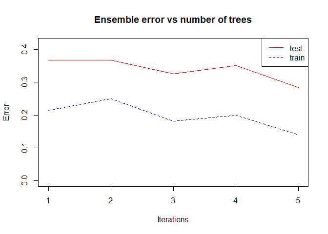<!-- -->

Ahora ajustamos el modelo con ayuda de `caret` y fijamos un $mfinal=100$
para no alargar el tiempo de cálculo.

``` r
library(MLmetrics)
```

    ## Warning: il pacchetto 'MLmetrics' è stato creato con R versione 4.2.3

    ## 
    ## Caricamento pacchetto: 'MLmetrics'

    ## I seguenti oggetti sono mascherati da 'package:caret':
    ## 
    ##     MAE, RMSE

    ## Il seguente oggetto è mascherato da 'package:base':
    ## 
    ##     Recall

``` r
baggrid<-expand.grid(mfinal=100, maxdepth=1:4)

baggFit <- train(Class~., data=music_pureX, method = "AdaBag", 
                trControl = fitControl,  
                tuneGrid = baggrid)
```

    ## Warning in nominalTrainWorkflow(x = x, y = y, wts = weights, info = trainInfo,
    ## : There were missing values in resampled performance measures.

``` r
trellis.par.set(caretTheme())
plot(baggFit)
```

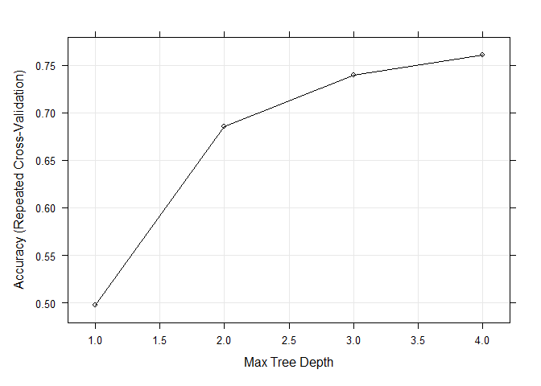<!-- -->

La mejor precisión se obtiene con una profundidad del arbol igual a 4.0.

``` r
confusionMatrix(table(predict(baggFit, newdata=music_tuneX, type="raw"), music_tuneX$Class), positive="Yes",mode="everything")
```

    ## Confusion Matrix and Statistics
    ## 
    ##         
    ##          blue grey red yellow
    ##   blue     20    9   3      3
    ##   grey      5   20   1      1
    ##   red       5    0  25      2
    ##   yellow    0    1   1     24
    ## 
    ## Overall Statistics
    ##                                           
    ##                Accuracy : 0.7417          
    ##                  95% CI : (0.6538, 0.8172)
    ##     No Information Rate : 0.25            
    ##     P-Value [Acc > NIR] : <2e-16          
    ##                                           
    ##                   Kappa : 0.6556          
    ##                                           
    ##  Mcnemar's Test P-Value : 0.4259          
    ## 
    ## Statistics by Class:
    ## 
    ##                      Class: blue Class: grey Class: red Class: yellow
    ## Sensitivity               0.6667      0.6667     0.8333        0.8000
    ## Specificity               0.8333      0.9222     0.9222        0.9778
    ## Pos Pred Value            0.5714      0.7407     0.7813        0.9231
    ## Neg Pred Value            0.8824      0.8925     0.9432        0.9362
    ## Precision                 0.5714      0.7407     0.7812        0.9231
    ## Recall                    0.6667      0.6667     0.8333        0.8000
    ## F1                        0.6154      0.7018     0.8065        0.8571
    ## Prevalence                0.2500      0.2500     0.2500        0.2500
    ## Detection Rate            0.1667      0.1667     0.2083        0.2000
    ## Detection Prevalence      0.2917      0.2250     0.2667        0.2167
    ## Balanced Accuracy         0.7500      0.7944     0.8778        0.8889

En la matriz de confusión, la mayoría de los valores están en la
diagonal, excepto por la Tristeza, y la precisión (accuracy) es del 74%.
La Tasa de No Información (No Information Rate) es del 25%.

## Tercer Clasificador: Random Forest

Random Forest es un método de aprendizaje por conjuntos utilizado para
clasificación, regresión y otras tareas. Consiste en construir una
multitud de árboles de decisión durante el entrenamiento y realizar la
predicción final agregando las predicciones de todos los árboles
individuales. Cada árbol se entrena en un subconjunto diferente de los
datos (muestreado al azar con reemplazo).

``` r
library(randomForest)
```

    ## Warning: il pacchetto 'randomForest' è stato creato con R versione 4.2.3

    ## randomForest 4.7-1.1

    ## Type rfNews() to see new features/changes/bug fixes.

    ## 
    ## Caricamento pacchetto: 'randomForest'

    ## Il seguente oggetto è mascherato da 'package:dplyr':
    ## 
    ##     combine

    ## Il seguente oggetto è mascherato da 'package:ggplot2':
    ## 
    ##     margin

``` r
music.rf <- randomForest(Class~., data=music_pureX, xtest=music_tuneX[,-1],
                        ytest=music_tuneX$Class)
music.rf
```

    ## 
    ## Call:
    ##  randomForest(formula = Class ~ ., data = music_pureX, xtest = music_tuneX[,      -1], ytest = music_tuneX$Class) 
    ##                Type of random forest: classification
    ##                      Number of trees: 500
    ## No. of variables tried at each split: 6
    ## 
    ##         OOB estimate of  error rate: 21.07%
    ## Confusion matrix:
    ##        blue grey red yellow class.error
    ## blue     42   18   3      7  0.40000000
    ## grey     14   52   2      2  0.25714286
    ## red       3    1  63      3  0.10000000
    ## yellow    3    1   2     64  0.08571429
    ##                 Test set error rate: 22.5%
    ## Confusion matrix:
    ##        blue grey red yellow class.error
    ## blue     20    6   4      0   0.3333333
    ## grey      7   22   0      1   0.2666667
    ## red       1    0  26      3   0.1333333
    ## yellow    3    0   2     25   0.1666667

``` r
plot(music.rf)
```

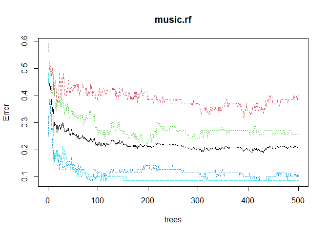<!-- -->

``` r
varImpPlot(music.rf) # gráfico de importancia de las variables
```

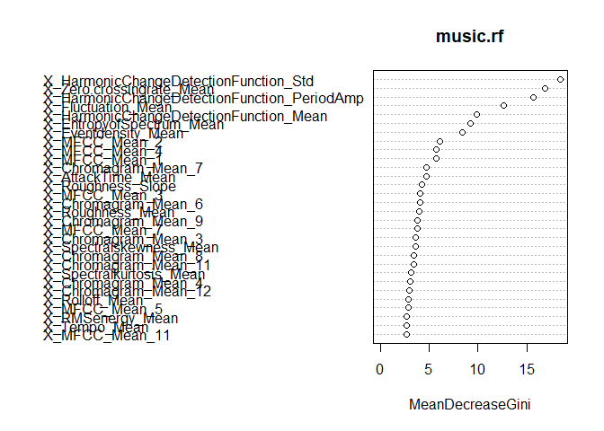<!-- -->

La tasa de error OOB (Out-of-Bag) estimada es del 21.79%. Esto significa
que, al evaluar el modelo con los datos que no se usaron durante el
entrenamiento (OOB), el 21.79% de las predicciones fueron incorrectas.
En la matriz de confusión para los datos OOB, la mayoría de los valores
están en la diagonal, excepto por la Tristeza que tiene un error de
clase del 42.86%. La tasa de error del conjunto de prueba es del 20%, lo
que indica que el modelo tuvo un rendimiento ligeramente mejor en el
conjunto de prueba en comparación con los datos OOB. En la matriz de
confusión del conjunto de prueba, la mayoría de los valores están en la
diagonal, excepto por la Tristeza que tiene un error de clase del 30%.
La representación de la importancia de las variables nos dice que
`X_HarmonicChangeDetectionFunction_Std` es la variable más importante.

La opción `mtry` (proporción de variables que entran en el arbol) indica
el número de variables que se seleccionan/muestrean al azar en cada nodo
para determinar el split óptimo, en el caso de árboles de clasificación
el valor por defecto es $\sqrt({\tt ncol(x)}) = \sqrt({\tt 44}) = 6$, la
raíz del número de variables usadas para predecir.

``` r
set.seed(nip)
music.tuneRF<-tuneRF(music_pureX[,-1], music_pureX[,1], 
       ntreeTry=300,
       mtryStart=6,
       stepFactor=1.5,
       plot=TRUE,
       trace=TRUE,
       doBest=TRUE)
```

    ## mtry = 6  OOB error = 22.5% 
    ## Searching left ...
    ## mtry = 4     OOB error = 23.57% 
    ## -0.04761905 0.05 
    ## Searching right ...
    ## mtry = 9     OOB error = 22.14% 
    ## 0.01587302 0.05

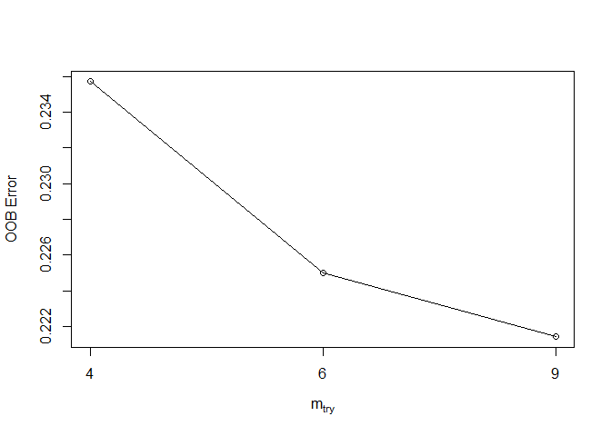<!-- -->

``` r
plot(music.tuneRF)
```

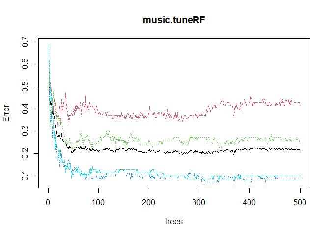<!-- -->

Si $mtry = 9$, el error es igual al 22.14%.

``` r
varImpPlot(music.tuneRF)
```

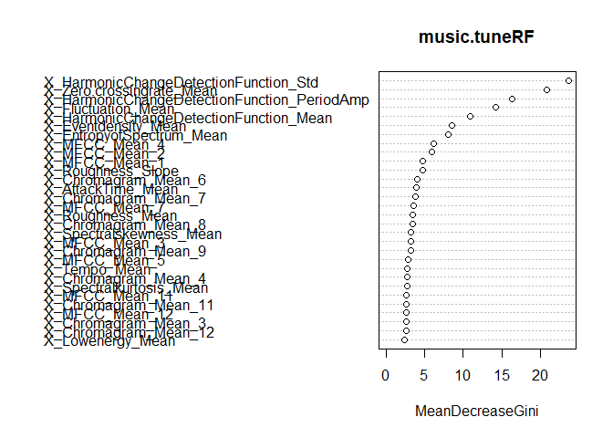<!-- -->

La representación de la importancia de las variables nos dice que
`X_HarmonicChangeDetectionFunction_Std` es la variable más importante.

``` r
predict(music.tuneRF, newdata=music_tuneX)%>%table(., music_tuneX$Class)%>%confusionMatrix(, positive="Yes", mode="everything") 
```

    ## Confusion Matrix and Statistics
    ## 
    ##         
    ## .        blue grey red yellow
    ##   blue     20    8   3      3
    ##   grey      6   22   0      0
    ##   red       4    0  25      2
    ##   yellow    0    0   2     25
    ## 
    ## Overall Statistics
    ##                                          
    ##                Accuracy : 0.7667         
    ##                  95% CI : (0.6807, 0.839)
    ##     No Information Rate : 0.25           
    ##     P-Value [Acc > NIR] : < 2.2e-16      
    ##                                          
    ##                   Kappa : 0.6889         
    ##                                          
    ##  Mcnemar's Test P-Value : NA             
    ## 
    ## Statistics by Class:
    ## 
    ##                      Class: blue Class: grey Class: red Class: yellow
    ## Sensitivity               0.6667      0.7333     0.8333        0.8333
    ## Specificity               0.8444      0.9333     0.9333        0.9778
    ## Pos Pred Value            0.5882      0.7857     0.8065        0.9259
    ## Neg Pred Value            0.8837      0.9130     0.9438        0.9462
    ## Precision                 0.5882      0.7857     0.8065        0.9259
    ## Recall                    0.6667      0.7333     0.8333        0.8333
    ## F1                        0.6250      0.7586     0.8197        0.8772
    ## Prevalence                0.2500      0.2500     0.2500        0.2500
    ## Detection Rate            0.1667      0.1833     0.2083        0.2083
    ## Detection Prevalence      0.2833      0.2333     0.2583        0.2250
    ## Balanced Accuracy         0.7556      0.8333     0.8833        0.9056

``` r
#OOB error
```

En la matriz de confusión, la mayoría de los valores están en la
diagonal, y la precisión (accuracy) es del 77%. La Tasa de No
Información (No Information Rate) es del 25%. Las estadísticas
proporcionan información sobre el rendimiento del modelo en las
diferentes clases. Por ejemplo, la Clase de la Felicidad tiene alta
especificidad y valor predictivo positivo, lo que indica que se
desempeña bien en la identificación correcta de casos positivos.

Ahora ajustamos el modelo con ayuda de `caret` y fijamos un $mfinal=100$
para no alargar el tiempo de cálculo.

``` r
tunegrid <- expand.grid(.mtry=c(4,6,9,11))

rfFit <- train(Class~., data=music_pureX, method = "rf", 
                trControl = fitControl,  
                tuneGrid = tunegrid)

trellis.par.set(caretTheme())
plot(rfFit)
```

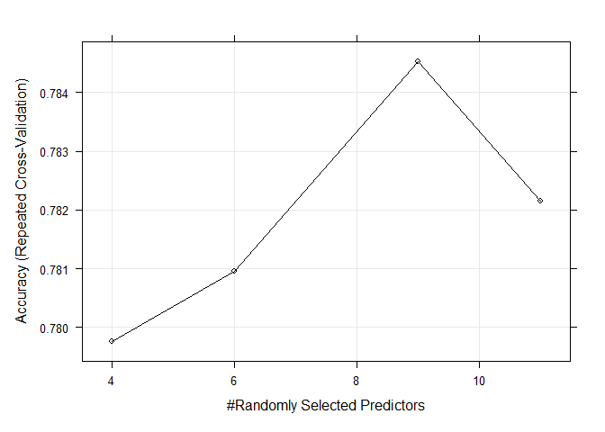<!-- -->

Como ya sabíamos, la mejor precisión se obtiene con $mtry = 9$.

``` r
confusionMatrix(predict(rfFit, newdata=music_tuneX), music_tuneX[,1])
```

    ## Confusion Matrix and Statistics
    ## 
    ##           Reference
    ## Prediction blue grey red yellow
    ##     blue     22    8   2      2
    ##     grey      4   21   0      1
    ##     red       4    0  26      2
    ##     yellow    0    1   2     25
    ## 
    ## Overall Statistics
    ##                                           
    ##                Accuracy : 0.7833          
    ##                  95% CI : (0.6989, 0.8533)
    ##     No Information Rate : 0.25            
    ##     P-Value [Acc > NIR] : < 2.2e-16       
    ##                                           
    ##                   Kappa : 0.7111          
    ##                                           
    ##  Mcnemar's Test P-Value : NA              
    ## 
    ## Statistics by Class:
    ## 
    ##                      Class: blue Class: grey Class: red Class: yellow
    ## Sensitivity               0.7333      0.7000     0.8667        0.8333
    ## Specificity               0.8667      0.9444     0.9333        0.9667
    ## Pos Pred Value            0.6471      0.8077     0.8125        0.8929
    ## Neg Pred Value            0.9070      0.9043     0.9545        0.9457
    ## Prevalence                0.2500      0.2500     0.2500        0.2500
    ## Detection Rate            0.1833      0.1750     0.2167        0.2083
    ## Detection Prevalence      0.2833      0.2167     0.2667        0.2333
    ## Balanced Accuracy         0.8000      0.8222     0.9000        0.9000

En la matriz de confusión, la mayoría de los valores están en la
diagonal, excepto por la Tristeza, y la precisión (accuracy) es del 79%.
La Tasa de No Información (No Information Rate) es del 25%.

## Cuarto Clasificador: Perceptrón Multicapa

El Perceptrón Multicapa (MLP) es una red neuronal artificial que se
utiliza para el aprendizaje supervisado. Está compuesto por múltiples
capas de neuronas interconectadas, en las que las salidas de las
neuronas de una capa se convierten en entradas para la siguiente capa.
Construimos la red neuronal.

``` r
require(nnet)
```

    ## Caricamento del pacchetto richiesto: nnet

``` r
nnetgrid<- expand.grid(size=c(5,10,14,16), decay=c(0.05,0.1))
set.seed(nip)
nnetFit<- train(music_pureX[,-1], music_pureX[,1], method = "nnet", 
              trControl = fitControl,  
              preProc = c("center", "scale"),
              tuneGrid=nnetgrid,
              trace = FALSE)
trellis.par.set(caretTheme())
plot(nnetFit)
```

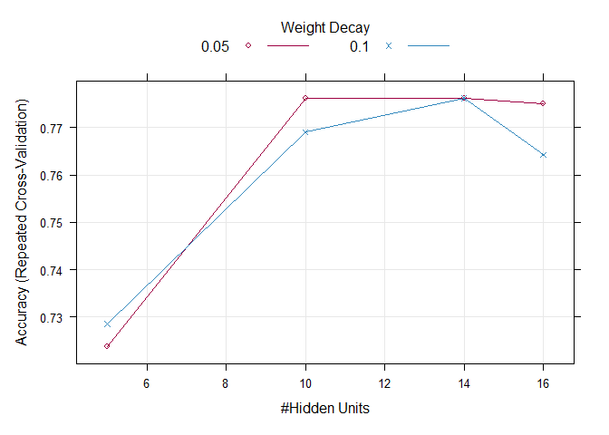<!-- -->

En el plot se puede notar que en general es mejor $decay=0.05$. En 14
los pasos dan la misma precision.

``` r
confusionMatrix(predict(nnetFit, newdata=music_tuneX), music_tuneX[,1])
```

    ## Confusion Matrix and Statistics
    ## 
    ##           Reference
    ## Prediction blue grey red yellow
    ##     blue     16    5   2      3
    ##     grey      6   25   0      1
    ##     red       5    0  27      2
    ##     yellow    3    0   1     24
    ## 
    ## Overall Statistics
    ##                                          
    ##                Accuracy : 0.7667         
    ##                  95% CI : (0.6807, 0.839)
    ##     No Information Rate : 0.25           
    ##     P-Value [Acc > NIR] : < 2.2e-16      
    ##                                          
    ##                   Kappa : 0.6889         
    ##                                          
    ##  Mcnemar's Test P-Value : NA             
    ## 
    ## Statistics by Class:
    ## 
    ##                      Class: blue Class: grey Class: red Class: yellow
    ## Sensitivity               0.5333      0.8333     0.9000        0.8000
    ## Specificity               0.8889      0.9222     0.9222        0.9556
    ## Pos Pred Value            0.6154      0.7813     0.7941        0.8571
    ## Neg Pred Value            0.8511      0.9432     0.9651        0.9348
    ## Prevalence                0.2500      0.2500     0.2500        0.2500
    ## Detection Rate            0.1333      0.2083     0.2250        0.2000
    ## Detection Prevalence      0.2167      0.2667     0.2833        0.2333
    ## Balanced Accuracy         0.7111      0.8778     0.9111        0.8778

En la matriz de confusión, la mayoría de los valores están en la
diagonal, y la precisión (accuracy) es del 77%. La Tasa de No
Información (No Information Rate) es del 25%. Las estadísticas
proporcionan información sobre el rendimiento del modelo en las
diferentes clases. Por ejemplo, la Clase de la Felicidad tiene alta
especificidad y valor predictivo negativo.

# Comparación de los Clasificadores

En esta sección vamos a comparar los clasificadores Bagging, Random
Forest y Perceptrón Multicapa.

## t-Test

Para comenzar, realizamos un t-test para comparar las medias de las
predicciones de los tres modelos.

``` r
compare_models(baggFit, rfFit)
```

    ## 
    ##  One Sample t-test
    ## 
    ## data:  x
    ## t = -0.99487, df = 29, p-value = 0.328
    ## alternative hypothesis: true mean is not equal to 0
    ## 95 percent confidence interval:
    ##  -0.07275670  0.02513765
    ## sample estimates:
    ##   mean of x 
    ## -0.02380952

``` r
compare_models(baggFit, nnetFit)
```

    ## 
    ##  One Sample t-test
    ## 
    ## data:  x
    ## t = -0.56969, df = 29, p-value = 0.5733
    ## alternative hypothesis: true mean is not equal to 0
    ## 95 percent confidence interval:
    ##  -0.07103675  0.04008437
    ## sample estimates:
    ##   mean of x 
    ## -0.01547619

``` r
compare_models(rfFit, nnetFit)
```

    ## 
    ##  One Sample t-test
    ## 
    ## data:  x
    ## t = 0.45247, df = 29, p-value = 0.6543
    ## alternative hypothesis: true mean is not equal to 0
    ## 95 percent confidence interval:
    ##  -0.02933486  0.04600153
    ## sample estimates:
    ##   mean of x 
    ## 0.008333333

El resultado sugiere que no existe una diferencia estadísticamente
significativa entre los tres modelos con un nivel de confianza del 95%.

## Comparación del Rendimiento

Ahora procederemos a utilizar la función `resamples` con los tres
modelos.

``` r
resamp<- resamples(list(BAGG=baggFit, RF=rfFit, NEURAL=nnetFit))
summary(resamp) # compara  modelos en base a sus remuestras comunes
```

    ## 
    ## Call:
    ## summary.resamples(object = resamp)
    ## 
    ## Models: BAGG, RF, NEURAL 
    ## Number of resamples: 30 
    ## 
    ## Accuracy 
    ##             Min.   1st Qu.    Median      Mean   3rd Qu.      Max. NA's
    ## BAGG   0.5000000 0.7142857 0.7857143 0.7607143 0.8482143 0.9285714    0
    ## RF     0.5714286 0.7500000 0.7857143 0.7845238 0.8214286 0.9285714    0
    ## NEURAL 0.6071429 0.7232143 0.7857143 0.7761905 0.8214286 0.9285714    0
    ## 
    ## AUC 
    ##             Min.   1st Qu.    Median      Mean   3rd Qu.      Max. NA's
    ## BAGG   0.7840136 0.8994473 0.9238946 0.9196712 0.9466412 0.9761905    0
    ## RF     0.8528912 0.9175170 0.9404762 0.9351474 0.9555697 0.9914966    0
    ## NEURAL 0.8367347 0.9162415 0.9421769 0.9304422 0.9515306 0.9829932    0
    ## 
    ## Kappa 
    ##             Min.   1st Qu.    Median      Mean   3rd Qu.      Max. NA's
    ## BAGG   0.3333333 0.6190476 0.7142857 0.6809524 0.7976190 0.9047619    0
    ## RF     0.4285714 0.6666667 0.7142857 0.7126984 0.7619048 0.9047619    0
    ## NEURAL 0.4761905 0.6309524 0.7142857 0.7015873 0.7619048 0.9047619    0
    ## 
    ## logLoss 
    ##             Min.   1st Qu.    Median      Mean   3rd Qu.      Max. NA's
    ## BAGG   0.4051629 0.5564491 0.6969982 0.9268998 0.7927927 4.3510648    0
    ## RF     0.5462759 0.5928380 0.6428279 0.6594450 0.7075484 0.8815012    0
    ## NEURAL 0.2540676 0.5382265 0.7200995 0.7899990 0.9531082 1.5420054    0
    ## 
    ## Mean_Balanced_Accuracy 
    ##             Min.   1st Qu.    Median      Mean   3rd Qu.     Max. NA's
    ## BAGG   0.6666667 0.8095238 0.8571429 0.8404762 0.8988095 0.952381    0
    ## RF     0.7142857 0.8333333 0.8571429 0.8563492 0.8809524 0.952381    0
    ## NEURAL 0.7380952 0.8154762 0.8571429 0.8507937 0.8809524 0.952381    0
    ## 
    ## Mean_Detection_Rate 
    ##             Min.   1st Qu.    Median      Mean   3rd Qu.      Max. NA's
    ## BAGG   0.1250000 0.1785714 0.1964286 0.1901786 0.2120536 0.2321429    0
    ## RF     0.1428571 0.1875000 0.1964286 0.1961310 0.2053571 0.2321429    0
    ## NEURAL 0.1517857 0.1808036 0.1964286 0.1940476 0.2053571 0.2321429    0
    ## 
    ## Mean_F1 
    ##             Min.   1st Qu.    Median      Mean   3rd Qu.      Max. NA's
    ## BAGG   0.4896978 0.6953453 0.7791410 0.7573353 0.8464400 0.9283883    0
    ## RF     0.5424679 0.7492674 0.7759070 0.7796253 0.8202839 0.9282051    0
    ## NEURAL 0.5848039 0.7267168 0.7897207 0.7727190 0.8238365 0.9285714    0
    ## 
    ## Mean_Neg_Pred_Value 
    ##             Min.   1st Qu.    Median      Mean   3rd Qu.      Max. NA's
    ## BAGG   0.8364092 0.9066227 0.9290001 0.9222708 0.9509041 0.9767316    0
    ## RF     0.8643281 0.9169244 0.9321405 0.9306556 0.9424348 0.9782609    0
    ## NEURAL 0.8757850 0.9101808 0.9299988 0.9279475 0.9432210 0.9782609    0
    ## 
    ## Mean_Pos_Pred_Value 
    ##             Min.   1st Qu.    Median      Mean   3rd Qu.      Max. NA's
    ## BAGG   0.4880952 0.7203959 0.7879960 0.7746807 0.8656250 0.9330357    0
    ## RF     0.5256944 0.7552083 0.7906746 0.7932540 0.8362351 0.9375000    0
    ## NEURAL 0.5875000 0.7485119 0.8062996 0.7909936 0.8488095 0.9375000    0
    ## 
    ## Mean_Precision 
    ##             Min.   1st Qu.    Median      Mean   3rd Qu.      Max. NA's
    ## BAGG   0.4880952 0.7203959 0.7879960 0.7746807 0.8656250 0.9330357    0
    ## RF     0.5256944 0.7552083 0.7906746 0.7932540 0.8362351 0.9375000    0
    ## NEURAL 0.5875000 0.7485119 0.8062996 0.7909936 0.8488095 0.9375000    0
    ## 
    ## Mean_Recall 
    ##             Min.   1st Qu.    Median      Mean   3rd Qu.      Max. NA's
    ## BAGG   0.5000000 0.7142857 0.7857143 0.7607143 0.8482143 0.9285714    0
    ## RF     0.5714286 0.7500000 0.7857143 0.7845238 0.8214286 0.9285714    0
    ## NEURAL 0.6071429 0.7232143 0.7857143 0.7761905 0.8214286 0.9285714    0
    ## 
    ## Mean_Sensitivity 
    ##             Min.   1st Qu.    Median      Mean   3rd Qu.      Max. NA's
    ## BAGG   0.5000000 0.7142857 0.7857143 0.7607143 0.8482143 0.9285714    0
    ## RF     0.5714286 0.7500000 0.7857143 0.7845238 0.8214286 0.9285714    0
    ## NEURAL 0.6071429 0.7232143 0.7857143 0.7761905 0.8214286 0.9285714    0
    ## 
    ## Mean_Specificity 
    ##             Min.   1st Qu.    Median      Mean   3rd Qu.      Max. NA's
    ## BAGG   0.8333333 0.9047619 0.9285714 0.9202381 0.9494048 0.9761905    0
    ## RF     0.8571429 0.9166667 0.9285714 0.9281746 0.9404762 0.9761905    0
    ## NEURAL 0.8690476 0.9077381 0.9285714 0.9253968 0.9404762 0.9761905    0
    ## 
    ## prAUC 
    ##             Min.   1st Qu.    Median      Mean   3rd Qu.      Max. NA's
    ## BAGG   0.4987711 0.6277631 0.6743326 0.6789967 0.7425057 0.8097446    0
    ## RF     0.5764827 0.6950254 0.7259930 0.7237191 0.7580367 0.8336168    0
    ## NEURAL 0.5779218 0.6620375 0.7314180 0.7125475 0.7525947 0.8157641    0

Esta función permite verificar que los resultados de remuestreo
coincidan y calcular las estadísticas de rendimiento de los modelos
basadas en 15 remuestreos. Hemos observado que, en general, los
resultados son muy similares entre los tres modelos. Sin embargo, el
modelo Random Forest muestra unos valores mejores.

A continuación, utilizamos `summary(diff(resamples))` con los tres
modelos.

``` r
summary(diff(resamp))
```

    ## 
    ## Call:
    ## summary.diff.resamples(object = diff(resamp))
    ## 
    ## p-value adjustment: bonferroni 
    ## Upper diagonal: estimates of the difference
    ## Lower diagonal: p-value for H0: difference = 0
    ## 
    ## Accuracy 
    ##        BAGG   RF        NEURAL   
    ## BAGG          -0.023810 -0.015476
    ## RF     0.9841            0.008333
    ## NEURAL 1.0000 1.0000             
    ## 
    ## AUC 
    ##        BAGG   RF        NEURAL   
    ## BAGG          -0.015476 -0.010771
    ## RF     0.2689            0.004705
    ## NEURAL 0.7403 1.0000             
    ## 
    ## Kappa 
    ##        BAGG   RF       NEURAL  
    ## BAGG          -0.03175 -0.02063
    ## RF     0.9841           0.01111
    ## NEURAL 1.0000 1.0000           
    ## 
    ## logLoss 
    ##        BAGG  RF      NEURAL 
    ## BAGG          0.2675  0.1369
    ## RF     0.225         -0.1306
    ## NEURAL 1.000 0.163          
    ## 
    ## Mean_Balanced_Accuracy 
    ##        BAGG   RF        NEURAL   
    ## BAGG          -0.015873 -0.010317
    ## RF     0.9841            0.005556
    ## NEURAL 1.0000 1.0000             
    ## 
    ## Mean_Detection_Rate 
    ##        BAGG   RF        NEURAL   
    ## BAGG          -0.005952 -0.003869
    ## RF     0.9841            0.002083
    ## NEURAL 1.0000 1.0000             
    ## 
    ## Mean_F1 
    ##        BAGG RF        NEURAL   
    ## BAGG        -0.022290 -0.015384
    ## RF     1               0.006906
    ## NEURAL 1    1                  
    ## 
    ## Mean_Neg_Pred_Value 
    ##        BAGG   RF        NEURAL   
    ## BAGG          -0.008385 -0.005677
    ## RF     0.8808            0.002708
    ## NEURAL 1.0000 1.0000             
    ## 
    ## Mean_Pos_Pred_Value 
    ##        BAGG RF       NEURAL  
    ## BAGG        -0.01857 -0.01631
    ## RF     1              0.00226
    ## NEURAL 1    1                
    ## 
    ## Mean_Precision 
    ##        BAGG RF       NEURAL  
    ## BAGG        -0.01857 -0.01631
    ## RF     1              0.00226
    ## NEURAL 1    1                
    ## 
    ## Mean_Recall 
    ##        BAGG   RF        NEURAL   
    ## BAGG          -0.023810 -0.015476
    ## RF     0.9841            0.008333
    ## NEURAL 1.0000 1.0000             
    ## 
    ## Mean_Sensitivity 
    ##        BAGG   RF        NEURAL   
    ## BAGG          -0.023810 -0.015476
    ## RF     0.9841            0.008333
    ## NEURAL 1.0000 1.0000             
    ## 
    ## Mean_Specificity 
    ##        BAGG   RF        NEURAL   
    ## BAGG          -0.007937 -0.005159
    ## RF     0.9841            0.002778
    ## NEURAL 1.0000 1.0000             
    ## 
    ## prAUC 
    ##        BAGG    RF       NEURAL  
    ## BAGG           -0.04472 -0.03355
    ## RF     0.04398           0.01117
    ## NEURAL 0.25094 1.00000

Esta función realiza una comparación del rendimiento entre los modelos,
analizando las diferencias en una variedad de métricas. En este caso, el
Random Forest parece ser el algoritmo más sólido en términos de
rendimiento en estas métricas.

## Gráficos

Además, queremos crear los gráficos:

``` r
densityplot(resamp, metric=resamp$metric[1])
```

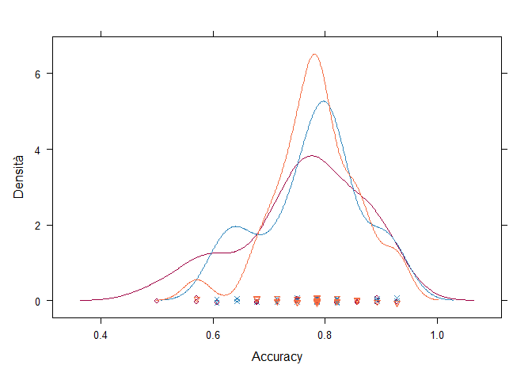<!-- -->

``` r
dotplot(resamp, metric=resamp$metric[1])
```

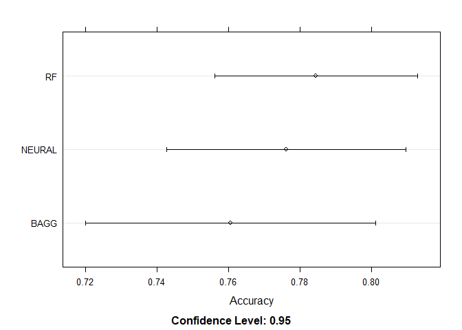<!-- -->

``` r
bwplot(resamp, metric=resamp$metric[1])
```

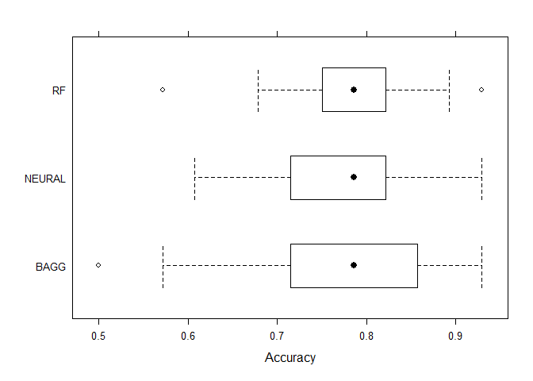<!-- -->

``` r
splom(resamp)
```

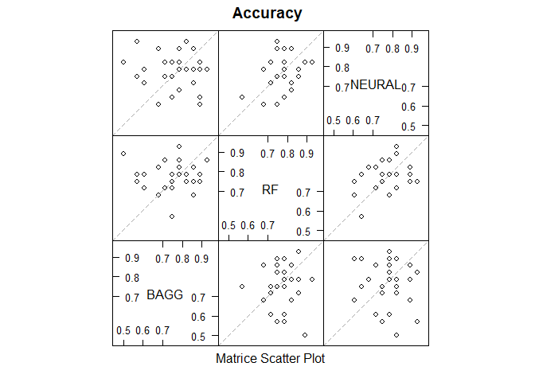<!-- -->

Sobre estos datos, el modelo Random Forest parece dar un mejor
rendimiento como clasificador que el Bagging y el Perceptrón Multicapa.
Mientras tanto, el Bagging parece ser el algoritmo menos sólido.

## Curvas ROC

Queremos obtener las curvas ROC y los valores AUC de los tres modelos.
En clasificación NO binaria, las curvas ROC se deben ajustar. Hay dos
posibilidades: `One-to-One`y `One-to-rest`. Vamos a usar la librería
`multiROC` para obtener gráficos ROC de cada categoría relativa al resto
y también una medida micro y macro asociadas.

### Bagging

El área bajo las curvas parece ser bastante grande, lo cual sugiere un
buen rendimiento del modelo. De hecho, los valores de AUC están cercanos
a 1, lo que indica que el clasificador Bagging está funcionando bien en
la mayoría de las categorías, con una clasificación muy alta en la
categoría Felicidad (0.987). Solo para la Tristeza, el área es más
pequeña y el valor AUC correspondiente es 0.843.

``` r
require(multiROC)
```

    ## Caricamento del pacchetto richiesto: multiROC

    ## Warning: il pacchetto 'multiROC' è stato creato con R versione 4.2.3

``` r
## preprocesamiento. 
true_label_b<-data.frame(class2ind(music_tuneX[,1]))
colnames(true_label_b)<- paste(colnames(true_label_b), "_true")
nn_pred_b<-data.frame(predict(baggFit,newdata=music_tuneX[,-1], type="prob"))
colnames(nn_pred_b)<- paste(colnames(nn_pred_b), "_pred_bagg")
final_b<-cbind(true_label_b,nn_pred_b)

## llamada principal
roc_res_b <- multi_roc(final_b, force_diag=T)
```

    ## Warning in regularize.values(x, y, ties, missing(ties), na.rm = na.rm): si
    ## riduce a valori unici di 'x'

    ## Warning in regularize.values(x, y, ties, missing(ties), na.rm = na.rm): si
    ## riduce a valori unici di 'x'

    ## Warning in regularize.values(x, y, ties, missing(ties), na.rm = na.rm): si
    ## riduce a valori unici di 'x'

    ## Warning in regularize.values(x, y, ties, missing(ties), na.rm = na.rm): si
    ## riduce a valori unici di 'x'

``` r
plot_roc_b<-plot_roc_data(roc_res_b)

## valores de AUC
unlist(roc_res_b$AUC)
```

    ##   bagg.blue    bagg.grey     bagg.red  bagg.yellow    bagg.macro   bagg.micro 
    ##    0.8429630    0.9403704    0.9100000    0.9866667    0.9186806    0.9292361

``` r
## representación gráfica
require(ggplot2)
ggplot(plot_roc_b, aes(x = 1-Specificity, y=Sensitivity)) +
  geom_path(aes(color = Group, linetype=Method), linewidth=1.5) +
  geom_segment(aes(x = 0, y = 0, xend = 1, yend = 1), 
               colour='grey', linetype = 'dotdash') +
  theme_bw() + 
  theme(plot.title = element_text(hjust = 0.5), 
        legend.justification=c(1, 0), legend.position=c(.95, .05),
        legend.title=element_blank(), 
        legend.background = element_rect(fill=NULL, size=0.5, 
                                         linetype="solid", colour ="black"))
```

    ## Warning: The `size` argument of `element_rect()` is deprecated as of ggplot2 3.4.0.
    ## ℹ Please use the `linewidth` argument instead.
    ## This warning is displayed once every 8 hours.
    ## Call `lifecycle::last_lifecycle_warnings()` to see where this warning was
    ## generated.

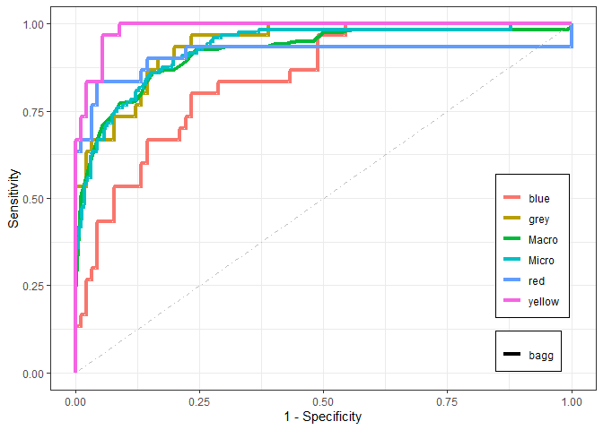<!-- -->

### Random Forest

El área bajo las curvas parece ser bastante grande, lo cual sugiere un
buen rendimiento del modelo. De hecho, los valores de AUC están cercanos
a 1, lo que indica que el clasificador Random Forest está funcionando
bien en la mayoría de las categorías, con una clasificación casi
perfecta en la categoría Felicidad (0.992). Solo para la Tristeza, el
área es más pequeña y el valor AUC correspondiente es 0.880.

``` r
require(multiROC)

## preprocesamiento. 
true_label_r<-data.frame(class2ind(music_tuneX[,1]))
colnames(true_label_r)<- paste(colnames(true_label_r), "_true")
nn_pred_r<-data.frame(predict(rfFit,newdata=music_tuneX[,-1], type="prob"))
colnames(nn_pred_r)<- paste(colnames(nn_pred_r), "_pred_rf")
final_r<-cbind(true_label_r,nn_pred_r)

## llamada principal
roc_res_r <- multi_roc(final_r, force_diag=T)
```

    ## Warning in regularize.values(x, y, ties, missing(ties), na.rm = na.rm): si
    ## riduce a valori unici di 'x'

    ## Warning in regularize.values(x, y, ties, missing(ties), na.rm = na.rm): si
    ## riduce a valori unici di 'x'

    ## Warning in regularize.values(x, y, ties, missing(ties), na.rm = na.rm): si
    ## riduce a valori unici di 'x'

    ## Warning in regularize.values(x, y, ties, missing(ties), na.rm = na.rm): si
    ## riduce a valori unici di 'x'

``` r
plot_roc_r<-plot_roc_data(roc_res_r)

## valores de AUC
unlist(roc_res_r$AUC)
```

    ##   rf.blue    rf.grey     rf.red  rf.yellow    rf.macro   rf.micro 
    ##  0.8714815  0.9659259  0.9470370  0.9907407  0.9422917  0.9516435

``` r
## representación gráfica
require(ggplot2)
ggplot(plot_roc_r, aes(x = 1-Specificity, y=Sensitivity)) +
  geom_path(aes(color = Group, linetype=Method), linewidth=1.5) +
  geom_segment(aes(x = 0, y = 0, xend = 1, yend = 1), 
               colour='grey', linetype = 'dotdash') +
  theme_bw() + 
  theme(plot.title = element_text(hjust = 0.5), 
        legend.justification=c(1, 0), legend.position=c(.95, .05),
        legend.title=element_blank(), 
        legend.background = element_rect(fill=NULL, size=0.5, 
                                         linetype="solid", colour ="black"))
```

<!-- -->

### Perceptrón Multicapa

El área bajo las curvas parece ser bastante grande, lo cual sugiere un
buen rendimiento del modelo. De hecho, los valores de AUC están cercanos
a 1, lo que indica que el clasificador Perceptrón Multicapa está
funcionando bien en la mayoría de las categorías, con una clasificación
alta en la categoría Felicidad (0.970). Solo para la Tristeza, el área
es más pequeña y el valor AUC correspondiente es 0.825.

``` r
require(multiROC)

## preprocesamiento. 
true_label_n<-data.frame(class2ind(music_tuneX[,1]))
colnames(true_label_n)<- paste(colnames(true_label_n), "_true")
nn_pred_n<-data.frame(predict(nnetFit,newdata=music_tuneX[,-1], type="prob"))
colnames(nn_pred_n)<- paste(colnames(nn_pred_n), "_pred_mlp")
final_n<-cbind(true_label_n,nn_pred_n)

## llamada principal
roc_res_n <- multi_roc(final_n, force_diag=T)
```

    ## Warning in regularize.values(x, y, ties, missing(ties), na.rm = na.rm): si
    ## riduce a valori unici di 'x'

    ## Warning in regularize.values(x, y, ties, missing(ties), na.rm = na.rm): si
    ## riduce a valori unici di 'x'

    ## Warning in regularize.values(x, y, ties, missing(ties), na.rm = na.rm): si
    ## riduce a valori unici di 'x'

    ## Warning in regularize.values(x, y, ties, missing(ties), na.rm = na.rm): si
    ## riduce a valori unici di 'x'

``` r
plot_roc_n<-plot_roc_data(roc_res_n)

## valores de AUC
unlist(roc_res_n$AUC)
```

    ##   mlp.blue    mlp.grey     mlp.red  mlp.yellow    mlp.macro   mlp.micro 
    ##   0.8251852   0.9455556   0.9288889   0.9696296   0.9162037   0.9231944

``` r
## representación gráfica
k=c("blue", "grey", "red", "yellow")
require(ggplot2)
ggplot(plot_roc_n, aes(x = 1-Specificity, y=Sensitivity)) +
  geom_path(aes(color = Group, linetype=Method), linewidth=1.5) +
  geom_segment(aes(x = 0, y = 0, xend = 1, yend = 1), 
               colour='grey', linetype = 'dotdash') +
  theme_bw() + 
  theme(plot.title = element_text(hjust = 0.5), 
        legend.justification=c(1, 0), legend.position=c(.95, .05),
        legend.title=element_blank(), 
        legend.background = element_rect(fill=NULL, size=0.5, 
                                         linetype="solid", colour ="black"))
```

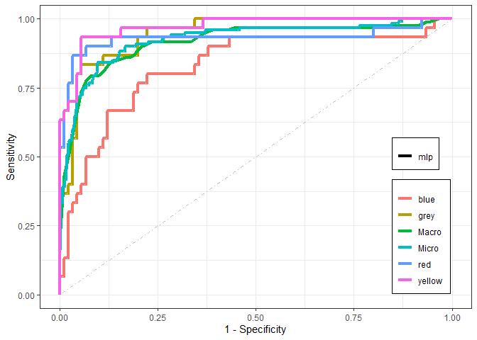<!-- -->

# Conclusión

El conjunto de datos sobre las emociones asociadas a la música turca
consta de cuatro clases: feliz, triste, enojado y relajado. Se observa
un alto grado de equilibrio entre estas clases, y las demás variables
son de tipo numérico (entero), sin valores faltantes. Durante el
análisis, identificamos que las columnas 32, 26, 27, 29, 23, 28 y 18
formaban un combo lineal, lo que nos permitió eliminarlas del conjunto
de datos. Al evaluar los pesos de las Componentes Principales,
observamos que la separación entre las clases no estaba claramente
definida y se identificaron algunos valores atípicos. Por lo tanto,
decidimos no basar nuestro análisis únicamente en dichos pesos. Para
realizar la clasificación, dividimos la muestra en dos partes: el $70\%$
para el entrenamiento y el $30\%$ para ajustar los parámetros.
Utilizamos varios algoritmos: Árbol de Decisión, Método Bootstrap,
Random Forest y Perceptrón Multicapa. La variable
`X_HarmonicChangeDetectionFunction_Std` resultó ser la más relevante
para la clasificación. Observamos que en general los resultados eran muy
similares entre los tres modelos, sin diferencias estadísticamente
significativas entre ellos. Sin embargo, el modelo Random Forest
muestraba unos valores mejores y parecía el algoritmo más sólido en
términos de rendimiento.
